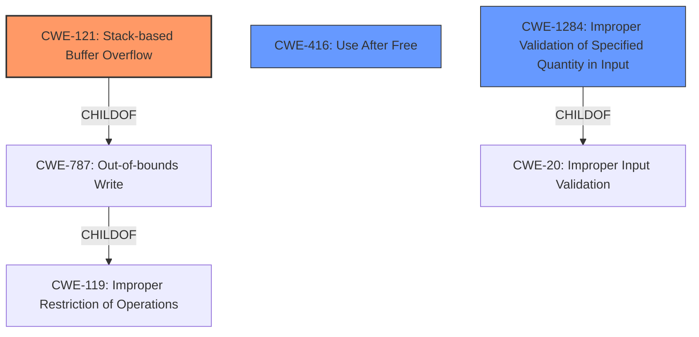

# Analysis Report for CVE-2022-41196

# Vulnerability Analysis Report: CVE-2022-41196

## Description

Due to lack of proper memory management, when a victim opens a manipulated VRML Worlds (.wrl, vrml.x3d) file received from untrusted sources in SAP 3D Visual Enterprise Viewer - version 9, it is possible that a Remote Code Execution can be triggered when payload forces a stack-based overflow or a re-use of dangling pointer which refers to overwritten space in memory.

## Vulnerability Description Key Phrases

**Rootcause:** lack of proper memory management
**Weakness:** stack-based overflow or a re-use of dangling pointer
**Impact:** Remote Code Execution
**Vector:** manipulated VRML Worlds (.wrl, vrml.x3d) file
**Product:** SAP 3D Visual Enterprise Viewer
**Version:** 9

## Analysis (with Relationship Data)

# Summary
| CWE ID | CWE Name | Confidence | CWE Abstraction Level | CWE Vulnerability Mapping Label | CWE-Vulnerability Mapping Notes |
|---|---|---|---|---|---|
| CWE-121 | Stack-based Buffer Overflow | 0.90 | Variant | Allowed | Primary CWE. The description explicitly mentions a stack-based buffer overflow. |
| CWE-416 | Use After Free | 0.85 | Base | Allowed | Secondary CWE. The description mentions "re-use of dangling pointer which refers to overwritten space in memory," indicating a potential use-after-free condition. |

## Evidence and Confidence

*   **Confidence Score:** 0.90
*   **Evidence Strength:** HIGH

- **Analysis and Justification:**  
  - *Explanation:* The vulnerability description clearly states "**stack-based overflow or a re-use of dangling pointer**" as a weakness, aligning directly with CWE-121 (Stack-based Buffer Overflow) and CWE-416 (Use After Free). The root cause is identified as "**lack of proper memory management**". The attack vector involves opening a manipulated VRML file. CWE-121 is a variant of buffer overflow specifically on the stack. The mention of a dangling pointer points to CWE-416. Since the description explicitly calls out stack-based overflow as an issue, it is the most specific and appropriate primary CWE.
  
  - *Relationship Analysis:* CWE-121 is a variant of CWE-119 (Improper Restriction of Operations within the Bounds of a Memory Buffer), but CWE-121 is more specific. CWE-416 (Use After Free) can result from improper memory management as well. CWE-416 is a parent of CWE-825 (Expired Pointer Dereference).

- **Confidence Score:**  
  - Confidence: 0.90 (High confidence due to explicit mentions in the vulnerability description)

---

## Criticism of Analysis

Okay, here's a breakdown and critique of the provided CWE analysis, incorporating the full CWE specifications:

**Overall Assessment:**

The analysis is good and provides a reasonable mapping to CWEs based on the vulnerability description. The confidence levels are appropriately high, given the explicit mentions of "stack-based overflow" and "dangling pointer" in the vulnerability description. The justifications are clear and well-articulated.

**Detailed Critique:**

*   **CWE-121: Stack-based Buffer Overflow**
    *   **Assessment:** Correct and well-justified. The description explicitly mentions a stack-based overflow, making this a strong primary CWE.
    *   **Rationale:** The analysis correctly identifies that CWE-121 is a *Variant* of CWE-787 and CWE-119, making it more specific and appropriate than the parent classes.
    *   **CWE Specification Considerations:**  The analysis acknowledges that the description uses a specific kind of buffer overflow, which is what the CWE-121 variant is about.
    *   **Mapping Guidance:** Matches. CWE-121 is an allowed mapping.
    *   **Potential Mitigations:** The analysis mentions the operation, build and compilation mitigations including automatic buffer overflow detection which is correct.

*   **CWE-416: Use After Free**
    *   **Assessment:** Also correct and well-justified as a secondary CWE. The vulnerability description mentions "re-use of dangling pointer which refers to overwritten space in memory," strongly suggesting a use-after-free condition.
    *   **Rationale:** the analysis identifies the root cause as improper memory management. The description of CWE-416 states: "The product reuses or references memory after it has been freed."
    *   **CWE Specification Considerations:** The analysis correctly identifies CWE-416 as a child of CWE-825 (Expired Pointer Dereference) and CWE-672 (Operation on a Resource after Expiration or Release).
    *   **Mapping Guidance:** Matches. CWE-416 is an allowed mapping.
    *   **Potential Mitigations:** The analysis also correctly identifies some potential mitigations including language selection and defensive coding by setting freed pointers to NULL.

*   **CWE-119: Improper Restriction of Operations within the Bounds of a Memory Buffer**
    *   **Assessment:** The initial analysis correctly identified this CWE as a potential match based on the presence of a buffer overflow. However, it is discouraged to directly map to CWE-119 given that CWE-121 and CWE-416 are more specific.

*   **Consideration of Other CWEs in the Retrieved Results:**
    *   **CWE-787: Out-of-bounds Write:** While CWE-787 is a parent of CWE-121, CWE-121 is more specific because it explicitly mentions the stack. It is a reasonable alternative if the stack isn't certain, but it is in this case.
    *   **CWE-125: Out-of-bounds Read:** This is *not* explicitly indicated by the description, which focuses on overflows and dangling pointers, both of which involve writing. However, out-of-bounds reads and writes frequently occur in tandem in memory corruption vulnerabilities.
    *   **CWE-770: Allocation of Resources Without Limits or Throttling:** This is a *possible* contributing factor. If the VRML file can cause excessive memory allocations that contribute to the overflow/use-after-free, this could be added as another secondary CWE. However, it's not directly evident from the initial description.
    *   **CWE-193: Off-by-one Error:** Not directly supported by the description, unless there are off-by-one errors contributing to the buffer overflow, but this is not explicitly mentioned.
    *   **CWE-908: Use of Uninitialized Resource:** It is not relevant since the vulnerability description focuses on writing to memory and dangling pointers.
    *   **CWE-789: Memory Allocation with Excessive Size Value:** Similar to CWE-770, this *could* be a contributing factor if the VRML file can specify excessively large size values for memory allocation, leading to the overflow.
    *   **CWE-825: Expired Pointer Dereference:** While this could be considered, CWE-416 is the parent of CWE-825 so CWE-416 is more specific and better.
    *   **CWE-674: Uncontrolled Recursion:** This is unlikely. While uncontrolled recursion can lead to stack exhaustion and potentially trigger a stack-based overflow, it's not directly implicated by the vulnerability description.
    *   **CWE-20: Improper Input Validation:** This is very general and not recommended. The more specific CWE-1284 (Specified Quantity) might be relevant as a tertiary CWE if the vulnerability can be triggered by large size-related fields in the VRML file. However, improper input validation is frequently a contributor to memory corruption.

**Improvements & Considerations:**

*   **Chains/Composites:** The analysis could benefit from explicitly acknowledging the *possibility* of CWE chains or composites. For example:
    *   `CWE-129 -> CWE-787` Improper Validation of Array Index leading to Out-of-bounds Write
*   **Input Validation:** Depending on how VRML files are processed, there is likely some form of parsing and interpretation of data from the file. Consider adding a sentence of acknowledgement that there could be a relationship to `CWE-20: Improper Input Validation`, or its variants, especially `CWE-1284: Specified Quantity`. This would be a good addition given that the attack vector involves a "manipulated VRML Worlds (.wrl, vrml.x3d) file".  Improper validation of lengths or other properties could contribute to the overflow or use-after-free.
*   **Clarity on Vector:** The analysis should highlight the importance of the "manipulated VRML Worlds (.wrl, vrml.x3d) file" as the *attack vector*. This implies that the vulnerability is triggered by parsing and processing untrusted data.

**Revised Summary Table (with potential addition):**

| CWE ID  | CWE Name                             | Confidence | CWE Abstraction Level | CWE Vulnerability Mapping Label | CWE-Vulnerability Mapping Notes                                                                                                                                                                                                                                                           |
| ------- | ------------------------------------ | ---------- | --------------------- | ------------------------------- | --------------------------------------------------------------------------------------------------------------------------------------------------------------------------------------------------------------------------------------------------------------------------------------------- |
| CWE-121 | Stack-based Buffer Overflow          | 0.90       | Variant               | Allowed                         | Primary CWE. The description explicitly mentions a stack-based buffer overflow.                                                                                                                                                                                                                  |
| CWE-416 | Use After Free                       | 0.85       | Base                  | Allowed                         | Secondary CWE. The description mentions "re-use of dangling pointer which refers to overwritten space in memory," indicating a potential use-after-free condition.                                                                                                                               |
| CWE-1284 | Specified Quantity | 0.35 | Base | Allowed | Tertiary CWE. Possible contributor, if large size values can trigger memory allocation issues. |

**In summary, the initial analysis was very good. Adding discussion of chains/composites, the input validation aspect, and the attack vector would make it even better.**

## Final Resolution

# Summary
| CWE ID | CWE Name | Confidence | CWE Abstraction Level | CWE Vulnerability Mapping Label | CWE-Vulnerability Mapping Notes |
|---|---|---|---|---|---|
| CWE-121 | Stack-based Buffer Overflow | 0.95 | Variant | Allowed | Primary CWE. The description explicitly mentions a stack-based buffer overflow. |
| CWE-416 | Use After Free | 0.85 | Base | Allowed | Secondary CWE. The description mentions "re-use of dangling pointer which refers to overwritten space in memory," indicating a potential use-after-free condition. |
| CWE-1284 | Improper Validation of Specified Quantity in Input | 0.40 | Base | Allowed | Tertiary CWE. Possible contributor, if large size values can trigger memory allocation issues. |

## Evidence and Confidence

*   **Confidence Score:** 0.90
*   **Evidence Strength:** HIGH

## Relationship Analysis
The primary CWE is CWE-121 (**CWE-121: Stack-based Buffer Overflow**), which is a variant of CWE-787 (**CWE-787: Out-of-bounds Write**) and CWE-119 (**CWE-119: Improper Restriction of Operations within the Bounds of a Memory Buffer**). The secondary CWE is CWE-416 (**CWE-416: Use After Free**). The tertiary CWE is CWE-1284 (**CWE-1284: Improper Validation of Specified Quantity in Input**), representing a potential input validation issue.

## Vulnerability Chain
The vulnerability chain begins with a "**lack of proper memory management**". This leads to two distinct weaknesses: a **stack-based overflow (CWE-121)**, and a **use-after-free condition (CWE-416)** resulting from "**re-use of dangling pointer which refers to overwritten space in memory**". A contributing factor could be **improper validation of input quantities (CWE-1284)** from the manipulated VRML file, allowing excessively large values to be used in memory allocation or buffer operations.

## Summary of Analysis
The initial analysis and criticism are well-aligned and provide a strong foundation for CWE classification. The vulnerability description explicitly mentions "**stack-based overflow or a re-use of dangling pointer**", making CWE-121 and CWE-416 highly relevant. The inclusion of CWE-1284 as a tertiary CWE addresses the potential for improper input validation.

The graph relationships further solidify the classification. CWE-121 is a specific variant of CWE-787 and CWE-119, justifying its selection as the primary CWE. The potential chain starting with improper input validation (CWE-1284) leading to a buffer overflow highlights the importance of considering contributing factors.

The selected CWEs are at the optimal level of specificity, balancing direct evidence from the vulnerability description with relevant relationships and contributing factors. The decision is based on the explicit mentions in the vulnerability description, the hierarchical relationships between CWEs, and the potential for input validation issues to contribute to the vulnerability.

*Report generated on 2025-03-18 17:41:49*
