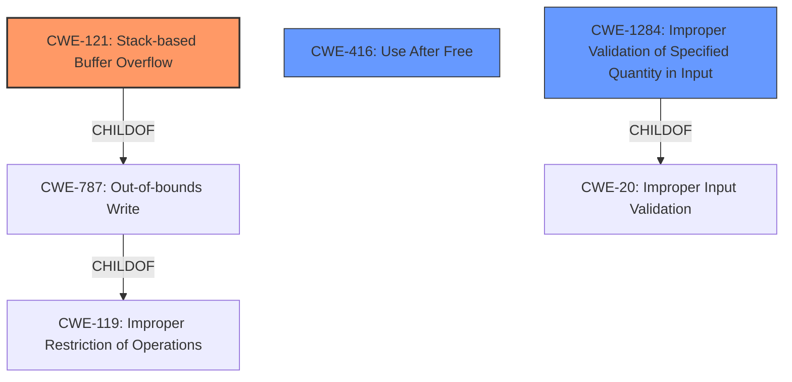

# Final Resolution for CVE-2022-41196

# Summary
| CWE ID | CWE Name | Confidence | CWE Abstraction Level | CWE Vulnerability Mapping Label | CWE-Vulnerability Mapping Notes |
|---|---|---|---|---|---|
| CWE-121 | Stack-based Buffer Overflow | 0.95 | Variant | Allowed | Primary CWE. The description explicitly mentions a stack-based buffer overflow. |
| CWE-416 | Use After Free | 0.85 | Base | Allowed | Secondary CWE. The description mentions "re-use of dangling pointer which refers to overwritten space in memory," indicating a potential use-after-free condition. |
| CWE-1284 | Improper Validation of Specified Quantity in Input | 0.40 | Base | Allowed | Tertiary CWE. Possible contributor, if large size values can trigger memory allocation issues. |

## Evidence and Confidence

*   **Confidence Score:** 0.90
*   **Evidence Strength:** HIGH

## Relationship Analysis
The primary CWE is CWE-121 (**CWE-121: Stack-based Buffer Overflow**), which is a variant of CWE-787 (**CWE-787: Out-of-bounds Write**) and CWE-119 (**CWE-119: Improper Restriction of Operations within the Bounds of a Memory Buffer**). The secondary CWE is CWE-416 (**CWE-416: Use After Free**). The tertiary CWE is CWE-1284 (**CWE-1284: Improper Validation of Specified Quantity in Input**), representing a potential input validation issue.

## Vulnerability Chain
The vulnerability chain begins with a "**lack of proper memory management**". This leads to two distinct weaknesses: a **stack-based overflow (CWE-121)**, and a **use-after-free condition (CWE-416)** resulting from "**re-use of dangling pointer which refers to overwritten space in memory**". A contributing factor could be **improper validation of input quantities (CWE-1284)** from the manipulated VRML file, allowing excessively large values to be used in memory allocation or buffer operations.

## Summary of Analysis
The initial analysis and criticism are well-aligned and provide a strong foundation for CWE classification. The vulnerability description explicitly mentions "**stack-based overflow or a re-use of dangling pointer**", making CWE-121 and CWE-416 highly relevant. The inclusion of CWE-1284 as a tertiary CWE addresses the potential for improper input validation.

The graph relationships further solidify the classification. CWE-121 is a specific variant of CWE-787 and CWE-119, justifying its selection as the primary CWE. The potential chain starting with improper input validation (CWE-1284) leading to a buffer overflow highlights the importance of considering contributing factors.

The selected CWEs are at the optimal level of specificity, balancing direct evidence from the vulnerability description with relevant relationships and contributing factors. The decision is based on the explicit mentions in the vulnerability description, the hierarchical relationships between CWEs, and the potential for input validation issues to contribute to the vulnerability.