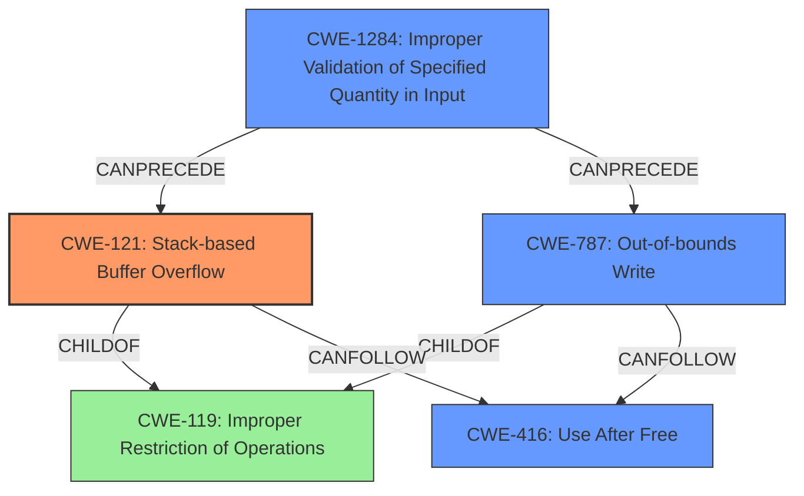

# Final Resolution for CVE-2022-41198

# Summary 
| CWE ID | CWE Name | Confidence | CWE Abstraction Level | CWE Vulnerability Mapping Label | CWE-Vulnerability Mapping Notes |
|---|---|---|---|---|---|
| CWE-121 | CWE-121: Stack-based Buffer Overflow | 0.8 | Variant | Allowed | Primary CWE |
| CWE-787 | CWE-787: Out-of-bounds Write | 0.6 | Base | Allowed | Secondary Candidate |
| CWE-416 | CWE-416: Use After Free | 0.6 | Base | Allowed | Secondary Candidate |
| CWE-1284 | CWE-1284: Improper Validation of Specified Quantity in Input | 0.3 | Base | Allowed | Contributing Factor |

## Evidence and Confidence

*   **Confidence Score:** 0.8
*   **Evidence Strength:** MEDIUM

## Relationship Analysis
The primary CWE is CWE-121 (Stack-based Buffer Overflow), which is a variant of CWE-119 (Improper Restriction of Operations within the Bounds of a Memory Buffer). CWE-787 (Out-of-bounds Write) is a related base CWE, as stack overflows inherently involve writing beyond buffer boundaries. CWE-416 (Use After Free) is considered due to the "dangling pointer" aspect of the vulnerability, and CWE-1284 (Improper Validation of Specified Quantity in Input) may precede the overflow. The relationship analysis supports the selection of CWE-121 as primary due to the explicit mention of "stack-based overflow" in the description.

## Vulnerability Chain
The vulnerability chain starts with a potentially unvalidated size from a SketchUp file (CWE-1284), leading to a stack-based buffer overflow (CWE-121) and potentially a use-after-free condition (CWE-416) if the overflow overwrites memory that is later accessed via a dangling pointer.

## Summary of Analysis
The initial analysis correctly identified CWE-121 as the primary **WEAKNESS**. The criticism highlighted the importance of considering CWE-416 given the "dangling pointer" aspect. The final decision takes this into account, making CWE-416 a secondary candidate. The inclusion of CWE-1284 as a contributing factor acknowledges the potential for improper input validation leading to the overflow.

The vulnerability description states: "Due to lack of proper memory management, when a victim opens a manipulated SketchUp (.skp, SketchUp.x3d) file received from untrusted sources in SAP 3D Visual Enterprise Viewer - version 9, it is possible that a Remote Code Execution can be triggered when payload forces a stack-based overflow or a re-use of dangling pointer which refers to overwritten space in memory."

*   The graph relationships support the selection of CWE-121 as primary, given its direct link to CWE-119. The possibility of CWE-787 and CWE-416 as secondary candidates is supported by the "dangling pointer" aspect. CWE-1284 is included to map the possibility of improper input validation.
*   The selected CWEs are at the optimal level of specificity. CWE-121 is a variant, providing a specific type of buffer overflow. CWE-787 and CWE-416 are base CWEs that describe the root cause and potential impact.
*   The confidence score reflects the strength of evidence. CWE-121 has the highest confidence (0.8) due to the explicit mention of "stack-based overflow". CWE-787 and CWE-416 have a confidence score of 0.6. CWE-1284 has lower confidence score of 0.3 as an additional contributing factor.