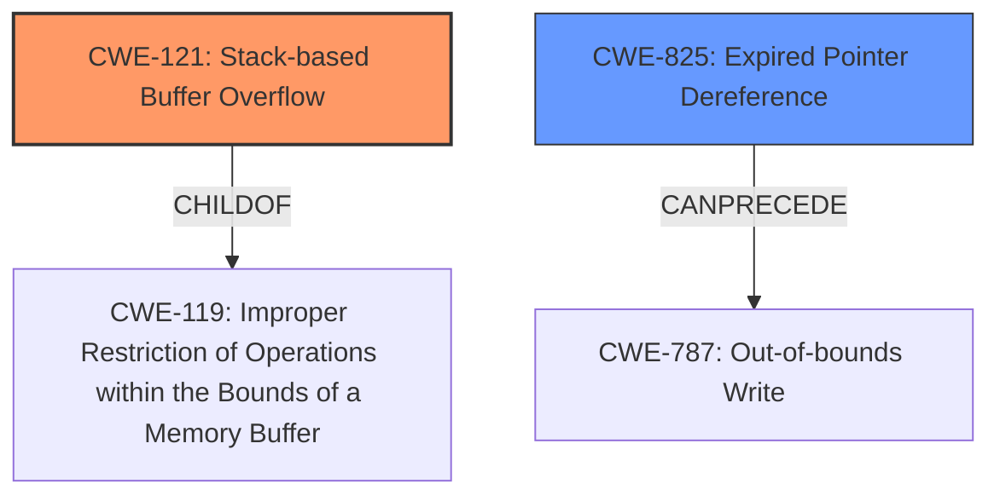

# Final Resolution for CVE-2022-41199

# Summary
| CWE ID  | CWE Name                        | Confidence | CWE Abstraction Level | CWE Vulnerability Mapping Label | CWE-Vulnerability Mapping Notes |
| :-------- | :------------------------------ | :--------- | :-------------------- | :------------------------------ | :------------------------------ |
| CWE-121 | Stack-based Buffer Overflow     | 0.90       | Variant             | Allowed                       | Primary CWE. Occurs due to lack of bounds checking before copying data to a stack buffer. |
| CWE-825 | Expired Pointer Dereference     | 0.75       | Base                | Allowed                       | Secondary Candidate. Results from re-using a pointer that is no longer valid. Can lead to CWE-787. |

## Evidence and Confidence

*   **Confidence Score:** 0.85
*   **Evidence Strength:** HIGH

## Relationship Analysis
The primary CWE is CWE-121 **Stack-based Buffer Overflow**, which is a variant of CWE-119 **Improper Restriction of Operations within the Bounds of a Memory Buffer**. The secondary CWE is CWE-825 **Expired Pointer Dereference**. CWE-825 can precede CWE-787 **Out-of-bounds Write**. The **lack of proper memory management** is the root cause, and this can lead to a stack overflow or a use-after-free condition.

## Vulnerability Chain
The vulnerability chain begins with a **lack of proper memory management**. This leads to two potential weaknesses: a **stack-based buffer overflow (CWE-121)** when processing a manipulated Open Inventor File (.iv, vrml.x3d), or a **use-after-free (CWE-825)** when a dangling pointer is re-used. Both of these weaknesses can lead to **remote code execution (RCE)**.

## Summary of Analysis
The initial analysis and criticism both agree on the selection of CWE-121 and CWE-825. The vulnerability description explicitly mentions a "**stack-based overflow**" and a "**re-use of dangling pointer**" due to "**lack of proper memory management**". CWE-121 is selected as the primary CWE because it directly addresses the stack-based overflow condition. CWE-825 is selected as a secondary CWE because it addresses the use-after-free scenario. The graph relationships influenced the decision to select these CWEs because they show how these weaknesses can lead to remote code execution. The selected CWEs are at the optimal level of specificity because they are more specific than CWE-119, which is a more general weakness. I agree with the above analysis.