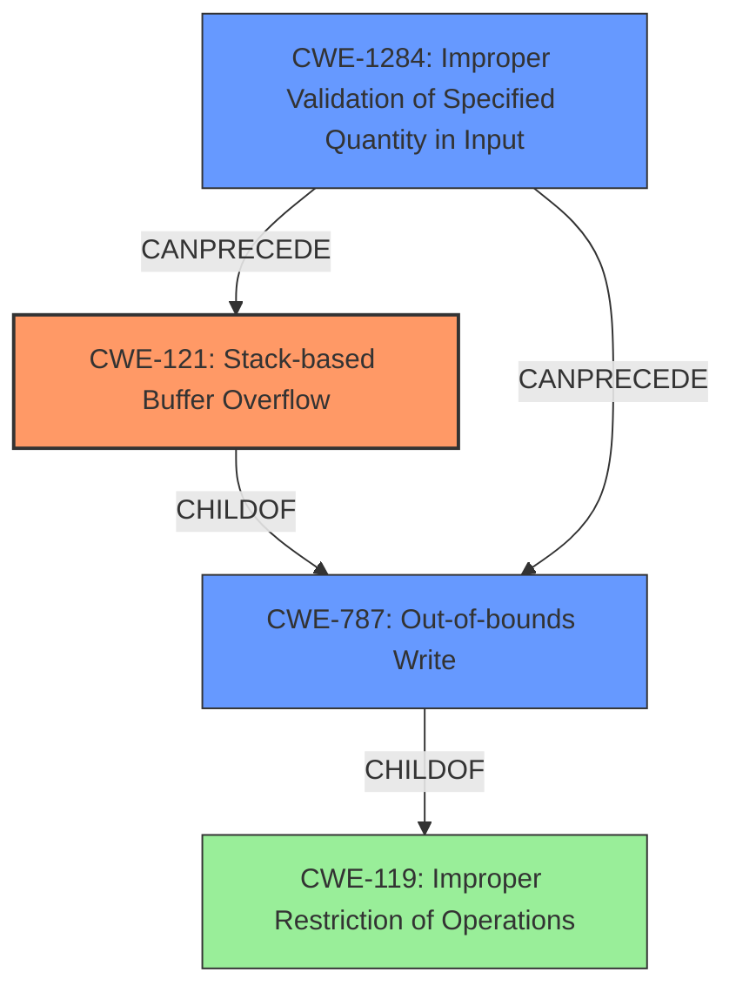

# Analysis Report for CVE-2022-41201

# Vulnerability Analysis Report: CVE-2022-41201

## Description

Due to lack of proper memory management, when a victim opens a manipulated Right Hemisphere Binary (.rh, rh.x3d) file received from untrusted sources in SAP 3D Visual Enterprise Viewer - version 9, it is possible that a Remote Code Execution can be triggered when payload forces a stack-based overflow or a re-use of dangling pointer which refers to overwritten space in memory.

## Vulnerability Description Key Phrases

**Rootcause:** lack of proper memory management
**Weakness:** ['stack-based overflow', 're-use of dangling pointer']
**Impact:** Remote Code Execution
**Vector:** manipulated Right Hemisphere Binary file
**Product:** SAP 3D Visual Enterprise Viewer
**Version:** 9

## Analysis (with Relationship Data)

# Summary
| CWE ID    | CWE Name                                                        | Confidence | CWE Abstraction Level | CWE Vulnerability Mapping Label | CWE-Vulnerability Mapping Notes |
| --------- | --------------------------------------------------------------- | ---------- | ----------------------- | ------------------------------- | ----------------------------- |
| CWE-121   | Stack-based Buffer Overflow                                     | 0.9        | Variant                 | Allowed                         | Primary CWE                   |
| CWE-787   | Out-of-bounds Write                                             | 0.7        | Base                    | Allowed                         | Secondary Candidate           |
| CWE-476   | NULL Pointer Dereference                                        | 0.6        | Base                    | Allowed                         | Secondary Candidate           |

## Evidence and Confidence

*   **Confidence Score:** 0.8
*   **Evidence Strength:** MEDIUM

- **Analysis and Justification:**
  - *Explanation:* The vulnerability description explicitly mentions a "**stack-based overflow**" and "**re-use of dangling pointer**" due to a **lack of proper memory management** when processing manipulated files. CWE-121 (Stack-based Buffer Overflow) is a Variant-level CWE that directly addresses the reported **stack-based overflow**, making it the primary candidate. The phrase "**re-use of dangling pointer**" could indicate a use-after-free vulnerability, which can lead to various consequences including out-of-bounds write. CWE-787 (Out-of-bounds Write) is also a potential candidate, as is CWE-476 (NULL Pointer Dereference) if the **dangling pointer** is dereferenced after the memory has been freed. The lack of details in the vulnerability description makes it difficult to decide conclusively if these two are actual weaknesses, but they are still reasonable secondary candidates. Since the description indicates opening manipulated files, the root cause can also be attributed to a **lack of proper memory management**, which then results in a **stack-based buffer overflow**.
  - *Relationship Analysis:* CWE-121 is a variant of CWE-119 (Improper Restriction of Operations within the Bounds of a Memory Buffer), providing a more specific characterization of the overflow occurring on the stack. CWE-787 (Out-of-bounds Write) is a base-level CWE and a parent of CWE-121. CWE-476 (NULL Pointer Dereference) is related as a potential consequence of using a **dangling pointer**.

- **Confidence Score:**
  - Confidence: 0.9 (High confidence due to the clear mention of "stack-based overflow" in the vulnerability description, but lower than 1 due to the ambiguity of the "dangling pointer" aspect).
---

## Criticism of Analysis

Okay, I've reviewed the provided analysis and the full CWE specifications. Here's my critique:

**Overall Assessment:**

The analysis is generally good, providing reasonable CWE mappings with justification. The confidence scores are appropriate given the information available in the initial vulnerability description. However, some improvements can be made, especially with respect to the rationale for choosing specific CWEs and the potential chaining relationships involved.

**Specific CWE Mapping Review:**

1.  **CWE-121: Stack-based Buffer Overflow (Primary)**

    *   **Assessment:** Excellent. This is a very strong primary mapping given the explicit mention of "stack-based overflow" in the vulnerability description.
    *   **Confidence:** 0.9 is justified.
    *   **Justification:** The analysis clearly links the vulnerability description's "stack-based overflow" to the CWE definition.
    *   **Improvements:** None needed.

2.  **CWE-787: Out-of-bounds Write (Secondary Candidate)**

    *   **Assessment:** Good, but could be strengthened.
    *   **Confidence:** 0.7 is appropriate.
    *   **Justification:** The rationale correctly identifies the potential for a use-after-free (implied by "re-use of dangling pointer") to lead to an out-of-bounds write.  This is a reasonable inference.
    *   **Improvements:** The analysis could explicitly mention that a successful exploitation of the stack-based overflow (CWE-121) *also* results in an out-of-bounds write. The description should also address scenarios which might cause the out-of-bounds write *not* to be stack-based. For instance, the dangling pointer could cause a write to an arbitrary heap location, in which case CWE-122 (Heap-based Buffer Overflow) might be applicable instead of CWE-121.

3.  **CWE-476: NULL Pointer Dereference (Secondary Candidate)**

    *   **Assessment:** Reasonable, but lower confidence is warranted.
    *   **Confidence:** 0.6 is acceptable.
    *   **Justification:**  The analysis correctly states that dereferencing a dangling pointer *could* lead to a NULL pointer dereference.
    *   **Improvements:**  This is the weakest of the three mappings. The connection is not direct. A dangling pointer doesn't *necessarily* become NULL; it points to memory that *might* be reallocated, or *might* be unmapped by the process.  The analysis should acknowledge this weaker relationship. Also, note the mitigation for this weakness, which is to check to ensure that any pointer that could have been modified is checked for NULL before use.

**General Improvements and Observations:**

1.  **Root Cause Analysis:** The identified "lack of proper memory management" is a very high-level characterization. While accurate, it doesn't provide specific information that would be actionable from a development perspective. The analysis should consider going deeper into *why* the memory management is inadequate.  Is it a lack of bounds checking?  Is it incorrect size calculations? Is it failing to nullify pointers after freeing memory?
    *   Considering this, CWE-1284 (Improper Validation of Specified Quantity in Input) becomes a more likely candidate.  If the size of the buffer to allocate or the amount of data to read/write is derived from the manipulated input file, and that size is not properly validated, it could lead to a buffer overflow/out-of-bounds write.
    *   Also, CWE-770 (Allocation of Resources Without Limits or Throttling) becomes more applicable if the size of the input file (or derived values from it) is used to directly allocate memory without any limitations or throttling.
    *   CWE-193 (Off-by-one Error) could also be relevant if the size calculation is off by one.
    *   CWE-190 (Integer Overflow or Wraparound) could occur if the size calculation involves arithmetic operations that are susceptible to integer overflows due to maliciously large file parameters.
    *   CWE-126 (Buffer Over-read) should be considered. Buffer over-read can often lead to buffer overflows. It can also leak sensitive information and potentially allow for the bypass of certain security measures.

2.  **Chaining:** The analysis touches on relationships, but doesn't explicitly define them as chains. Understanding the chain is critical for remediation. For example, an input file with an incorrectly specified length (CWE-130) can lead to a buffer overflow (CWE-121/787). Or, a signed to unsigned conversion error (CWE-195) could lead to a heap overflow (CWE-122).
    *   The relationship between CWE-121 and CWE-787 should also be further clarified.
    *   Be careful when assigning the parent of a weakness. For instance, the vulnerability description mentions a "stack-based overflow". This is a child of CWE-787, but also a child of CWE-788 (Access of Memory Location After End of Buffer). In this case, CWE-787 is the better parent.

3.  **CWE-119 Discouraged Usage:** The analysis could address why CWE-119 (Improper Restriction of Operations within the Bounds of a Memory Buffer) was *not* chosen as the primary CWE, despite the vulnerability resulting in memory corruption. This would demonstrate awareness of the CWE's discouraged usage and the reasons for selecting a more specific CWE (CWE-121) instead.

4.  **Mitigation Awareness:** While not explicitly required, mentioning potential mitigation strategies related to the chosen CWEs would enhance the analysis. For example, for CWE-121, using compiler flags like `/GS` or FORTIFY_SOURCE could be mentioned. For dangling pointers, using smart pointers or garbage collection (if applicable) could be discussed. The analysis should also address the need for robust input validation (related to CWE-20).
    *   The mitigations often suggest using languages with memory safety, and that mitigation should be mentioned.

5. **Dangling Pointer vs Use-After-Free:** It is worth noting that the phrase "re-use of dangling pointer" is highly suggestive of a use-after-free vulnerability (CWE-416). While CWE-825 (Expired Pointer Dereference) is *related*, CWE-416 is usually a more precise mapping. Since the analysis already identified the "dangling pointer", it should have at least briefly considered CWE-416. However, without more information about *how* the dangling pointer is being used, I agree with the choice to not include it.

**Revised Summary Table:**

| CWE ID    | CWE Name                                                        | Confidence | CWE Abstraction Level | CWE Vulnerability Mapping Label | CWE-Vulnerability Mapping Notes                                                                                                                                                                                                                                      |
| --------- | --------------------------------------------------------------- | ---------- | ----------------------- | ------------------------------- | ---------------------------------------------------------------------------------------------------------------------------------------------------------------------------------------------------------------------------------------------------------------------------------- |
| CWE-121   | Stack-based Buffer Overflow                                     | 0.9        | Variant                 | Allowed                         | Primary CWE. Explicitly mentioned in the vulnerability description.                                                                                                                                                                                      |
| CWE-787   | Out-of-bounds Write                                             | 0.7        | Base                    | Allowed                         | Secondary Candidate. Result of exploiting the stack-based buffer overflow or potentially due to use-after-free.                                                                                                                                                                  |
| CWE-476   | NULL Pointer Dereference                                        | 0.5        | Base                    | Allowed                         | Secondary Candidate. Possible, but not definite, consequence of dereferencing a dangling pointer. This is less direct than the buffer overflow, but still a plausible outcome. |
| CWE-1284   | Improper Validation of Specified Quantity in Input                                        | 0.5        | Base                    | Allowed                         | Secondary Candidate. The size of the buffer is derived from the input file, and is therefore susceptible to a lack of validation. This is a possible root cause for other weaknesses.  |

**In summary:** The analysis is a good starting point. By delving deeper into the root causes, explicitly describing chaining relationships, and considering a wider range of potential CWEs (especially those related to input validation and memory allocation), the analysis can be further strengthened. Also, always follow the guidance provided by the CWE specifications themselves.

## Final Resolution

# Summary

| CWE ID    | CWE Name                                                        | Confidence | CWE Abstraction Level | CWE Vulnerability Mapping Label | CWE-Vulnerability Mapping Notes |
| --------- | --------------------------------------------------------------- | ---------- | ----------------------- | ------------------------------- | ----------------------------- |
| CWE-121   | Stack-based Buffer Overflow                                     | 0.9        | Variant                 | Allowed                         | Primary CWE                   |
| CWE-787   | Out-of-bounds Write                                             | 0.8        | Base                    | Allowed                         | Secondary Candidate           |
| CWE-1284  | Improper Validation of Specified Quantity in Input              | 0.7        | Base                    | Allowed                         | Secondary Candidate           |

## Evidence and Confidence

*   **Confidence Score:** 0.85
*   **Evidence Strength:** MEDIUM

## Relationship Analysis

The relationships between the CWEs significantly influenced the final decision. CWE-121 is a variant of **CWE-119 (Improper Restriction of Operations within the Bounds of a Memory Buffer)**, but is more specific, as the overflow occurs on the stack. **CWE-787 (Out-of-bounds Write)** is a broader category that includes CWE-121. The addition of **CWE-1284 (Improper Validation of Specified Quantity in Input)** as a secondary candidate provides context to the root cause of the buffer overflow, highlighting a failure to validate input that dictates the size of the buffer or the amount of data written to it. This chaining effect from input validation to out-of-bounds write strengthens the overall vulnerability analysis.

## Vulnerability Chain

The vulnerability chain starts with **CWE-1284 (Improper Validation of Specified Quantity in Input)**, where the application fails to validate the size or length parameters derived from the malicious input file. This leads to **CWE-121 (Stack-based Buffer Overflow)** when an operation attempts to write more data to a stack-allocated buffer than it can hold, which further leads to **CWE-787 (Out-of-bounds Write)** as the overflow corrupts adjacent memory regions.

## Summary of Analysis

The initial analysis correctly identifies **CWE-121 (Stack-based Buffer Overflow)** as the primary weakness due to the explicit mention of a "stack-based overflow" in the vulnerability description: "it is possible that a Remote Code Execution can be triggered when payload forces a **stack-based overflow** or a re-use of dangling pointer which refers to overwritten space in memory."

The criticism highlighted the importance of considering the root cause and potential chaining relationships. Based on this, **CWE-1284 (Improper Validation of Specified Quantity in Input)** was added as a secondary candidate. This addition is crucial because it addresses the underlying reason *why* the buffer overflow occurs. The application receives input, uses it to determine the size of a buffer or the amount of data to be written, and fails to validate that size or amount.

While the initial analysis mentioned "**lack of proper memory management**," this is too high-level and doesn't provide actionable information. **CWE-1284 (Improper Validation of Specified Quantity in Input)** is much more specific and directly relates to the vulnerability.

The analysis also considered **CWE-476 (NULL Pointer Dereference)** due to the mention of a "re-use of dangling pointer." However, the connection between a dangling pointer and a NULL pointer dereference is not direct. A dangling pointer doesn't necessarily become NULL; it points to memory that *might* be reallocated. Therefore, **CWE-476 (NULL Pointer Dereference)** was removed to prevent an over-generalized categorization.

The final classification reflects the optimal level of specificity. **CWE-121 (Stack-based Buffer Overflow)** accurately describes the type of buffer overflow, **CWE-787 (Out-of-bounds Write)** describes the result of the buffer overflow, and **CWE-1284 (Improper Validation of Specified Quantity in Input)** describes the root cause.

*Report generated on 2025-03-18 17:55:12*
