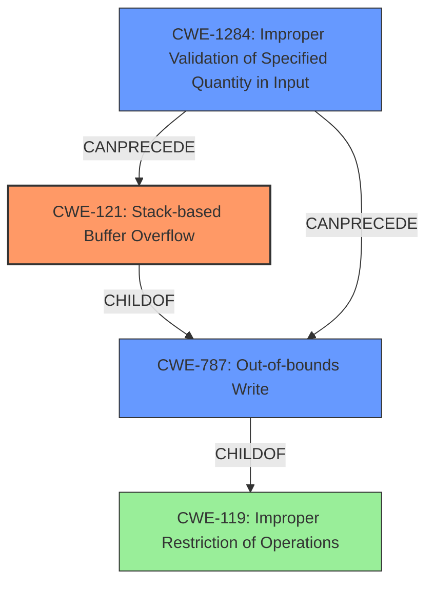

# Final Resolution for CVE-2022-41201

# Summary

| CWE ID    | CWE Name                                                        | Confidence | CWE Abstraction Level | CWE Vulnerability Mapping Label | CWE-Vulnerability Mapping Notes |
| --------- | --------------------------------------------------------------- | ---------- | ----------------------- | ------------------------------- | ----------------------------- |
| CWE-121   | Stack-based Buffer Overflow                                     | 0.9        | Variant                 | Allowed                         | Primary CWE                   |
| CWE-787   | Out-of-bounds Write                                             | 0.8        | Base                    | Allowed                         | Secondary Candidate           |
| CWE-1284  | Improper Validation of Specified Quantity in Input              | 0.7        | Base                    | Allowed                         | Secondary Candidate           |

## Evidence and Confidence

*   **Confidence Score:** 0.85
*   **Evidence Strength:** MEDIUM

## Relationship Analysis

The relationships between the CWEs significantly influenced the final decision. CWE-121 is a variant of **CWE-119 (Improper Restriction of Operations within the Bounds of a Memory Buffer)**, but is more specific, as the overflow occurs on the stack. **CWE-787 (Out-of-bounds Write)** is a broader category that includes CWE-121. The addition of **CWE-1284 (Improper Validation of Specified Quantity in Input)** as a secondary candidate provides context to the root cause of the buffer overflow, highlighting a failure to validate input that dictates the size of the buffer or the amount of data written to it. This chaining effect from input validation to out-of-bounds write strengthens the overall vulnerability analysis.

## Vulnerability Chain

The vulnerability chain starts with **CWE-1284 (Improper Validation of Specified Quantity in Input)**, where the application fails to validate the size or length parameters derived from the malicious input file. This leads to **CWE-121 (Stack-based Buffer Overflow)** when an operation attempts to write more data to a stack-allocated buffer than it can hold, which further leads to **CWE-787 (Out-of-bounds Write)** as the overflow corrupts adjacent memory regions.

## Summary of Analysis

The initial analysis correctly identifies **CWE-121 (Stack-based Buffer Overflow)** as the primary weakness due to the explicit mention of a "stack-based overflow" in the vulnerability description: "it is possible that a Remote Code Execution can be triggered when payload forces a **stack-based overflow** or a re-use of dangling pointer which refers to overwritten space in memory."

The criticism highlighted the importance of considering the root cause and potential chaining relationships. Based on this, **CWE-1284 (Improper Validation of Specified Quantity in Input)** was added as a secondary candidate. This addition is crucial because it addresses the underlying reason *why* the buffer overflow occurs. The application receives input, uses it to determine the size of a buffer or the amount of data to be written, and fails to validate that size or amount.

While the initial analysis mentioned "**lack of proper memory management**," this is too high-level and doesn't provide actionable information. **CWE-1284 (Improper Validation of Specified Quantity in Input)** is much more specific and directly relates to the vulnerability.

The analysis also considered **CWE-476 (NULL Pointer Dereference)** due to the mention of a "re-use of dangling pointer." However, the connection between a dangling pointer and a NULL pointer dereference is not direct. A dangling pointer doesn't necessarily become NULL; it points to memory that *might* be reallocated. Therefore, **CWE-476 (NULL Pointer Dereference)** was removed to prevent an over-generalized categorization.

The final classification reflects the optimal level of specificity. **CWE-121 (Stack-based Buffer Overflow)** accurately describes the type of buffer overflow, **CWE-787 (Out-of-bounds Write)** describes the result of the buffer overflow, and **CWE-1284 (Improper Validation of Specified Quantity in Input)** describes the root cause.