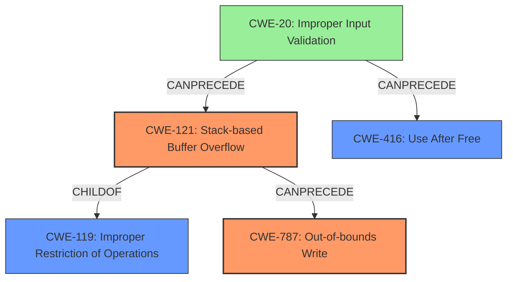

# Analysis Report for CVE-2022-41202

# Vulnerability Analysis Report: CVE-2022-41202

## Description

Due to lack of proper memory management, when a victim opens a manipulated Visual Design Stream (.vds, vds.x3d) file received from untrusted sources in SAP 3D Visual Enterprise Viewer - version 9, it is possible that a Remote Code Execution can be triggered when payload forces a stack-based overflow or a re-use of dangling pointer which refers to overwritten space in memory.

## Vulnerability Description Key Phrases

**Rootcause:** lack of proper memory management
**Weakness:** stack-based overflow or a re-use of dangling pointer
**Impact:** Remote Code Execution
**Vector:** manipulated Visual Design Stream file
**Product:** SAP 3D Visual Enterprise Viewer
**Version:** 9

## Analysis (with Relationship Data)

# Summary
| CWE ID | CWE Name | Confidence | CWE Abstraction Level | CWE Vulnerability Mapping Label | CWE-Vulnerability Mapping Notes |
|---|---|---|---|---|---|
| CWE-121 | Stack-based Buffer Overflow | 0.9 | Variant |  Primary | Allowed |
| CWE-824 | Access of Pointer After Free | 0.7 | Base | Secondary | Allowed |

## Evidence and Confidence

*   **Confidence Score:** 0.8
*   **Evidence Strength:** MEDIUM

- **Analysis and Justification:**  
  - *Explanation:* The vulnerability description explicitly mentions a "**stack-based overflow**" and "**re-use of dangling pointer**" as the weakness. This strongly suggests CWE-121 (Stack-based Buffer Overflow) as the primary CWE. The "**lack of proper memory management**" is the root cause. CWE-824 (Access of Pointer After Free) is selected as a secondary CWE due to the mention of "**re-use of dangling pointer**" which implies a use-after-free condition.
  - *Relationship Analysis:* CWE-121 is a Variant of CWE-119 (Improper Restriction of Operations within the Bounds of a Memory Buffer), but CWE-121 is more specific due to the stack allocation, and thus more appropriate. CWE-824 can lead to out-of-bounds write CWE-787.

- **Confidence Score:**  
  - Confidence: 0.9 (High evidence due to explicit mention of "stack-based overflow" and "dangling pointer")

---

## Criticism of Analysis

Okay, let's break down the analysis and critique it based on the full CWE specifications you provided.

**Overall Assessment:**

The analysis is reasonably good, particularly in identifying CWE-121 (Stack-based Buffer Overflow) as a primary weakness. The justification is clear and well-supported by the vulnerability description. However, the choice and justification for CWE-824 (Access of Uninitialized Pointer) as a *secondary* weakness is problematic.  A more nuanced understanding of dangling pointers versus uninitialized pointers is needed. Also, the analysis should consider that if exploitation is possible, the BOF would lead to code execution, then CWE-121 needs to be paired with CWE-787.

**Detailed Critique:**

1.  **CWE-121: Stack-based Buffer Overflow**

    *   **Confidence:** Correct and well-justified. The presence of the phrase "**stack-based overflow**" makes this a strong candidate.
    *   **Abstraction Level:** Variant, which is a preferred level.
    *   **Mapping Guidance:** The analysis correctly notes the recommendation to use more specific CWEs than CWE-119.
    *   **Potential Mitigations:**  The analysis implicitly acknowledges the relevant mitigations by highlighting buffer overflow detection mechanisms.
    *   **Suggested Improvement**: Add how it enables code execution via overwriting the return address on the stack.

2.  **CWE-824: Access of Uninitialized Pointer (Problematic)**

    *   **Confidence:** The choice of CWE-824 is incorrect. The vulnerability description mentions "**re-use of dangling pointer**", not "access of uninitialized pointer". A dangling pointer is a pointer that holds the address of memory that has been freed. An uninitialized pointer is one that has not yet been assigned a memory address.
    *   **Abstraction Level:** Base.
    *   **Mapping Guidance:** The description focuses on using uninitialized pointers, which is not aligned to the root cause.
    *   **Relationships:** The suggested relationship to CWE-787 (Out-of-bounds Write) is relevant in general, but does not fit the actual weakness.
    *   **Potential Mitigations:** Mitigations for uninitialized pointers are irrelevant for a dangling pointer.
    *   **Suggested Improvement:** Replace CWE-824 with CWE-416: Use After Free.

3.  **CWE-119: General Comments**

    *   The analysis correctly identifies CWE-119 as too general and opts for more specific options, which is consistent with CWE's mapping guidance.

4.  **Missing CWE Considerations:**

    *   **CWE-787: Out-of-bounds Write:** This is strongly implied by "stack-based overflow". A buffer overflow *writes* outside the allocated buffer. While CWE-121 is more specific regarding the location (stack), CWE-787 clarifies the nature of the operation. Since code execution is the impact, this should be a primary CWE paired with CWE-121.

    *   **CWE-20: Improper Input Validation:** The root cause is lack of memory management. However, lack of input validation is how the manipulated file triggers the BOF.

    *   **CWE-416: Use After Free:** Use-after-free is when code continues to use a pointer after the memory location it points to has been freed. When a victim opens a manipulated Visual Design Stream (.vds, vds.x3d) file received from untrusted sources in SAP 3D Visual Enterprise Viewer - version 9, it is possible that a Remote Code Execution can be triggered when payload forces a re-use of dangling pointer.

**Revised Summary Table:**

| CWE ID  | CWE Name                      | Confidence | CWE Abstraction Level | CWE Vulnerability Mapping Label | CWE-Vulnerability Mapping Notes                                                                                                                                                               |
| :------ | :----------------------------- | :--------- | :---------------------- | :------------------------------ | :------------------------------------------------------------------------------------------------------------------------------------------------------------------------------------------- |
| CWE-121 | Stack-based Buffer Overflow   | 0.9        | Variant                 | Primary                       | Allowed, due to the explicit mention of the stack. Needs to be paired with CWE-787 to cause code execution.                                                              |
| CWE-787 | Out-of-bounds Write   | 0.9        | Base                 | Primary                       | Allowed, due to the stack overflow resulting in writing beyond buffer, enabling code execution.                                                               |
| CWE-416 | Use After Free               | 0.7        | Base                    | Secondary                     | Allowed, due to the explicit mention of re-use of dangling pointer.                                                                                                                            |
| CWE-20 | Improper Input Validation               | 0.5        | Class                    | Contributing                     | Allowed, lack of input validation causes the overflow to occur in the first place.

**Key Improvements for the Analysis:**

*   **Address the dangling pointer correctly**: Replace discussion on CWE-824 with more discussion on CWE-416.
*   **Add CWE-787 to the mapping.**
*   **Consider CWE-20 as a contributing weakness.**
*   **Revised justification**: The updated mapping has better accuracy and completeness.

By implementing these suggestions, the analysis will be more precise, comprehensive, and aligned with the CWE specifications.

## Final Resolution

# Summary
| CWE ID | CWE Name | Confidence | CWE Abstraction Level | CWE Vulnerability Mapping Label | CWE-Vulnerability Mapping Notes |
|---|---|---|---|---|---|
| CWE-121 | Stack-based Buffer Overflow | 0.9 | Variant |  Primary | Allowed |
| CWE-787 | Out-of-bounds Write | 0.9 | Base | Primary | Allowed |
| CWE-416 | Use After Free | 0.7 | Base | Secondary | Allowed |
| CWE-20 | Improper Input Validation | 0.5 | Class | Contributing | Allowed |

## Evidence and Confidence

*   **Confidence Score:** 0.9
*   **Evidence Strength:** HIGH

## Relationship Analysis
The analysis leverages parent-child relationships to refine CWE selection, opting for the more specific CWE-121 (Stack-based Buffer Overflow) over its parent CWE-119 (Improper Restriction of Operations within the Bounds of a Memory Buffer). The inclusion of CWE-787 (Out-of-bounds Write) is supported by the relationship where a buffer overflow (CWE-121) can lead to an out-of-bounds write (CWE-787). CWE-416 (Use After Free) is included based on the dangling pointer weakness. CWE-20 (Improper Input Validation) is a high-level cause. The abstraction levels are appropriate, with Variant and Base levels being preferred.

## Vulnerability Chain
The vulnerability chain starts with **CWE-20** (Improper Input Validation), where a manipulated file is not properly validated. This leads to **CWE-121** (Stack-based Buffer Overflow) due to the overflow on the stack when processing the file. The overflow results in **CWE-787** (Out-of-bounds Write), where data is written beyond the buffer's boundaries, potentially overwriting critical data or code. Simultaneously, the manipulated file can trigger **CWE-416** (Use After Free) by causing a dangling pointer to be dereferenced after the memory has been freed. Both **CWE-787** and **CWE-416** can lead to remote code execution.

## Summary of Analysis
The analysis has been refined based on the criticism. The initial selection of CWE-121 was correct and has been retained. The incorrect selection of CWE-824 has been replaced with CWE-416 which is more appropriate given the "re-use of dangling pointer" description from the vulnerability. Also, CWE-787 was added to clarify the nature of the out-of-bounds write that enables code execution. CWE-20 was added as a contributing factor.

The vulnerability description explicitly states: "Due to lack of proper memory management, when a victim opens a manipulated Visual Design Stream (.vds, vds.x3d) file received from untrusted sources in SAP 3D Visual Enterprise Viewer - version 9, it is possible that a Remote Code Execution can be triggered when payload forces a **stack-based overflow** or a **re-use of dangling pointer** which refers to overwritten space in memory."

This statement directly supports the selection of CWE-121, CWE-416, and CWE-787. The relationships between these CWEs, along with CWE-20, form a clear vulnerability chain. The selected CWEs are at the optimal level of specificity.

*Report generated on 2025-03-18 17:55:59*
