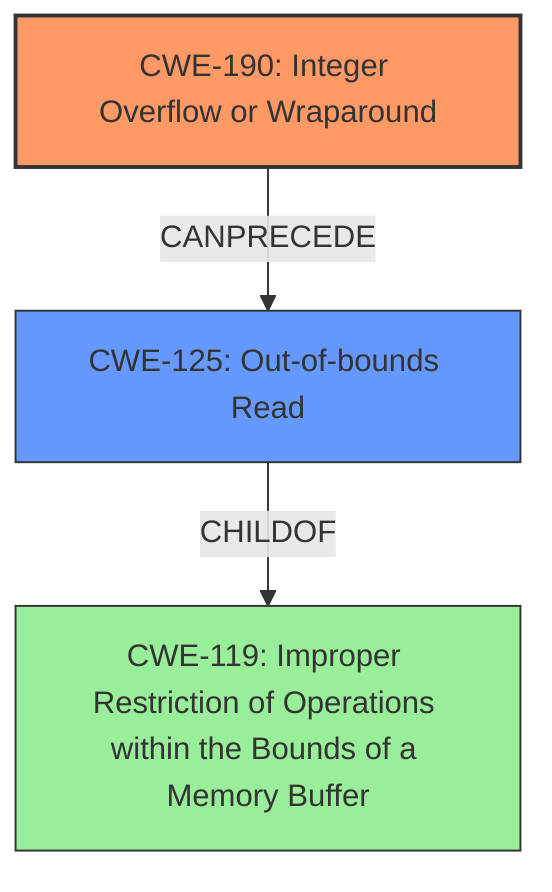

# Final Resolution for CVE-2022-41318

# Summary
| CWE ID | CWE Name | Confidence | CWE Abstraction Level | CWE Vulnerability Mapping Label | CWE-Vulnerability Mapping Notes |
|---|---|---|---|---|---|
| CWE-190 | Integer Overflow or Wraparound | 0.95 | Base | Primary | Allowed |
| CWE-125 | Out-of-bounds Read | 0.85 | Base | Secondary Candidate | Allowed |

## Evidence and Confidence

*   **Confidence Score:** 0.95
*   **Evidence Strength:** HIGH

## Relationship Analysis
The primary weakness is **CWE-190 (Integer Overflow or Wraparound)**, which doesn't have direct parent-child relationships in the provided data, but it CanPrecede vulnerabilities related to memory corruption. The secondary weakness, **CWE-125 (Out-of-bounds Read)**, is a child of **CWE-119 (Improper Restriction of Operations within the Bounds of a Memory Buffer)**. The abstraction levels influenced the selection, favoring the Base level CWEs for direct mapping.

## Vulnerability Chain
The vulnerability chain starts with **CWE-190 (Integer Overflow or Wraparound)**. The incorrect integer overflow protection leads to a **buffer over-read**, which is **CWE-125 (Out-of-bounds Read)**. This results in unintended memory locations being read, potentially exposing sensitive information like cleartext credentials.

## Summary of Analysis
The initial analysis and criticism were well-reasoned and supported by the vulnerability description. The explicit mention of "incorrect integer-overflow protection" in the vulnerability description strongly supports the selection of **CWE-190 (Integer Overflow or Wraparound)** as the primary **ROOTCAUSE**. The resulting "buffer over-read" directly corresponds to **CWE-125 (Out-of-bounds Read)**, making it a relevant secondary CWE. The relationship analysis highlights the progression from integer overflow to out-of-bounds read. The chosen CWEs are at the optimal level of specificity, providing a clear and accurate representation of the vulnerability. The assessment is based on the evidence in the vulnerability description, specifically the phrase "incorrect integer-overflow protection" and the mention of "buffer over-read". The suggestion to evaluate **CWE-126 (Buffer Over-read)** was considered, but **CWE-125 (Out-of-bounds Read)** is retained because it accurately describes the **WEAKNESS** of reading beyond the buffer's boundaries due to the overflow.