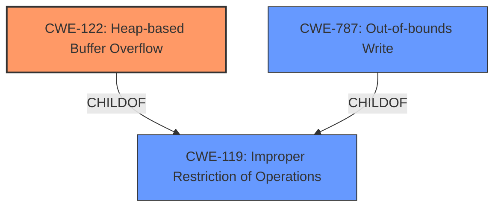

# Final Resolution for CVE-2022-4135

# Summary
| CWE ID | CWE Name | Confidence | CWE Abstraction Level | CWE Vulnerability Mapping Label | CWE-Vulnerability Mapping Notes |
|---|---|---|---|---|---|
| CWE-122 | Heap-based Buffer Overflow | 0.9 | Variant | Primary | Allowed |

## Evidence and Confidence

*   **Confidence Score:** 0.9
*   **Evidence Strength:** HIGH

## Relationship Analysis
The primary relationship impacting the decision is that CWE-122 (Heap-based Buffer Overflow) is a variant of CWE-119 (Improper Restriction of Operations within the Bounds of a Memory Buffer). Choosing CWE-122 provides a more specific classification due to the explicit mention of "heap" in the vulnerability description. The analysis considered and rejected CWE-787 (Out-of-bounds Write) because while it is related, CWE-122 provides more context regarding the memory region involved.

## Vulnerability Chain
The vulnerability chain starts with a **heap buffer overflow** (**CWE-122**). This allows an attacker to potentially overwrite data on the heap. If the attacker can overwrite function pointers or other critical data structures, this can lead to arbitrary code execution, potentially resulting in a sandbox escape.

## Summary of Analysis
The initial analysis and the provided criticism both converge on the conclusion that **CWE-122 (Heap-based Buffer Overflow)** is the most appropriate classification. The vulnerability description explicitly mentions a "heap buffer overflow," providing strong evidence for this classification. The criticism reinforces this choice, highlighting that CWE-122 is more specific than CWE-119 and CWE-787.

The decision is based on the following evidence from the vulnerability description: "Heap buffer overflow in GPU in Google Chrome prior to 107.0.5304.121 allowed a remote attacker who had compromised the renderer process to potentially perform a sandbox escape via a crafted HTML page."

The graph relationships influenced the decision by highlighting the hierarchical relationship between CWE-122 and CWE-119, reinforcing the choice of the more specific CWE.

The selected CWE is at the optimal level of specificity because it directly reflects the type of buffer overflow (heap-based) described in the vulnerability.