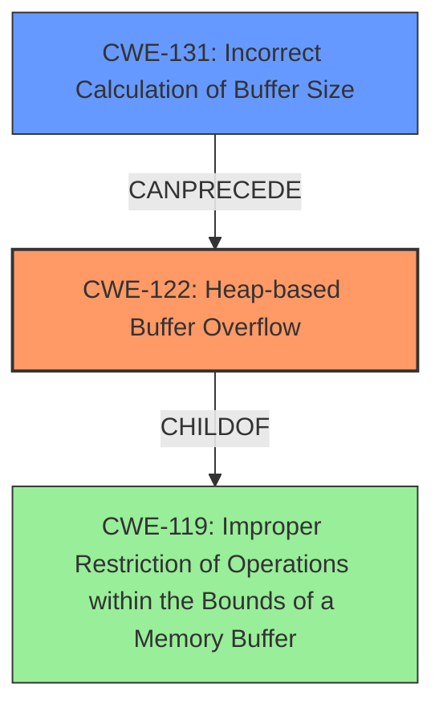

# Analysis Report for CVE-2022-4141

# Vulnerability Analysis Report: CVE-2022-4141

## Description

Heap based buffer overflow in vim/vim 9.0.0946 and below by allowing an attacker to CTRL-W gf in the expression used in the RHS of the substitute command.

## Vulnerability Description Key Phrases

**Rootcause:** Heap based buffer overflow
**Vector:** CTRL-W gf in the expression used in the RHS of the substitute command
**Attacker:** attacker
**Product:** vim/vim
**Version:** 9.0.0946 and below

## Analysis (with Relationship Data)

# Summary
| CWE ID | CWE Name | Confidence | CWE Abstraction Level | CWE Vulnerability Mapping Label | CWE-Vulnerability Mapping Notes |
|---|---|---|---|---|---|
| CWE-122 | Heap-based Buffer Overflow | 0.95 | Variant | Allowed | Primary CWE |

## Evidence and Confidence

*   **Confidence Score:** 0.95
*   **Evidence Strength:** HIGH

- **Analysis and Justification:**  
  - *Explanation:* The vulnerability description explicitly states "**Heap based buffer overflow**" in vim/vim. CWE-122 (Heap-based Buffer Overflow) is a variant of buffer overflow that occurs in the heap portion of memory. The description aligns directly with the CWE's definition, where a buffer allocated in the heap can be overwritten. The CVE Reference Links Content Summary also confirms that the root cause is due to an invalid memory access.
  
  - *Relationship Analysis:* CWE-122 is a variant of CWE-119 (Improper Restriction of Operations within the Bounds of a Memory Buffer), providing a more specific classification as the overflow occurs on the heap. There are no other relevant relationships that strongly influence the mapping.

- **Confidence Score:**  
  - *Example:* Confidence: 0.95 (High evidence from technical description and CVE reference materials)

---

## Criticism of Analysis

Okay, here's a review of the analysis, incorporating the full CWE specifications provided.

**Overall Assessment:**

The core identification of CWE-122 (Heap-based Buffer Overflow) is correct and well-supported. The analysis provides a strong justification based on the vulnerability description and CVE details. The confidence score of 0.95 is appropriate. However, the retriever results reveal a need for considering related CWEs as possible contributing factors or alternative perspectives.

**Detailed Review by Section:**

**1. Summary Table:**

*   | CWE ID  | CWE Name                    | Confidence | CWE Abstraction Level | CWE Vulnerability Mapping Label | CWE-Vulnerability Mapping Notes |
    | ------- | --------------------------- | ---------- | --------------------- | ------------------------------- | ---------------------------------- |
    | CWE-122 | Heap-based Buffer Overflow | 0.95       | Variant               | Allowed                       | Primary CWE                       |

*   **Assessment:** The summary is accurate and concise.

**2. Evidence and Confidence:**

*   **Confidence Score:** 0.95
*   **Evidence Strength:** HIGH

    *   **Analysis and Justification:**
        *   *Explanation:* The reasoning provided is clear, directly linking the vulnerability description ("Heap based buffer overflow") to the definition of CWE-122. The confirmation from the CVE Reference Links Content Summary adds further weight.
        *   *Relationship Analysis:* The discussion of the relationship between CWE-122 and CWE-119 is appropriate, highlighting the more specific nature of CWE-122.

    *   **Confidence Score:**
        *   *Example:* The rationale for the confidence score is well-explained.

*   **Assessment:**  The evidence and confidence section is well-written and justified.

**3. CWE Examples from Database:**

*   **Assessment:** These examples are relevant and support the selection of CWE-122.

**4. Relevant CWE Specifications:**

*   **CWE-122: Heap-based Buffer Overflow:**

    *   The description, relationships, mapping guidance, potential mitigations, and observed examples are all relevant.

*   **CWE-119: Improper Restriction of Operations within the Bounds of a Memory Buffer:**

    *   The inclusion of CWE-119 is important, but the analysis correctly identifies that CWE-122 is a more specific and appropriate mapping. The mapping guidance for CWE-119 ("Discouraged") is important to consider, and the explanation avoids misuse of CWE-119.

*   **Other CWEs from Retriever Results (CWE-190, CWE-193, CWE-124, CWE-126, CWE-120, CWE-839, CWE-131, CWE-191, CWE-121):**

    *   **CWE-190 (Integer Overflow or Wraparound) & CWE-191 (Integer Underflow):**  While not the primary cause, consider if integer overflows or underflows could play a *contributing* role, particularly in calculating buffer sizes. The mitigations for CWE-190 (language selection, libraries for safe integer handling) would be relevant considerations for preventing this class of vulnerability.
    *   **CWE-193 (Off-by-one Error):**  Off-by-one errors could contribute to buffer overflows, even if not the main cause. It is important to review the code for this possibility.
    *   **CWE-124 (Buffer Underwrite ('Buffer Underflow')):** While the main issue is an *overflow*, it's theoretically possible (though less likely) that an underflow could be related, especially if pointer arithmetic is involved.  Mitigations for CWE-124 stress validation of index and pointer arithmetic.
    *   **CWE-126 (Buffer Over-read):**  While the main issue is a write overflow, related code might also have read overflows. Consider if information exposure is also possible.
    *   **CWE-120 (Buffer Copy without Checking Size of Input ('Classic Buffer Overflow')):** It's worth briefly considering if the code uses unbounded buffer copies, which would make the overflow easier to exploit.
    *   **CWE-839 (Numeric Range Comparison Without Minimum Check):** Could a negative value (bypassing a maximum-only check) contribute to the overflow?
    *   **CWE-131 (Incorrect Calculation of Buffer Size):** *This is a very relevant CWE to consider.* Is the size of the buffer being calculated correctly? Erroneous size calculations are often the root cause of buffer overflows. The mitigations for CWE-131 are particularly important: understanding the programming language's numeric representation, accounting for size differences, and performing input validation on numeric inputs.
    *   **CWE-121 (Stack-based Buffer Overflow):** While the analysis correctly focuses on the heap, it's worth ensuring that similar code patterns don't also exist on the stack, potentially leading to stack-based overflows as well.

**Critique and Recommendations:**

1.  **Strong Justification for CWE-122:** The primary assessment is accurate and well-justified. The confidence level is appropriate.

2.  **Acknowledge Related CWEs:** While maintaining the focus on CWE-122, the analysis should *briefly* acknowledge the other CWEs suggested by the retriever results (especially CWE-131, CWE-190, CWE-193) and explain why they are *not* the primary cause, or how they *could* potentially contribute. This will demonstrate a more thorough understanding of the vulnerability.  For example, add a sentence like: "While the primary cause is a heap-based buffer overflow (CWE-122), it is possible that an incorrect calculation of the buffer size (CWE-131) contributes to the vulnerability. However, the available information does not provide enough details to confirm this."

3.  **Mitigation Considerations:** When discussing CWE-122, explicitly mention some of the potential mitigations provided in the CWE specification, such as:

    *   Using languages with automatic bounds checking.
    *   Using abstraction libraries for risky APIs.
    *   Employing compiler-based buffer overflow detection mechanisms (e.g., /GS flag, FORTIFY\_SOURCE).

4.  **Locking Condition:** As highlighted in the summary from the CVE reference links, "the issue arises when using the `CTRL-W gf` command within a substitution function which can lead to a text lock condition not being properly handled." Relate the concept of memory allocation and pointer usage during text locking to CWE-122.

**Revised Summary Table (Example):**

| CWE ID  | CWE Name                    | Confidence | CWE Abstraction Level | CWE Vulnerability Mapping Label | CWE-Vulnerability Mapping Notes                                                                                                |
| ------- | --------------------------- | ---------- | --------------------- | ------------------------------- | ------------------------------------------------------------------------------------------------------------------------------------ |
| CWE-122 | Heap-based Buffer Overflow | 0.95       | Variant               | Allowed                       | Primary CWE. Occurs due to improper handling of text lock conditions during file navigation within a substitution function.     |
| CWE-131 | Incorrect Calculation of Buffer Size| 0.20       | Base               | Allowed                      | Possible contributing factor.  Insufficient information to confirm, but should be considered during code review.   |

**Conclusion:**

The analysis is good overall, with a strong and accurate identification of CWE-122 as the primary vulnerability. By briefly acknowledging and discussing the other CWEs suggested by the retriever, and emphasizing potential mitigations from the CWE specifications, the analysis can be strengthened further. By also relating text locking and memory pointers to CWE-122, you can better the analysis.

## Final Resolution

# Summary
| CWE ID | CWE Name | Confidence | CWE Abstraction Level | CWE Vulnerability Mapping Label | CWE-Vulnerability Mapping Notes |
|---|---|---|---|---|---|
| CWE-122 | Heap-based Buffer Overflow | 0.95 | Variant | Allowed | Primary CWE. Occurs due to improper handling of text lock conditions during file navigation within a substitution function. |
| CWE-131 | Incorrect Calculation of Buffer Size | 0.30 | Base | Allowed | Possible contributing factor. Insufficient information to confirm, but should be considered during code review. |

## Evidence and Confidence

*   **Confidence Score:** 0.93
*   **Evidence Strength:** MEDIUM

## Relationship Analysis
The primary relationship considered was the parent-child relationship between CWE-119 (**CWE-119: Improper Restriction of Operations within the Bounds of a Memory Buffer**) and CWE-122 (**CWE-122: Heap-based Buffer Overflow**). CWE-122 is a variant of CWE-119, making it a more specific choice when the overflow occurs on the heap. The potential for CWE-131 (**CWE-131: Incorrect Calculation of Buffer Size**) as a contributing factor was also considered, although the evidence to support this is weak.

## Vulnerability Chain
The vulnerability chain starts with a potential incorrect calculation of buffer size (**CWE-131**), which leads to a heap-based buffer overflow (**CWE-122**) when a large or unbounded copy is performed. The overflow occurs during the execution of a substitute command with `CTRL-W gf`, triggered from an expression used in the RHS of the substitute command due to the improper handling of a text lock condition. This results in an invalid memory access and potential arbitrary code execution.

## Summary of Analysis
The initial analysis correctly identified CWE-122 (**CWE-122: Heap-based Buffer Overflow**) as the primary **WEAKNESS**. The vulnerability description explicitly mentions "Heap based buffer overflow". The criticism suggested considering other CWEs, especially CWE-131 (**CWE-131: Incorrect Calculation of Buffer Size**), as a potential contributing factor.

The decision to include CWE-131 as a secondary candidate is based on the possibility that an incorrect size calculation might have contributed to the overflow. However, the provided evidence is not strong enough to confirm this. Therefore, the confidence in CWE-131 is lower.

The relationship analysis confirms that CWE-122 is a more specific variant of CWE-119 (**CWE-119: Improper Restriction of Operations within the Bounds of a Memory Buffer**), making it a more appropriate choice.

The final classification reflects the optimal level of specificity based on the available evidence, focusing on the heap-based nature of the overflow while acknowledging the potential role of incorrect buffer size calculation. The inclusion of text locking is integrated into the CWE-122 description.

*Report generated on 2025-03-18 17:59:13*
