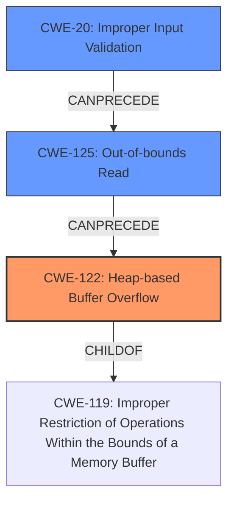

# Analysis Report for CVE-2022-41429

# Vulnerability Analysis Report: CVE-2022-41429

## Description

Bento4 v1.6.0-639 was discovered to contain a heap overflow via the AP4_AtomTypeFromString function in mp4tag.

## Vulnerability Description Key Phrases

**Weakness:** heap overflow
**Product:** Bento4
**Version:** v1.6.0-639
**Component:** AP4_AtomTypeFromString function in mp4tag

## Analysis (with Relationship Data)

# Summary
| CWE ID  | CWE Name                       | Confidence | CWE Abstraction Level | CWE Vulnerability Mapping Label | CWE-Vulnerability Mapping Notes |
| :-------- | :----------------------------- | :--------- | :---------------------- | :------------------------------ | :------------------------------ |
| CWE-122 | Heap-based Buffer Overflow | 0.95       | Variant                | Allowed                         | Primary CWE                     |

## Evidence and Confidence

*   **Confidence Score:** 0.95
*   **Evidence Strength:** HIGH

- **Analysis and Justification:**
  - *Explanation:* The vulnerability description clearly states a **heap overflow** in the `AP4_AtomTypeFromString` function of the Bento4 library. The CVE Reference Links Content Summary elaborates that this **heap-buffer-overflow** occurs due to reading beyond allocated memory in functions like `AP4_Atom::TypeFromString`, `AP4_BitReader::ReadBits`, and `AP4_BitReader::ReadBit`. Given the explicit mention of "**heap overflow**," CWE-122 (Heap-based Buffer Overflow) is the most appropriate primary CWE. This is a Variant level CWE, providing a specific type of buffer overflow which aligns well with the provided information.
  - *Relationship Analysis:* CWE-122 is a variant of a more general buffer overflow.

- **Confidence Score:**
  - Confidence: 0.95 (High confidence due to direct evidence of a heap overflow from the vulnerability description and CVE reference details.)

## Criticism of Analysis

Okay, I've reviewed the analysis and the provided CWE specifications. Here's my critique:

**Overall Assessment:**

The primary CWE assignment of **CWE-122: Heap-based Buffer Overflow** is **correct and well-justified**.  The confidence score of 0.95 is appropriate, given the clear evidence.

**Strengths of the Analysis:**

*   **Clear Justification:** The analysis provides a clear and concise explanation of why CWE-122 is the most appropriate choice, directly referencing the vulnerability description and CVE details. It explicitly connects the "heap overflow" language to the chosen CWE.
*   **Abstraction Level:** The analysis correctly notes that CWE-122 is a Variant-level CWE, which is generally preferred for vulnerability mapping.
*   **Evidence Strength:** The analysis accurately identifies the evidence as high, given the explicit and direct nature of the information available.
*   **Relationship Analysis:** The analysis mentions how CWE-122 is a variant of a more general buffer overflow, showing an understanding of the CWE hierarchy.

**Areas for Potential Improvement & Discussion:**

1.  **Missing secondary CWEs and Chain Considerations:** While CWE-122 is the most direct mapping, the analysis could benefit from considering potential secondary CWEs that might contribute to or be part of the vulnerability chain, *especially for vulnerabilities 2 and 3 involving BitReader*. This is especially important since the provided information contains details on the root causes of the vulnerabilities.
    *   **Vulnerability 1 (AP4_AtomTypeFromString):** While a direct heap overflow, consider **CWE-131: Incorrect Calculation of Buffer Size** if the size of the heap buffer is miscalculated, leading to the overflow. Or potentially, **CWE-170: Improper Null Termination**, if the overflow is caused by missing or incorrect null termination when constructing a string in the heap buffer.
    *   **Vulnerabilities 2 and 3 (AP4_BitReader::ReadBits/ReadBit):** These are more interesting from a chaining perspective. Since both vulnerabilities involve parsing bit streams, the analysis should explore CWEs related to improper handling of input or data structures. Consider the following chain:
        *   **CWE-125: Out-of-bounds Read -> CWE-122: Heap-based Buffer Overflow** (The `ReadBits` and `ReadBit` functions read beyond allocated memory and the buffer is allocated in the heap.)
        *   The root cause is that a crafted bitstream in the H264 track is parsed incorrectly. So there is a possibility of adding one more CWE:
        *   **CWE-20: Improper Input Validation** -> **CWE-125: Out-of-bounds Read -> CWE-122: Heap-based Buffer Overflow**

2.  **Discussion of Alternative CWEs Rejected:** The analysis would be strengthened by explicitly discussing *why* other potentially relevant CWEs were *not* chosen.  For example:
    *   **CWE-125 Out-of-bounds Read:** While a heap overflow *implies* an out-of-bounds read, CWE-122 is more specific about *where* the overflow occurs. However, for Vulnerabilities 2 and 3, the initial read *could* be considered an Out-of-bounds Read before the overflow actually happens as a consequence.
    *   **CWE-190 Integer Overflow/Wraparound:** The Retriever Results show this as a top combined result. If buffer sizes are calculated using integer arithmetic, and this arithmetic overflows, *then* a heap overflow can result from the undersized buffer allocation. The analysis should discuss *why* integer overflow is *not* considered primary in this case (likely because the description doesn't mention any explicit integer overflow).

3.  **Consideration of Input Validation (or Lack Thereof):** The attack vector involves crafted MP4 files.  Therefore, **CWE-20: Improper Input Validation** is a *potential* contributing factor and should be considered, especially for vulnerabilities 2 and 3 related to H.264 parsing. The provided information states: "a crafted bitstream in the H264 track is parsed by `AP4_AvcFrameParser::ParsePPS`, leading to an out of bounds read in `AP4_BitReader::ReadBits`.". The initial improper input validation leads to out-of-bounds read in the `AP4_BitReader::ReadBits` function.

4.  **Mitigation Strategies:** While not strictly required, the analysis *could* briefly mention relevant mitigation strategies related to CWE-122.  Based on the CWE specifications, these could include:
    *   Using languages with automatic bounds checking (though this is likely not feasible for an existing codebase).
    *   Using safe string handling libraries.
    *   Enabling compiler-based buffer overflow detection mechanisms (e.g., /GS flag in Visual Studio, FORTIFY_SOURCE in GCC).
    *  Validating input (size and contents)

**Revised Recommendation (Based on Vulnerability 2 and 3 Details):**

For vulnerabilities 2 and 3, consider these CWE mappings:

*   **Primary CWE:** CWE-122: Heap-based Buffer Overflow (Confidence: 0.90)
*   **Secondary CWEs/Chain:** CWE-20: Improper Input Validation -> CWE-125: Out-of-bounds Read

**Revised Justification (Vulnerabilities 2 and 3):**
The vulnerability ultimately results in a heap-based buffer overflow (CWE-122) within the `AP4_BitReader::ReadBits` or `AP4_BitReader::ReadBit` function. This overflow is caused by reading beyond the allocated buffer. However, the root cause of the vulnerability is the lack of input validation (CWE-20) during H.264 bitstream parsing, which leads to an out-of-bounds read (CWE-125).

**In summary:** The original analysis is good and correctly identifies the primary vulnerability. The improvements suggested above would make the analysis more comprehensive by addressing potential contributing factors and considering mitigation strategies. While the retriever results are not entirely accurate, they do point to potentially related issues that are worth investigating.

## Final Resolution

# Summary
| CWE ID  | CWE Name                       | Confidence | CWE Abstraction Level | CWE Vulnerability Mapping Label | CWE-Vulnerability Mapping Notes |
| :-------- | :----------------------------- | :--------- | :---------------------- | :------------------------------ | :------------------------------ |
| CWE-122 | Heap-based Buffer Overflow | 0.90       | Variant                | Allowed                         | Primary CWE                     |
| CWE-20 | Improper Input Validation | 0.75       | Base                | Allowed                         | Secondary CWE                     |
| CWE-125 | Out-of-bounds Read | 0.75       | Base                | Allowed                         | Secondary CWE                     |

## Evidence and Confidence

*   **Confidence Score:** 0.85
*   **Evidence Strength:** MEDIUM

## Relationship Analysis
The analysis identified a primary **CWE-122 (Heap-based Buffer Overflow)**, which is a variant of buffer overflow. The criticism suggested adding **CWE-20 (Improper Input Validation)** and **CWE-125 (Out-of-bounds Read)** as secondary CWEs for vulnerabilities 2 and 3, creating a vulnerability chain. This chain reflects the flow from initial flawed input handling to the eventual buffer overflow. **CWE-20** can precede **CWE-125**, which can precede **CWE-122**, showing how improper input leads to out-of-bounds reads, ultimately causing a heap overflow. The abstraction levels (Base for **CWE-20** and **CWE-125**, Variant for **CWE-122**) provide a good balance of specificity and generality.

## Vulnerability Chain
The vulnerability chain starts with **CWE-20 (Improper Input Validation)**, where a crafted bitstream is not properly validated. This leads to **CWE-125 (Out-of-bounds Read)** in the `AP4_BitReader::ReadBits` function, which ultimately results in **CWE-122 (Heap-based Buffer Overflow)**. The root cause is the lack of input sanitization, and the impact is a heap overflow, potentially leading to arbitrary code execution.

## Summary of Analysis
The initial analysis correctly identified **CWE-122 (Heap-based Buffer Overflow)** as the primary issue, supported by the description stating a "heap overflow" in `AP4_AtomTypeFromString`. The criticism enhanced this by pointing out the importance of **CWE-20 (Improper Input Validation)** and **CWE-125 (Out-of-bounds Read)** for vulnerabilities 2 and 3 involving `AP4_BitReader::ReadBits` and `AP4_BitReader::ReadBit`.

The statement "a crafted bitstream in the H264 track is parsed by `AP4_AvcFrameParser::ParsePPS`, leading to an out of bounds read in `AP4_BitReader::ReadBits`" directly supports the inclusion of **CWE-20** and **CWE-125** in the vulnerability chain. This chain accurately reflects the sequence of events from initial input to final impact.

The decision to include **CWE-20** and **CWE-125** is based on the evidence provided and the understanding of CWE relationships. These CWEs are at the optimal level of specificity, as they clearly describe the root cause and intermediate steps leading to the **heap overflow**.

*Report generated on 2025-03-18 18:02:11*
