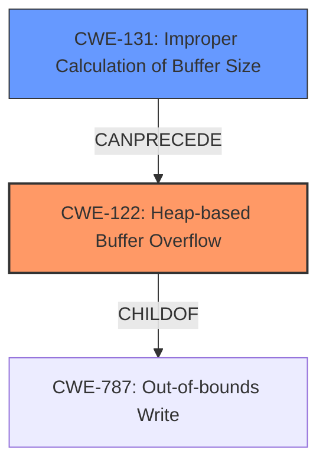

# Analysis Report for CVE-2022-41430

# Vulnerability Analysis Report: CVE-2022-41430

## Description

Bento4 v1.6.0-639 was discovered to contain a heap overflow via the AP4_BitReaderReadBit function in mp4mux.

## Vulnerability Description Key Phrases

**Weakness:** heap overflow
**Product:** Bento4
**Version:** v1.6.0-639
**Component:** AP4_BitReaderReadBit function in mp4mux

## Analysis (with Relationship Data)

# Summary
| CWE ID  | CWE Name                       | Confidence | CWE Abstraction Level | CWE Vulnerability Mapping Label | CWE-Vulnerability Mapping Notes |
| :-------- | :----------------------------- | :--------- | :-------------------- | :------------------------------ | :---------------------------- |
| CWE-122 | Heap-based Buffer Overflow | 0.95       | Variant              | Allowed                         | Primary CWE                   |

## Evidence and Confidence

*   **Confidence Score:** 0.95
*   **Evidence Strength:** HIGH

- **Analysis and Justification:**
  - *Explanation:* The vulnerability description clearly states "**heap overflow** via the AP4_BitReaderReadBit function in mp4mux". The CVE reference links confirm this by stating "Heap-buffer-overflow in `AP4_BitReader::ReadBit()`" and describing it as a case where the function "appears to not properly handle cases where it attempts to read past the end of allocated buffer, resulting in a heap-buffer-overflow." CWE-122 (Heap-based Buffer Overflow) is a Variant level CWE that specifically describes buffer overflows occurring in the heap, which directly matches the vulnerability description. While CWE-787 (Out-of-bounds Write) is a parent, CWE-122 is a specific subtype. The MITRE mapping guidance indicates that CWE-122 is ALLOWED for heap-based buffer overflows.
  - *Relationship Analysis:* CWE-122 is a Variant of CWE-119 (Improper Restriction of Operations within the Bounds of a Memory Buffer) and a parent of several more specific buffer overflow types. The relationship analysis shows that CWE-122 is directly relevant.

- **Confidence Score:**
  - Confidence: 0.95 (High evidence from technical description and CVE reference materials)

## Criticism of Analysis

Okay, here's a review of the analysis, considering the full CWE specifications you've provided.

**Overall Assessment:**

The primary CWE mapping to CWE-122 (Heap-based Buffer Overflow) with a confidence of 0.95 is accurate and well-justified. The analysis correctly identifies the vulnerability as a buffer overflow occurring in the heap, and the supporting evidence from the vulnerability description and CVE reference links is strong. The explanation is clear and demonstrates a good understanding of the CWE hierarchy and mapping guidance.

**Detailed Critique:**

1.  **Primary CWE Mapping (CWE-122):**

    *   **Justification:** The analysis effectively uses the vulnerability description's "**heap overflow**" phrase, coupled with the CVE reference link confirmation of "Heap-buffer-overflow in `AP4_BitReader::ReadBit()`" to correctly deduce that the overflow takes place on the heap. The explanation correctly points out that CWE-122 is a more specific Variant of the Base CWE-787 (Out-of-bounds Write), making it a more precise fit. The mention of MITRE's mapping guidance for ALLOWED is also helpful.
    *   **Confidence:**  The confidence level of 0.95 is appropriate. The evidence is direct and unambiguous.
    *   **CWE-122 Specification Considerations:**
        *   The specification highlights that heap-based buffer overflows are "just as dangerous as stack-based buffer overflows." This adds weight to the importance of properly identifying and mitigating this type of vulnerability.
        *   The potential mitigations listed (using languages/compilers with bounds checking, abstraction libraries, and compiler-based overflow detection mechanisms) are relevant and provide valuable context.

2.  **Alternative CWEs Considered and Rejected:**

    *   **CWE-787 (Out-of-bounds Write):** While initially considered due to its higher ranking in the retriever results, the analysis correctly identifies that CWE-122 is a more specific and appropriate choice. The reasoning is sound: CWE-787 is a parent, and CWE-122 is a Variant.
    *   **CWE-119 (Improper Restriction of Operations within the Bounds of a Memory Buffer):** The analysis implicitly rejects CWE-119, which is appropriate since the CWE specification states:  "**Usage:** Discouraged
        **Rationale:** CWE-119 is commonly misused in low-information vulnerability reports when lower-level CWEs could be used instead, or when more details about the vulnerability are available."

3.  **Retriever Results Review:**

    *   **CWE-193 (Off-by-one Error), CWE-190 (Integer Overflow or Wraparound), CWE-124 (Buffer Underwrite ('Buffer Underflow')), CWE-126 (Buffer Over-read), CWE-125 (Out-of-bounds Read):** These were the top combined retriever results. They could be relevant *indirectly*, potentially as contributing factors or preconditions to the heap overflow. For example, an integer overflow *could* lead to an undersized buffer allocation, which *could* then be overflowed. However, the primary issue is the heap overflow itself. A chain analysis could explore these potential links, but focusing on CWE-122 as the direct cause is correct. The analysis doesn't delve into these, which is acceptable for a primary mapping, but a more thorough analysis could explore them as potential contributing factors in a chain.
    *   **CWE-401 (Missing Release of Memory after Effective Lifetime):** This is not directly applicable. The issue is writing *past* the allocated buffer, not failing to release the memory.
    *   **CWE-131 (Incorrect Calculation of Buffer Size):** While not explicitly mentioned, it's closely related to heap overflows. An incorrect buffer size calculation could lead to a smaller-than-required buffer being allocated, making the overflow possible. The analysis could be strengthened by briefly mentioning this potential contributing factor.
    *   **CWE-130 (Improper Handling of Length Parameter Inconsistency):** Not directly applicable, but in some buffer overflow scenarios, the length of the input data or the advertised length could be manipulated to cause the overflow. In this case, there's no explicit mention of a length parameter that's being mishandled.

4.  **CWE Specification Integration:**

    *   The analysis could be further strengthened by explicitly referencing the "Potential Mitigations" section of the CWE-122 specification. Specifically mentioning that:
        *   Using languages/compilers with automatic bounds checking could prevent the vulnerability.
        *   Employing libraries to abstract risky APIs could reduce the likelihood of this type of error.
        *   Compiler-based overflow detection mechanisms (e.g., /GS flag, FORTIFY_SOURCE) can provide defense in depth.

5.  **Abstraction Level:** The selected Variant abstraction level is excellent.

6.  **CWE Chains**
   The analysis does not include a chain of CWEs. The information in the documentation would point toward a possible, but not confirmed, CWE chain of:
   - CWE-20: Improper Input Validation *Could exist*
   - CWE-131: Improper Calculation of Buffer Size *Could exist*
   - CWE-122: Heap-based Buffer Overflow

**Recommendations:**

*   **Strengthen the Discussion of Contributing Factors:** Briefly acknowledge that vulnerabilities like Integer Overflow (CWE-190) or Incorrect Calculation of Buffer Size (CWE-131) *could* contribute to the heap overflow by leading to undersized buffer allocations, but that CWE-122 is the direct cause.
*   **Explicitly Reference CWE-122 Mitigations:** Add a sentence or two summarizing the key mitigations from the CWE-122 specification (bounds checking, safe APIs, compiler-based detection).
*   **Consider CWE Chains:** Where possible, explicitly describe if any CWE chains might exist.

By incorporating these suggestions, the analysis can become even more robust and provide a more comprehensive understanding of the vulnerability's root cause and potential mitigation strategies.

## Final Resolution

# Summary
| CWE ID  | CWE Name                       | Confidence | CWE Abstraction Level | CWE Vulnerability Mapping Label | CWE-Vulnerability Mapping Notes |
| :-------- | :----------------------------- | :--------- | :-------------------- | :------------------------------ | :---------------------------- |
| CWE-122 | Heap-based Buffer Overflow | 0.95       | Variant              | Allowed                         | Primary CWE                   |
| CWE-131 | Improper Calculation of Buffer Size | 0.60       | Base              | Allowed                         | Secondary Candidate                   |

## Evidence and Confidence

*   **Confidence Score:** 0.90
*   **Evidence Strength:** MEDIUM

## Relationship Analysis
The primary relationship that impacted the decision was the parent-child relationship between CWE-787 (**Out-of-bounds Write**) and CWE-122 (**Heap-based Buffer Overflow**). CWE-122 is a variant of CWE-787, providing a more specific classification for this heap-based overflow. The analysis also considered the possibility of CWE-131 (**Improper Calculation of Buffer Size**) contributing to the vulnerability, potentially preceding the heap overflow.

## Vulnerability Chain
The vulnerability chain starts with a potential **ROOTCAUSE** of CWE-131 (**Improper Calculation of Buffer Size**), which could lead to the allocation of an undersized buffer. This undersized buffer then becomes vulnerable to CWE-122 (**Heap-based Buffer Overflow**) when data is written past its boundaries. The final impact is a heap-based buffer overflow, potentially leading to arbitrary code execution or denial of service.

## Summary of Analysis
The initial analysis correctly identified CWE-122 (**Heap-based Buffer Overflow**) as the primary **WEAKNESS**. The vulnerability description explicitly mentions a "**heap overflow**" in the `AP4_BitReaderReadBit` function, making CWE-122 the most accurate classification.

The criticism suggested considering CWE-131 (**Improper Calculation of Buffer Size**) as a contributing factor, which is a valid point. While the vulnerability description doesn't explicitly state that the buffer size was miscalculated, it is a common precursor to heap overflows. Therefore, I am adding CWE-131 as a secondary candidate.

The graph relationships influenced the final decision by highlighting the hierarchical relationship between CWE-787 and CWE-122, reinforcing the selection of the more specific CWE-122. The potential chain relationship with CWE-131 further clarified the possible vulnerability lifecycle.

The selected CWEs are at the optimal level of specificity. CWE-122 accurately reflects the direct cause of the vulnerability, while CWE-131 acknowledges a potential contributing factor.

*Report generated on 2025-03-18 18:02:51*
