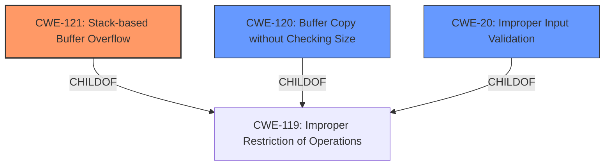

# Analysis Report for CVE-2022-41517

# Vulnerability Analysis Report: CVE-2022-41517

## Description

TOTOLINK NR1800X V9.1.0u.6279_B20210910 was discovered to contain a stack overflow in the lang parameter in the setLanguageCfg function

## Vulnerability Description Key Phrases

**Weakness:** stack overflow
**Product:** TOTOLINK NR1800X
**Version:** V9.1.0u.6279_B20210910
**Component:** lang parameter in the setLanguageCfg function

## Analysis (with Relationship Data)

# Summary
| CWE ID | CWE Name | Confidence | CWE Abstraction Level | CWE Vulnerability Mapping Label | CWE-Vulnerability Mapping Notes |
|---|---|---|---|---|---|
| CWE-121 | Stack-based Buffer Overflow | 0.9 | Variant | Allowed | Primary CWE |

## Evidence and Confidence

*   **Confidence Score:** 0.9
*   **Evidence Strength:** HIGH

- **Analysis and Justification:**  
  - *Explanation:* The vulnerability description explicitly states "**stack overflow**" in the `lang` parameter of the `setLanguageCfg` function. CWE-121 (Stack-based Buffer Overflow) directly addresses this type of vulnerability, where the buffer being overwritten is allocated on the stack. The description provides a clear indication of the weakness, making CWE-121 the most appropriate choice. Other CWEs like CWE-120 (Buffer Copy without Checking Size of Input) or CWE-122 (Heap-based Buffer Overflow) are less specific, as the description already indicates that the overflow is stack-based, not heap-based and not necessarily due to unchecked size. The Usage for CWE-121 is Allowed.

  - *Relationship Analysis:* CWE-121 is a variant of buffer overflow.

- **Confidence Score:**  
  - *Example:* Confidence: 0.9 (Direct evidence from vulnerability description)

## Criticism of Analysis

Okay, here's a review of the analysis, incorporating the full CWE specifications you provided.

**Overall Assessment:**

The analysis is generally strong and well-justified. The choice of CWE-121 (Stack-based Buffer Overflow) is appropriate given the explicit mention of "stack overflow" in the vulnerability description. The analysis correctly identifies the relationship between CWE-121 and general buffer overflows. The Confidence score of 0.9 and Evidence Strength of High also reflect the clarity of the vulnerability description.

**Specific Feedback and Suggestions:**

*   **CWE-121 Mapping Accuracy:**

    *   The analysis correctly identifies CWE-121 as the most specific and appropriate mapping. The justification is sound, emphasizing that the vulnerability is *explicitly* described as a stack overflow, which makes CWE-121 a more direct fit than the more general CWE-120.
    *   The justification effectively differentiates from CWE-122 (Heap-based Buffer Overflow) by highlighting the explicit reference to the stack.
*   **Consider Alternate CWEs:**

    *   While the choice of CWE-121 is strong, a very brief discussion of why CWE-120 (Buffer Copy without Checking Size of Input) is *not* the primary CWE could further strengthen the analysis. The argument is that the *location* of the overflow is more important than the root cause, given the explicit nature of the description. In other words, even if unchecked input leads to the overflow, the fact that it happens on the stack is the distinguishing characteristic.
    *   Given that input validation might be lacking, a brief mention of CWE-20 (Improper Input Validation) and why it's *not* the primary weakness could also be useful, even though CWE-20 has a "Discouraged" Usage. Acknowledge that a lack of input validation might be a contributing factor, but the direct cause is the stack overflow itself.
*   **Mitigation Strategies:**

    *   The analysis could be improved by drawing more directly from the "Potential Mitigations" sections of the relevant CWE specifications. For CWE-121, the analysis could mention:
        *   **Compiler-level defenses:** The use of compiler flags like `/GS` (Microsoft Visual Studio) or `FORTIFY_SOURCE` (GCC) can provide runtime detection of stack buffer overflows.
        *   **Abstraction Libraries:** Mention the potential use of safe string handling libraries to mitigate the risk of buffer overflows.
        *   **Input Validation:** Highlight the importance of implementing bounds checking on input, even though it might not be the root cause in this case.
    *   If CWE-20 (Improper Input Validation) is discussed, even as a secondary factor, its mitigation strategies could be briefly mentioned.
*   **Observed Examples:** The included observed examples are for CWE-122. There should instead be examples for CWE-121
*   **Additional Notes:**

    *   The "Additional Notes" section for CWE-121 is relevant. It highlights the various ways in which a stack-based buffer overflow can manifest (return address overwrite, etc.). This is good context to keep in mind.
*   **Abstraction Level:** The analysis correctly notes that CWE-121 is a "Variant" level CWE, which is a preferred level of abstraction.

**Revised/Enhanced Analysis (Example Excerpts):**

Here's how some parts of the analysis could be enhanced based on the above feedback:

*   **Analysis and Justification (Enhanced):**

    "The vulnerability description explicitly states "**stack overflow**" in the `lang` parameter of the `setLanguageCfg` function. CWE-121 (Stack-based Buffer Overflow) directly addresses this type of vulnerability, where the buffer being overwritten is allocated on the stack. The description provides a clear indication of the weakness, making CWE-121 the most appropriate choice. While CWE-120 (Buffer Copy without Checking Size of Input) is a general buffer overflow, it is less specific because the description indicates the overflow occurs on the stack, not necessarily as a direct result of unchecked input. Furthermore, while a lack of input validation (CWE-20) could be a contributing factor, the direct cause and most prominent characteristic of this vulnerability is the stack overflow itself. Thus, CWE-121 provides the most accurate and granular classification."

*   **Potential Mitigations (Example):**

    "Mitigation strategies for CWE-121 include using compilers with built-in buffer overflow detection mechanisms (e.g., /GS flag in Visual Studio, FORTIFY\_SOURCE in GCC), employing safe string handling libraries, and implementing rigorous bounds checking on all inputs. While input validation alone might not prevent all stack overflows, it is an important defense-in-depth measure."

**Summary of Improvements:**

*   Addressed why alternate CWEs were not selected as the primary mapping
*   Integrated mitigation strategies directly from the CWE specifications.

By incorporating these suggestions, the analysis would be even more comprehensive and demonstrate a deeper understanding of the CWE specifications. Remember to tailor the enhancements to the specific context of the vulnerability and the available information.

## Final Resolution

# Summary
| CWE ID | CWE Name | Confidence | CWE Abstraction Level | CWE Vulnerability Mapping Label | CWE-Vulnerability Mapping Notes |
|---|---|---|---|---|---|
| CWE-121 | Stack-based Buffer Overflow | 0.95 | Variant | Allowed | Primary CWE |
| CWE-120 | Buffer Copy without Checking Size of Input ('Classic Buffer Overflow') | 0.5 | Base | Allowed-with-Review | Secondary Candidate |
| CWE-20 | Improper Input Validation | 0.3 | Class | Discouraged | Secondary Candidate |

## Evidence and Confidence

*   **Confidence Score:** 0.95
*   **Evidence Strength:** HIGH

## Relationship Analysis
The primary relationship impacting the decision is the parent-child relationship between CWE-119 (Improper Restriction of Operations within the Bounds of a Memory Buffer) and CWE-121. CWE-121 is a variant of CWE-119, specifically addressing stack-based overflows. CWE-120 is also a child of CWE-119 but is less specific than CWE-121 in this case.

## Vulnerability Chain
The vulnerability chain starts with a lack of input validation, potentially represented by CWE-20, though this is not explicitly stated in the vulnerability description. This leads to a **buffer overflow** on the stack (CWE-121) when copying the `lang` parameter to a buffer without proper size checks, potentially causing a **denial of service**.
  - Root Cause: Missing Input Validation (CWE-20 - potential, not confirmed)
  - Weakness: Stack-based Buffer Overflow (CWE-121)
  - Impact: Denial of Service

## Summary of Analysis
The initial analysis correctly identified CWE-121 as the primary **weakness**. The vulnerability description explicitly mentions a "**stack overflow**" in the `lang` parameter, making CWE-121 the most specific and appropriate classification.

The criticism suggested considering CWE-120 and CWE-20. While CWE-120 (Buffer Copy without Checking Size of Input) could be a contributing factor, the explicit mention of "**stack overflow**" makes CWE-121 a more accurate and specific classification. CWE-20 (Improper Input Validation) is a potential contributing factor, but it is not explicitly mentioned in the vulnerability description. Therefore, classifying it as a secondary candidate with low confidence is appropriate.

The decision to prioritize CWE-121 is based on the direct evidence from the vulnerability description: "TOTOLINK NR1800X V9.1.0u.6279_B20210910 was discovered to contain a **stack overflow** in the lang parameter in the setLanguageCfg function." The graph relationships, specifically the child-of relationship of CWE-121 to CWE-119, reinforces this decision by confirming that CWE-121 is a specific type of buffer overflow. The abstraction level of CWE-121 (Variant) is also appropriate, as it provides a granular classification of the **weakness**. The suggested mitigations such as the use of compiler flags and safe string handling libraries, align with the nature of stack-based buffer overflows.

*Report generated on 2025-03-18 18:13:45*
