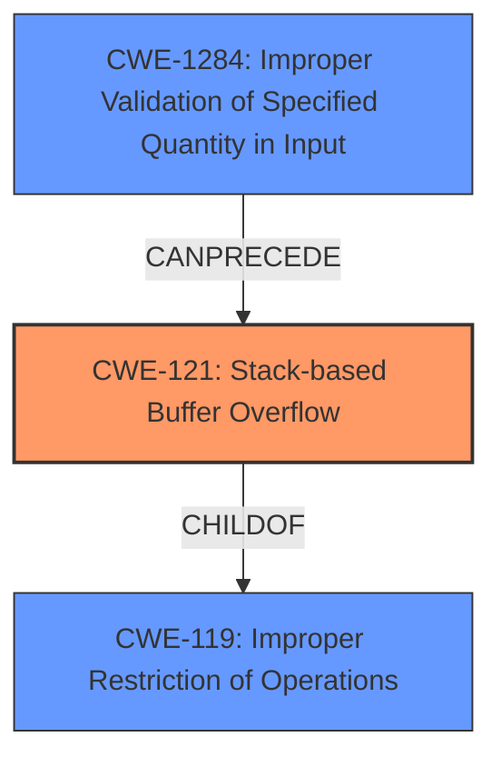

# Final Resolution for CVE-2022-41520

# Summary
| CWE ID | CWE Name | Confidence | CWE Abstraction Level | CWE Vulnerability Mapping Label | CWE-Vulnerability Mapping Notes |
|---|---|---|---|---|---|
| CWE-121 | Stack-based Buffer Overflow | 0.95 | Variant | Allowed | Primary CWE |
| CWE-1284 | Improper Validation of Specified Quantity in Input | 0.70 | Base | Allowed | Secondary Candidate |

## Evidence and Confidence

*   **Confidence Score:** 0.90
*   **Evidence Strength:** MEDIUM

## Relationship Analysis
The primary relationship impacting the decision is the parent-child relationship between CWE-119 (Improper Restriction of Operations within the Bounds of a Memory Buffer) and CWE-121 (**Stack-based Buffer Overflow**). CWE-121 is a variant of CWE-119, making it a more specific and appropriate choice given the explicit mention of "stack overflow" in the vulnerability description. The decision to include CWE-1284 (Improper Validation of Specified Quantity in Input) is based on the understanding that the 'File' parameter likely represents a file path, and the vulnerability chain may involve a failure to properly validate this input before using it in the `UploadCustomModule` function, leading to the **stack overflow**.

## Vulnerability Chain
The vulnerability chain starts with **CWE-1284 (Improper Validation of Specified Quantity in Input)**, where the 'File' parameter (likely a file path) is not properly validated. This leads to **CWE-121 (Stack-based Buffer Overflow)** when the unvalidated file path is used within the `UploadCustomModule` function, causing a buffer to be overwritten on the stack. The final impact is a potential compromise of the system due to the **stack overflow**.

## Summary of Analysis
The initial analysis correctly identified **CWE-121 (Stack-based Buffer Overflow)** as the primary weakness. The criticism raised valid points about considering alternative CWEs and potential chaining. Based on the evidence and the relationships between CWEs, the decision to include CWE-1284 as a secondary CWE is justified.

*   **Evidence from the vulnerability description:** "TOTOLINK NR1800X V9.1.0u.6279_B20210910 was discovered to contain an authenticated **stack overflow** via the File parameter in the UploadCustomModule function." This directly supports the choice of **CWE-121**.
*   **Graph relationships:** The parent-child relationship between CWE-119 and CWE-121 reinforces the specificity of CWE-121. The 'CanPrecede' relationship between CWE-1284 and CWE-121 suggests a potential vulnerability chain.
*   **Justification:** The inclusion of CWE-1284 is based on the assumption that the 'File' parameter represents a file path that is not properly validated. This is a reasonable assumption given the context of the `UploadCustomModule` function.
*   **Optimal level of specificity:** CWE-121 is a Variant, providing a specific description of the **stack overflow**. CWE-1284 is a Base, which is suitable for describing the **improper input validation** that may lead to the **stack overflow**.

The retriever results listed several other CWEs that were not selected:
* **CWE-78 (Improper Neutralization of Special Elements used in an OS Command ('OS Command Injection'))**: This was not selected because the vulnerability description does not explicitly mention command injection. While possible, it's not the primary issue.
* **CWE-190 (Integer Overflow or Wraparound) and CWE-191 (Integer Underflow (Wrap or Wraparound))**: These were not selected because there is no evidence in the description to suggest an integer overflow or underflow.
* **CWE-193 (Off-by-one Error)**: This was not selected because the description indicates a full **stack overflow**, not just an off-by-one error.
* **CWE-125 (Out-of-bounds Read)**: This was not selected because the vulnerability is a **stack overflow**, which is a write, not a read.
* **CWE-122 (Heap-based Buffer Overflow)**: This was not selected because the description specifically mentions a **stack overflow**, not a heap overflow.
* **CWE-789 (Memory Allocation with Excessive Size Value)**: This was not selected because the description does not mention memory allocation issues, only a **stack overflow**.
* **CWE-674 (Uncontrolled Recursion)**: This was not selected because the description does not mention recursion.

The decision to add CWE-1284 improves the overall assessment by considering the potential vulnerability chain and providing a more complete picture of the root cause.