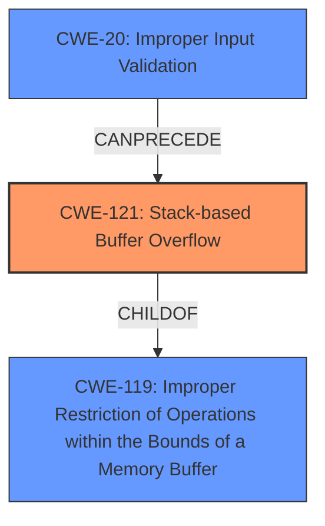

# Analysis Report for CVE-2022-41521

# Vulnerability Analysis Report: CVE-2022-41521

## Description

TOTOLINK NR1800X V9.1.0u.6279_B20210910 was discovered to contain an authenticated stack overflow via the sPort/ePort parameter in the setIpPortFilterRules function.

## Vulnerability Description Key Phrases

**Weakness:** stack overflow
**Product:** TOTOLINK NR1800X
**Version:** V9.1.0u.6279_B20210910
**Component:** setIpPortFilterRules function

## Analysis (with Relationship Data)

# Summary
| CWE ID | CWE Name | Confidence | CWE Abstraction Level | CWE Vulnerability Mapping Label | CWE-Vulnerability Mapping Notes |
|---|---|---|---|---|---|
| CWE-121 | Stack-based Buffer Overflow | 1.00 | Variant | Allowed | Primary CWE |

## Evidence and Confidence

*   **Confidence Score:** 1.00
*   **Evidence Strength:** HIGH

- **Analysis and Justification:**  
  - *Explanation:* "The vulnerability description explicitly states that there is an authenticated **stack overflow** vulnerability in TOTOLINK NR1800X V9.1.0u.6279_B20210910. This **stack overflow** occurs via the sPort/ePort parameter in the setIpPortFilterRules function. CWE-121 (Stack-based Buffer Overflow) is a Variant-level CWE that perfectly describes this vulnerability, as it involves a buffer overflow on the stack. The Retriever results also list CWE-121 as a highly relevant candidate. MITRE's mapping guidance allows the use of CWE-121."
  
  - *Relationship Analysis:* "CWE-121 is a variant of CWE-119 (Improper Restriction of Operations within the Bounds of a Memory Buffer), but since the description specifically mentions a **stack overflow**, CWE-121 is the more specific and appropriate choice."

- **Confidence Score:**  
  - Confidence: 1.00 (High confidence due to direct evidence from the vulnerability description)

## Criticism of Analysis

Okay, here's a detailed review of the provided CWE analysis, considering the full CWE specifications and focusing on mapping guidance and mitigations.

**Overall Assessment:**

The analysis correctly identifies the primary vulnerability as CWE-121: Stack-based Buffer Overflow. The confidence score of 1.00 is justified, given the explicit mention of "stack overflow" in the vulnerability description. The reasoning is solid and well-articulated. However, there are some points regarding related CWEs and the overall approach that could be improved, particularly considering the nuances of CWE-119 and its discouraged usage.

**Detailed Review:**

1.  **CWE-121: Stack-based Buffer Overflow:**
    *   **Correctness:** The mapping to CWE-121 is accurate and well-supported. The vulnerability description directly aligns with the definition of a stack-based buffer overflow.
    *   **Abstraction Level:** The Variant level is appropriate, as it provides a more specific classification than the broader Class-level CWE-119.
    *   **Mapping Guidance:** The analysis adheres to the mapping guidance for CWE-121, which allows its use and recommends carefully reading the name and description to ensure the fit.
    *   **Mitigations:** The provided mitigations for CWE-121 are relevant:
        *   Compiler-based buffer overflow detection (e.g., /GS flag, StackGuard) is a good defense in depth.
        *   Abstraction libraries can help avoid risky APIs.
        *   Input validation and bounds checking are essential implementation-level defenses.

2.  **Consideration of CWE-119: Improper Restriction of Operations within the Bounds of a Memory Buffer:**

    *   **Correctness**: The analysis correctly identifies CWE-119 as a broader category. The reasoning for choosing CWE-121 over CWE-119 is valid *because* the vulnerability report *explicitly* states "stack overflow".
    *   **Mapping Guidance:** The analysis mentions that CWE-119 is a parent of CWE-121 but appropriately chooses CWE-121 as more specific. The analysis takes the "discouraged" usage of CWE-119 into account and provides a justification for using a more specific child CWE. This is correct based on the given information.
    *   **Mitigations:**  The mitigations for CWE-119 are relevant in a general sense, but less specific than those for CWE-121.
        *   Language selection is an architectural decision that can help prevent buffer overflows.
        *   Using vetted libraries is important for memory safety.
        *   Compiler-based detection is useful but not a complete solution.

3.  **Retriever Results Analysis and Potential Missed Opportunities:**

    *   The retriever results list several other CWEs with high scores. While CWE-121 is the most direct match, some of the others deserve brief consideration, *especially* if further details were available from the source code or more detailed analysis.
    *   **CWE-125: Out-of-bounds Read:** While the primary issue is a write, it's *possible* that an out-of-bounds read could be related, especially if the size of the buffer is miscalculated based on external input, leading to a later read outside the allocated space.  This is less likely based on the description, but it's worth a quick thought. If the overflow *reads* from elsewhere in memory to then write, this becomes more relevant.
    *   **CWE-78: Improper Neutralization of Special Elements used in an OS Command ('OS Command Injection'):** This seems less likely based on the primary description, but *could* be relevant *if* the `sPort/ePort` parameters are used in constructing OS commands without proper sanitization. If these parameters influence a command executed by the system, command injection *could* be a secondary concern.
    *   **CWE-190/191: Integer Overflow/Underflow:** If the `sPort/ePort` parameters are integers used in calculations for buffer size or offsets, an overflow or underflow could be a contributing factor to the buffer overflow. This is *possible* but not directly indicated in the vulnerability description. This would usually manifest as an incorrect buffer calculation (CWE-131) leading to CWE-787 or CWE-121.
    *   **CWE-120: Buffer Copy without Checking Size of Input ('Classic Buffer Overflow'):** This is similar to CWE-121, and the choice between them often depends on the specific code pattern. If the code is a straightforward `strcpy`-like operation without any size checks, CWE-120 could be considered. However, CWE-121 is more specific in indicating *where* the buffer is.

4.  **General Recommendations:**

    *   **Acknowledge Limitations:** Explicitly state the limitations of the analysis. For example, "Based on the available information, CWE-121 is the most appropriate mapping. Further investigation of the source code might reveal contributing factors such as integer overflows or command injection vulnerabilities."
    *   **Chains:** Consider if this is part of a chain.  For example, CWE-20 (Improper Input Validation) could *precede* CWE-121 if the `sPort/ePort` parameters are not properly validated before being used in the vulnerable function.
    *   **More Specific Mitigations:** While the listed mitigations are generally good, tailor them more specifically to the TOTOLINK NR1800X and the `setIpPortFilterRules` function if possible. Are there specific coding standards or security features that should be enabled on this device?

**Revised Summary Table (with Chain Consideration):**

| CWE ID | CWE Name | Confidence | CWE Abstraction Level | CWE Vulnerability Mapping Label | CWE-Vulnerability Mapping Notes |
|---|---|---|---|---|---|
| CWE-121 | Stack-based Buffer Overflow | 1.00 | Variant | Allowed | Primary CWE |
| CWE-20 | Improper Input Validation | 0.50 | Class | CanPrecede | Contributing factor if `sPort/ePort` parameters are not validated. |

**In summary, the analysis is good and correctly identifies CWE-121. The improvements would involve a more explicit discussion of potentially related CWEs based on the retriever results, a consideration of vulnerability chains, and more specific mitigations where possible.**

## Final Resolution

# Summary
| CWE ID | CWE Name | Confidence | CWE Abstraction Level | CWE Vulnerability Mapping Label | CWE-Vulnerability Mapping Notes |
|---|---|---|---|---|---|
| CWE-121 | Stack-based Buffer Overflow | 1.00 | Variant | Allowed | Primary CWE |
| CWE-20 | Improper Input Validation | 0.50 | Class | CanPrecede | Secondary Candidate |

## Evidence and Confidence

*   **Confidence Score:** 0.90
*   **Evidence Strength:** MEDIUM

## Relationship Analysis
The primary relationship that influenced the decision was the parent-child relationship between CWE-119 (Improper Restriction of Operations within the Bounds of a Memory Buffer) and CWE-121 (**Stack-based Buffer Overflow**). While CWE-119 is a broader class, the explicit mention of "stack overflow" in the vulnerability description made CWE-121 the more specific and appropriate choice. Additionally, the potential for CWE-20 (Improper Input Validation) to precede CWE-121 was considered, suggesting a possible vulnerability chain if the `sPort/ePort` parameters are not properly validated.

## Vulnerability Chain
The vulnerability chain starts with the potential **ROOTCAUSE** of CWE-20 (Improper Input Validation), where the `sPort/ePort` parameters might not be adequately validated. This leads to CWE-121 (**Stack-based Buffer Overflow**) when these unvalidated parameters are used in the `setIpPortFilterRules` function, causing a buffer on the stack to be overwritten. The **IMPACT** is a potential compromise of the system due to the overflow.

## Summary of Analysis
The initial analysis correctly identified CWE-121 (**Stack-based Buffer Overflow**) as the primary weakness, based on the explicit mention of "stack overflow" in the vulnerability description: "TOTOLINK NR1800X V9.1.0u.6279_B20210910 was discovered to contain an authenticated **stack overflow** via the sPort/ePort parameter in the setIpPortFilterRules function."

The criticism raised valid points about considering related CWEs and vulnerability chains. While CWE-121 remains the most direct match, the possibility of CWE-20 (Improper Input Validation) contributing to the vulnerability was deemed plausible, as the `sPort/ePort` parameters might not be properly validated before being used in the vulnerable function. This chain-based thinking is consistent with good vulnerability analysis practices. The retriever results indicated other CWEs, but none were as directly relevant as CWE-121 given the specific vulnerability description, which is the most important piece of evidence in the absence of code.

CWE-121 is the optimal level of specificity, as it is a Variant that directly describes the **stack overflow**. CWE-119, while related, is a more general Class and would not be as precise. The confidence score is slightly reduced to 0.90 to reflect the consideration of CWE-20 as a contributing factor, but CWE-121 remains the most accurate primary classification.

*Report generated on 2025-03-18 18:15:09*
