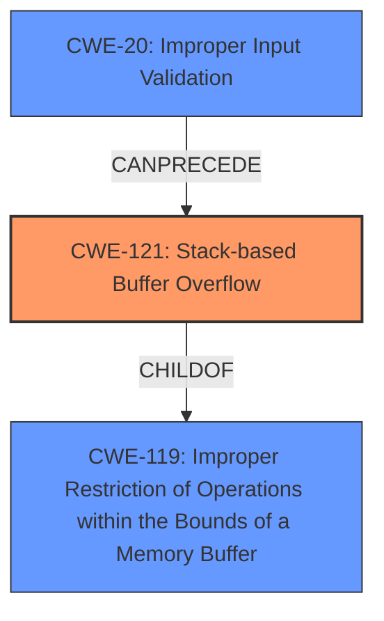

# Final Resolution for CVE-2022-41521

# Summary
| CWE ID | CWE Name | Confidence | CWE Abstraction Level | CWE Vulnerability Mapping Label | CWE-Vulnerability Mapping Notes |
|---|---|---|---|---|---|
| CWE-121 | Stack-based Buffer Overflow | 1.00 | Variant | Allowed | Primary CWE |
| CWE-20 | Improper Input Validation | 0.50 | Class | CanPrecede | Secondary Candidate |

## Evidence and Confidence

*   **Confidence Score:** 0.90
*   **Evidence Strength:** MEDIUM

## Relationship Analysis
The primary relationship that influenced the decision was the parent-child relationship between CWE-119 (Improper Restriction of Operations within the Bounds of a Memory Buffer) and CWE-121 (**Stack-based Buffer Overflow**). While CWE-119 is a broader class, the explicit mention of "stack overflow" in the vulnerability description made CWE-121 the more specific and appropriate choice. Additionally, the potential for CWE-20 (Improper Input Validation) to precede CWE-121 was considered, suggesting a possible vulnerability chain if the `sPort/ePort` parameters are not properly validated.

## Vulnerability Chain
The vulnerability chain starts with the potential **ROOTCAUSE** of CWE-20 (Improper Input Validation), where the `sPort/ePort` parameters might not be adequately validated. This leads to CWE-121 (**Stack-based Buffer Overflow**) when these unvalidated parameters are used in the `setIpPortFilterRules` function, causing a buffer on the stack to be overwritten. The **IMPACT** is a potential compromise of the system due to the overflow.

## Summary of Analysis
The initial analysis correctly identified CWE-121 (**Stack-based Buffer Overflow**) as the primary weakness, based on the explicit mention of "stack overflow" in the vulnerability description: "TOTOLINK NR1800X V9.1.0u.6279_B20210910 was discovered to contain an authenticated **stack overflow** via the sPort/ePort parameter in the setIpPortFilterRules function."

The criticism raised valid points about considering related CWEs and vulnerability chains. While CWE-121 remains the most direct match, the possibility of CWE-20 (Improper Input Validation) contributing to the vulnerability was deemed plausible, as the `sPort/ePort` parameters might not be properly validated before being used in the vulnerable function. This chain-based thinking is consistent with good vulnerability analysis practices. The retriever results indicated other CWEs, but none were as directly relevant as CWE-121 given the specific vulnerability description, which is the most important piece of evidence in the absence of code.

CWE-121 is the optimal level of specificity, as it is a Variant that directly describes the **stack overflow**. CWE-119, while related, is a more general Class and would not be as precise. The confidence score is slightly reduced to 0.90 to reflect the consideration of CWE-20 as a contributing factor, but CWE-121 remains the most accurate primary classification.