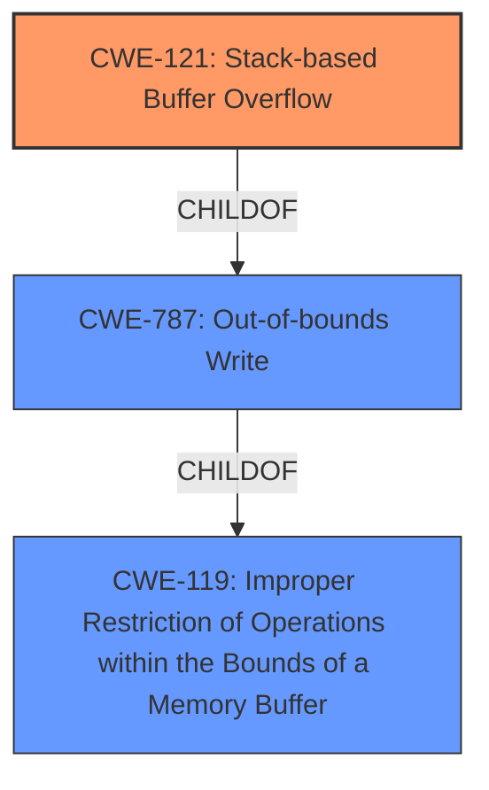

# Final Resolution for CVE-2022-41522

# Summary
| CWE ID | CWE Name | Confidence | CWE Abstraction Level | CWE Vulnerability Mapping Label | CWE-Vulnerability Mapping Notes |
|---|---|---|---|---|---|
| CWE-121 | Stack-based Buffer Overflow | 0.95 | Variant | Primary | Allowed |
| CWE-787 | Out-of-bounds Write | 0.6 | Base | Secondary Candidate | Allowed |
| CWE-119 | Improper Restriction of Operations within the Bounds of a Memory Buffer | 0.4 | Class | Secondary Candidate | Discouraged |

## Evidence and Confidence

*   **Confidence Score:** 0.95
*   **Evidence Strength:** HIGH

## Relationship Analysis
The primary CWE is CWE-121, a Variant of CWE-787, which in turn is a child of CWE-119. CWE-121 is chosen for its specificity in describing the location of the buffer overflow (stack). While CWE-787 accurately describes the out-of-bounds write, it lacks the specificity of the stack location. CWE-119 is a more general class and is discouraged when more specific CWEs are available. The abstraction levels influenced the decision by favoring the most specific applicable CWE.

## Vulnerability Chain
The vulnerability chain begins with an unauthenticated input being processed by the `main` function. This leads to a **stack overflow** (**CWE-121**) due to the absence of proper bounds checking. The result is an **out-of-bounds write** (**CWE-787**), potentially leading to arbitrary code execution or denial-of-service. **CWE-119** represents the general class of the weakness, that there was an **Improper Restriction of Operations within the Bounds of a Memory Buffer**.

## Summary of Analysis
The initial analysis and criticism both converge on the appropriateness of CWE-121 as the primary classification. The vulnerability description explicitly states an unauthenticated **stack overflow**, making CWE-121 the most accurate and specific choice. The criticism highlights the importance of choosing the most specific CWE and mentions the "Discouraged" status of CWE-119.

The graph relationships reinforce the choice of CWE-121. It's a variant of CWE-787 and a child of CWE-119, reflecting the hierarchical relationship and specificity.

The selection of CWE-121 is at the optimal level of specificity because the vulnerability description clearly indicates a stack-based buffer overflow. Choosing a more general CWE like CWE-787 or CWE-119 would sacrifice accuracy and detail.

The evidence from the vulnerability description is as follows: "TOTOLINK NR1800X V9.1.0u.6279_B20210910 was discovered to contain an unauthenticated **stack overflow** via the main function." This evidence directly supports the classification as CWE-121. The high confidence score reflects this direct match and the support from the criticism provided.