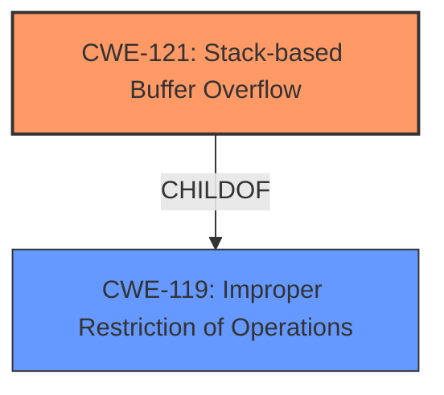

# Analysis Report for CVE-2022-41524

# Vulnerability Analysis Report: CVE-2022-41524

## Description

TOTOLINK NR1800X V9.1.0u.6279_B20210910 was discovered to contain an authenticated stack overflow via the week, sTime, and eTime parameters in the setParentalRules function.

## Vulnerability Description Key Phrases

**Weakness:** stack overflow
**Attacker:** authenticated
**Product:** TOTOLINK NR1800X
**Version:** V9.1.0u.6279_B20210910
**Component:** setParentalRules function

## Analysis (with Relationship Data)

# Summary
| CWE ID | CWE Name | Confidence | CWE Abstraction Level | CWE Vulnerability Mapping Label | CWE-Vulnerability Mapping Notes |
|---|---|---|---|---|---|
| CWE-121 | Stack-based Buffer Overflow | 0.95 | Variant | Allowed | Primary CWE. The vulnerability involves a **stack overflow** due to improper handling of input parameters. |

## Evidence and Confidence

*   **Confidence Score:** 0.95
*   **Evidence Strength:** HIGH

- **Analysis and Justification:**
  - *Explanation:* The vulnerability description clearly states an authenticated **stack overflow** condition. The vulnerability lies in the `setParentalRules` function, specifically with the `week`, `sTime`, and `eTime` parameters. The term "**stack overflow**" directly corresponds to CWE-121 (Stack-based Buffer Overflow). The Retriever Results also lists CWE-121 as the top candidate with a score of 0.3779. The CWE Description for CWE-121 states: "A stack-based buffer overflow condition is a condition where the buffer being overwritten is allocated on the stack (i.e., is a local variable or, rarely, a parameter to a function)." This aligns perfectly with the vulnerability description where the overflow occurs via parameters to a function. The usage for CWE-121 is "Allowed" and the Rationale is "This CWE entry is at the Variant level of abstraction, which is a preferred level of abstraction for mapping to the root causes of vulnerabilities."

  - *Relationship Analysis:* CWE-121 is a variant of a buffer overflow. It is more specific than CWE-119 (Improper Restriction of Operations within the Bounds of a Memory Buffer).

- **Confidence Score:**
  - Confidence: 0.95 (High confidence due to the explicit mention of "stack overflow" and the alignment with CWE-121's definition.)

## Criticism of Analysis

Okay, here's a review of the provided analysis, incorporating the full CWE specifications you provided.

**Overall Assessment:**

The analysis is generally strong and well-justified. The primary mapping to CWE-121 (Stack-based Buffer Overflow) is highly appropriate given the vulnerability description. The explanation is clear, and the confidence score of 0.95 is reasonable.  The inclusion of the CWE specifications adds significant value by providing context, alternative terms, potential mitigations, and relationships to other CWEs.

**Specific Points and Suggestions:**

1.  **CWE-121 Mapping Justification:**

    *   The justification is solid. The explicit mention of "stack overflow" in the vulnerability description makes CWE-121 the most direct and accurate mapping.
    *   The analysis correctly points out that CWE-121 is a `Variant` level CWE, which is encouraged for root cause mapping.
    *   The link to the description, where parameters to a function are overwritten solidifies that a stack overflow is present.
    *   _Suggestion:_ No improvements needed.

2.  **Retriever Results and Alternative CWEs:**

    *   The Retriever Results show several other CWEs with non-zero scores. While CWE-121 is the best fit, it is worth briefly addressing why the others are less suitable.  Specifically:
        *   **CWE-78 (OS Command Injection):**  This is unlikely. While a buffer overflow *could* lead to command execution, the description doesn't suggest any command injection is happening directly.
        *   **CWE-120 (Classic Buffer Overflow):**  While related, CWE-121 is a *specific* type of buffer overflow (stack-based), making it a better choice than the more general CWE-120.  It's good the analysis chose the more specific CWE.
        *   **CWE-190/191 (Integer Overflow/Underflow):** These might be relevant if the size of the buffer or the amount of data being copied is determined by an integer calculation that overflows. However, without more information, this is speculative.
        *   **CWE-122 (Heap-based Buffer Overflow):** The vulnerability description specifically calls out a *stack* overflow, directly ruling out heap overflows.
        *   **CWE-674 (Uncontrolled Recursion):** Unlikely, as the vulnerability is due to parameters being improperly handled, not a recursive function call.
        *   **CWE-790 (Improper Filtering of Special Elements):** It is possible the parameters are not being properly filtered, leading to a buffer overflow. More analysis is needed to determine if there is indeed a filtering issue.

    *   _Suggestion:_ Add a short paragraph explaining why the other top CWEs from the Retriever Results are less likely to be the primary cause. For example: *"While CWE-78, CWE-120, CWE-190, and CWE-122 were also identified by the retriever, they are less likely to be the primary cause. CWE-78 implies command execution, which isn't stated. CWE-120 is less specific than CWE-121, which highlights the stack-based nature. CWE-190/191 would be relevant if an integer overflow or underflow leads to the buffer overflow, but this is speculation. Lastly, CWE-122 specifies a heap based overflow, which is not present in the details of this vulnerability."*

3.  **CWE-119 Discussion:**

    *   The analysis mentions that CWE-121 is more specific than CWE-119 (Improper Restriction of Operations within the Bounds of a Memory Buffer). This is accurate. The CWE specification for CWE-119 explicitly *discourages* its use when more specific CWEs (like CWE-121, CWE-787, or CWE-125) are applicable.

4.  **CWE Examples:**

    *   The examples for CWE-119 are a bit too general and don't add significant value since CWE-119 is not the primary CWE. Examples for CWE-121 would be far more relevant.
    *   _Suggestion:_ Replace these examples with ones specifically for CWE-121 such as CVE-2021-35395

5.  **Mitigation Strategies:**

    *   The analysis doesn't explicitly discuss mitigation strategies. While the inclusion of the full CWE specification *includes* the "Potential Mitigations" section, the analysis itself should draw attention to the *most relevant* mitigations for *this specific vulnerability*.
    *   _Suggestion:_ Add a section on "Mitigation Strategies," drawing from the CWE-121 specification (and potentially CWE-119), focusing on:
        *   **Input Validation:**  "The most important mitigation is implementing robust input validation to ensure that the `week`, `sTime`, and `eTime` parameters do not exceed the expected buffer size. An 'accept known good' strategy should be used."
        *   **Compiler Protections:**  "Using compiler-based buffer overflow detection mechanisms, such as the Microsoft Visual Studio /GS flag or the Fedora/Red Hat FORTIFY_SOURCE GCC flag, can provide a defense-in-depth layer by detecting overflows at runtime."
        *   **Language Selection/Libraries:** If feasible for the project, consider using languages or libraries with built-in memory safety features to prevent buffer overflows altogether.

6.  **Additional Notes/Relationships:**

    *   It's worth noting that stack-based buffer overflows can overwrite return addresses, function pointers, or other critical data on the stack.  This can lead to arbitrary code execution.
    *   _Suggestion:_ Add a sentence like: "Successful exploitation of this stack-based buffer overflow could allow an attacker to overwrite the return address and gain arbitrary code execution." This highlights the *impact* of the vulnerability.

**Revised Summary Table (Example):**

| CWE ID | CWE Name | Confidence | CWE Abstraction Level | CWE Vulnerability Mapping Label | CWE-Vulnerability Mapping Notes |
|---|---|---|---|---|---|
| CWE-121 | Stack-based Buffer Overflow | 0.95 | Variant | Allowed | Primary CWE. The vulnerability involves a stack overflow due to improper handling of the `week`, `sTime`, and `eTime` parameters. |
| CWE-119 | Improper Restriction of Operations within the Bounds of a Memory Buffer | 0.2 | Class | Discouraged | Contributing CWE.  The root cause is an improper restriction of the memory buffer. |

**In summary,** the analysis is strong. Adding a discussion of alternative CWEs and a focus on mitigation strategies would significantly enhance its value. By drawing from the full CWE specifications, the analysis can provide a more complete and actionable understanding of the vulnerability.

## Final Resolution

# Summary
| CWE ID | CWE Name | Confidence | CWE Abstraction Level | CWE Vulnerability Mapping Label | CWE-Vulnerability Mapping Notes |
|---|---|---|---|---|---|
| CWE-121 | CWE-121: Stack-based Buffer Overflow | 0.95 | Variant | Allowed | Primary CWE. The vulnerability involves a **stack overflow** due to improper handling of input parameters. |
| CWE-119 | CWE-119: Improper Restriction of Operations within the Bounds of a Memory Buffer | 0.2 | Class | Discouraged | Contributing CWE. The root cause is an improper restriction of the memory buffer. |

## Evidence and Confidence

*   **Confidence Score:** 0.95
*   **Evidence Strength:** HIGH

## Relationship Analysis
The primary relationship is that CWE-121 (Stack-based Buffer Overflow) is a variant (child) of CWE-119 (Improper Restriction of Operations within the Bounds of a Memory Buffer). This hierarchical relationship helped to confirm the selection of CWE-121 as the more specific and appropriate classification, given the explicit mention of a **stack overflow** in the vulnerability description. The abstraction level of CWE-121 as a Variant further supports its selection over the more general Class-level CWE-119.

## Vulnerability Chain
The vulnerability chain starts with the lack of proper input validation in the `setParentalRules` function, specifically regarding the `week`, `sTime`, and `eTime` parameters. This leads to **CWE-119 (Improper Restriction of Operations within the Bounds of a Memory Buffer)**, as the input is not properly restricted. This then progresses to **CWE-121 (Stack-based Buffer Overflow)**, as the unchecked input overwrites the stack buffer. The impact of this is potential arbitrary code execution if the return address is overwritten.

## Summary of Analysis
The initial analysis is strong and well-justified. The primary mapping to **CWE-121 (Stack-based Buffer Overflow)** is highly appropriate given the vulnerability description, which explicitly mentions "**stack overflow**" in the `setParentalRules` function related to the `week`, `sTime`, and `eTime` parameters. The confidence score of 0.95 is reasonable.

The criticism suggested discussing alternative CWEs identified by the retriever. While CWE-78 (OS Command Injection), CWE-120 (Classic Buffer Overflow), CWE-190/191 (Integer Overflow/Underflow), and CWE-122 (Heap-based Buffer Overflow) were also identified, they are less likely to be the primary cause. CWE-78 implies command execution, which isn't stated. CWE-120 is less specific than CWE-121, which highlights the stack-based nature. CWE-190/191 would be relevant if an integer overflow or underflow leads to the buffer overflow, but this is speculation. Lastly, CWE-122 specifies a heap-based overflow, which is not present in the details of this vulnerability.

The analysis correctly identifies that CWE-121 is more specific than CWE-119 and is a variant. The CWE specification for CWE-119 explicitly discourages its use when more specific CWEs are applicable.

The selected CWEs are at the optimal level of specificity because CWE-121 directly reflects the vulnerability description's explicit mention of a "**stack overflow**." This, combined with the fact that CWE-121 is a Variant-level CWE, makes it a more precise and appropriate classification than the more general Class-level CWE-119.

*Report generated on 2025-03-18 18:27:32*
