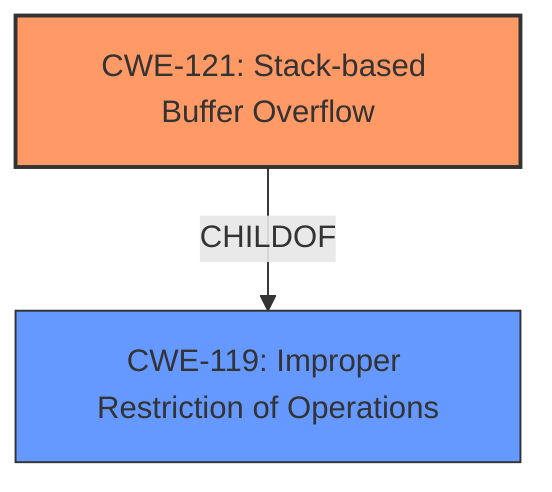

# Final Resolution for CVE-2022-41524

# Summary
| CWE ID | CWE Name | Confidence | CWE Abstraction Level | CWE Vulnerability Mapping Label | CWE-Vulnerability Mapping Notes |
|---|---|---|---|---|---|
| CWE-121 | CWE-121: Stack-based Buffer Overflow | 0.95 | Variant | Allowed | Primary CWE. The vulnerability involves a **stack overflow** due to improper handling of input parameters. |
| CWE-119 | CWE-119: Improper Restriction of Operations within the Bounds of a Memory Buffer | 0.2 | Class | Discouraged | Contributing CWE. The root cause is an improper restriction of the memory buffer. |

## Evidence and Confidence

*   **Confidence Score:** 0.95
*   **Evidence Strength:** HIGH

## Relationship Analysis
The primary relationship is that CWE-121 (Stack-based Buffer Overflow) is a variant (child) of CWE-119 (Improper Restriction of Operations within the Bounds of a Memory Buffer). This hierarchical relationship helped to confirm the selection of CWE-121 as the more specific and appropriate classification, given the explicit mention of a **stack overflow** in the vulnerability description. The abstraction level of CWE-121 as a Variant further supports its selection over the more general Class-level CWE-119.

## Vulnerability Chain
The vulnerability chain starts with the lack of proper input validation in the `setParentalRules` function, specifically regarding the `week`, `sTime`, and `eTime` parameters. This leads to **CWE-119 (Improper Restriction of Operations within the Bounds of a Memory Buffer)**, as the input is not properly restricted. This then progresses to **CWE-121 (Stack-based Buffer Overflow)**, as the unchecked input overwrites the stack buffer. The impact of this is potential arbitrary code execution if the return address is overwritten.

## Summary of Analysis
The initial analysis is strong and well-justified. The primary mapping to **CWE-121 (Stack-based Buffer Overflow)** is highly appropriate given the vulnerability description, which explicitly mentions "**stack overflow**" in the `setParentalRules` function related to the `week`, `sTime`, and `eTime` parameters. The confidence score of 0.95 is reasonable.

The criticism suggested discussing alternative CWEs identified by the retriever. While CWE-78 (OS Command Injection), CWE-120 (Classic Buffer Overflow), CWE-190/191 (Integer Overflow/Underflow), and CWE-122 (Heap-based Buffer Overflow) were also identified, they are less likely to be the primary cause. CWE-78 implies command execution, which isn't stated. CWE-120 is less specific than CWE-121, which highlights the stack-based nature. CWE-190/191 would be relevant if an integer overflow or underflow leads to the buffer overflow, but this is speculation. Lastly, CWE-122 specifies a heap-based overflow, which is not present in the details of this vulnerability.

The analysis correctly identifies that CWE-121 is more specific than CWE-119 and is a variant. The CWE specification for CWE-119 explicitly discourages its use when more specific CWEs are applicable.

The selected CWEs are at the optimal level of specificity because CWE-121 directly reflects the vulnerability description's explicit mention of a "**stack overflow**." This, combined with the fact that CWE-121 is a Variant-level CWE, makes it a more precise and appropriate classification than the more general Class-level CWE-119.