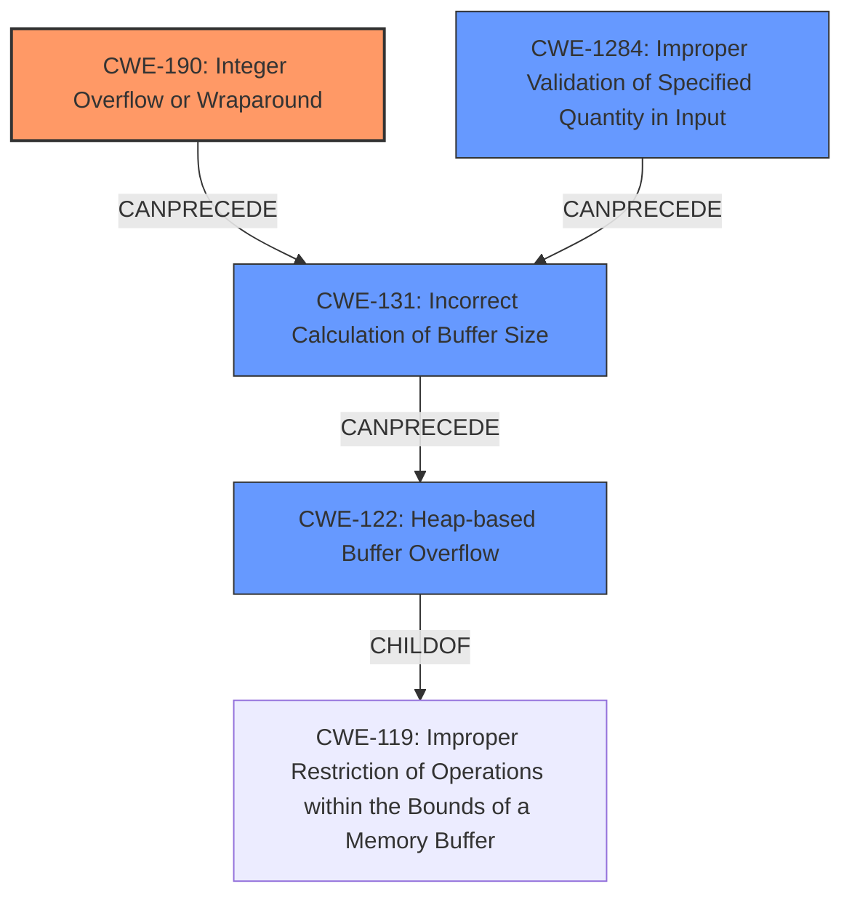

# Analysis Report for CVE-2022-4172

# Vulnerability Analysis Report: CVE-2022-4172

## Description

An integer overflow and buffer overflow issues were found in the ACPI Error Record Serialization Table (ERST) device of QEMU in the read_erst_record() and write_erst_record() functions. Both issues may allow the guest to overrun the host buffer allocated for the ERST memory device. A malicious guest could use these flaws to crash the QEMU process on the host.

## Vulnerability Description Key Phrases

**Weakness:** ['integer overflow', 'buffer overflow']
**Impact:** crash the QEMU process on the host
**Vector:** overrun the host buffer allocated for the ERST memory device
**Attacker:** malicious guest
**Product:** QEMU
**Component:** ACPI Error Record Serialization Table (ERST) device

## Analysis (with Relationship Data)

# Summary
| CWE ID | CWE Name | Confidence | CWE Abstraction Level | CWE Vulnerability Mapping Label | CWE-Vulnerability Mapping Notes |
|---|---|---|---|---|---|
| CWE-190 | Integer Overflow or Wraparound | 0.95 | Base | Primary | Allowed |
| CWE-131 | Incorrect Calculation of Buffer Size | 0.85 | Base | Secondary Candidate | Allowed |
| CWE-122 | Heap-based Buffer Overflow | 0.75 | Variant | Secondary Candidate | Allowed |

## Evidence and Confidence

*   **Confidence Score:** 0.90
*   **Evidence Strength:** HIGH

- **Analysis and Justification:**  
  - *Explanation:* The vulnerability description clearly states an **integer overflow** in the ACPI ERST device of QEMU, which directly aligns with CWE-190 (Integer Overflow or Wraparound). The CVE reference links content summary further confirms this, stating that an integer overflow was possible when calculating the buffer size for the ERST memory device. This **integer overflow** leads to an incorrect buffer size calculation which contributes to the **buffer overflow**. The impact of crashing the QEMU process further reinforces the severity of the weakness. CWE-190 is at the Base level of abstraction, making it a preferred level for mapping the root cause.
  
  - *Relationship Analysis:* CWE-190 is a child of CWE-20 (Improper Input Validation) and CWE-682 (Incorrect Calculation). The vulnerability involves an **integer overflow** during buffer size calculation, which is a form of incorrect calculation. The **integer overflow** can precede a **buffer overflow**, indicated by the CANPRECEDE relationship with CWE-119.

- **Confidence Score:**  
  - *Example:* Confidence: 0.95 (High confidence due to explicit mention of **integer overflow** in both the vulnerability description and CVE reference materials)

---

- **Analysis and Justification:**  
  - *Explanation:* The vulnerability description mentions a **buffer overflow** issue. The CVE reference links content summary indicates that the **integer overflow** leads to an incorrect buffer size calculation, contributing to the **buffer overflow**. CWE-131 (Incorrect Calculation of Buffer Size) directly addresses the incorrect size calculation which is a root cause. This is a base level CWE and is ALLOWED.
  
  - *Relationship Analysis:* CWE-131 is related to CWE-119 (Improper Restriction of Operations within the Bounds of a Memory Buffer) through the CANPRECEDE relationship, reflecting that an incorrect size calculation can lead to a **buffer overflow**.

- **Confidence Score:**  
  - *Example:* Confidence: 0.85 (High confidence as the incorrect calculation of the buffer size is directly linked to the **integer overflow**.)

---

- **Analysis and Justification:**  
  - *Explanation:* The vulnerability description states that the **integer overflow** and **buffer overflow** issues may allow the guest to overrun the host buffer. The CVE reference links content summary confirms that the issues lead to the guest being able to overrun the host buffer allocated for the ERST memory device. Since the buffer is allocated in the heap, CWE-122 (Heap-based Buffer Overflow) is a relevant mapping. CWE-122 is at the Variant level of abstraction.
  
  - *Relationship Analysis:* CWE-122 is a specific type of **buffer overflow**, where the buffer is allocated on the heap.

- **Confidence Score:**  
  - *Example:* Confidence: 0.75 (Good confidence due to explicit mention of **buffer overflow** and the heap allocation context.)

## Criticism of Analysis

Okay, I've reviewed the provided analysis and the full CWE specifications. Here's my critique:

**Overall Assessment:**

The analysis is generally good and well-justified. It correctly identifies the primary CWE as CWE-190 (Integer Overflow or Wraparound) and provides strong evidence for it. The secondary mappings to CWE-131 (Incorrect Calculation of Buffer Size) and CWE-122 (Heap-based Buffer Overflow) are also reasonable, though the confidence levels are appropriately lower.  The analysis also provides good relationship context.

**Detailed Breakdown:**

*   **CWE-190 (Integer Overflow or Wraparound) - Primary:**
    *   **Strengths:** The justification is strong. The explicit mention of "integer overflow" in the vulnerability description and CVE details makes this a very confident mapping. The relationship analysis with CWE-119, CWE-20 and CWE-682 is accurate.
    *   **Mapping Guidance Adherence:**  The analysis correctly notes that CWE-190 is at the Base level of abstraction, which is preferred.
    *   **Potential Mitigations:** The analysis doesn't directly mention mitigations, but given the context, using a language with automatic bounds checking or libraries for safe integer handling are relevant mitigations, as are strictly defining protocols and requiring conformance.
    *   **Recommendation:** No change needed.

*   **CWE-131 (Incorrect Calculation of Buffer Size) - Secondary Candidate:**
    *   **Strengths:** The analysis correctly identifies that the integer overflow *leads* to an incorrect buffer size calculation, making this a valid secondary mapping.
    *   **Mapping Guidance Adherence:** Aligns with Allowed usage.
    *   **Potential Mitigations:** The analysis could be strengthened by explicitly mentioning mitigations for CWE-131, such as allocating enough memory to handle the largest possible encoding or validating input to be within the expected range.
    *    **Recommendation:** Add reference to input validation on the size field itself to prevent the incorrect calculation.
*   **CWE-122 (Heap-based Buffer Overflow) - Secondary Candidate:**
    *   **Strengths:** The analysis acknowledges that the overflow occurs on the heap, making this a valid, although more specific, mapping.
    *   **Mapping Guidance Adherence:** The analysis correctly notes that CWE-122 is at the Variant level of abstraction.
    *   **Potential Mitigations:** The analysis is good as-is. The mitigations mentioned in the specification are already implied by the general mitigations for buffer overflows.
    *   **Recommendation:** No change needed.

**General Recommendations:**

*   **CWE-119 Consideration**: While the analysis appropriately avoids using CWE-119 as the primary mapping (due to its discouraged usage), consider briefly acknowledging why it *isn't* the primary mapping. For example: "While a buffer overflow (CWE-119) occurs, the root cause is the integer overflow, making CWE-190 the more appropriate primary mapping."
*   **Prioritization:**  Consider explicitly stating the order of attack events, i.e., Integer Overflow -> Incorrect Buffer Size -> Heap-based Buffer Overflow.

**Retriever Result Analysis:**

The retriever results highlight several other CWEs that are potentially relevant but were not included in the final analysis. Here's a brief look at why those CWEs might have been excluded and whether that's appropriate:

*   **CWE-1284 (Improper Validation of Specified Quantity in Input):** This is related to CWE-20 and could be a plausible secondary, tertiary, or alternative mapping, especially since the size value isn't being correctly validated. Perhaps add this in as a tertiary mapping with lower confidence.
*   **CWE-191 (Integer Underflow):** Less likely than CWE-190 because the primary issue is about exceeding the maximum, not going below the minimum.  The analysis is correct to exclude it unless there is evidence an integer underflow is occuring and affecting size calculations.
*   **CWE-125 (Out-of-bounds Read):** Not directly implicated in the vulnerability description. It is about *writing* outside the buffer, not reading. Exclusion is correct.
*   **CWE-789 (Memory Allocation with Excessive Size Value):** While this *could* be related if the attacker could directly influence a size, the core problem is about an *incorrect* size calculation, not an *excessive* size. Exclusion is correct.
*   **CWE-1285 (Improper Validation of Specified Index, Position, or Offset in Input):** Not directly applicable. The issue is not with validating an index or offset, but the buffer's calculated size. Exclusion is correct.
*  **CWE-197 (Numeric Truncation Error):**  This could be related if there is evidence an integer truncation is occuring. But, it is not explicitly stated in the description.

**In summary, the analysis is very strong and provides solid justification for its CWE selections. Adding just a few minor clarifications about relationship context would further strengthen it.**

## Final Resolution

# Summary
| CWE ID | CWE Name | Confidence | CWE Abstraction Level | CWE Vulnerability Mapping Label | CWE-Vulnerability Mapping Notes |
|---|---|---|---|---|---|
| **CWE-190** | **Integer Overflow or Wraparound** | 0.95 | Base | Primary | Allowed |
| **CWE-131** | **Incorrect Calculation of Buffer Size** | 0.85 | Base | Secondary Candidate | Allowed |
| **CWE-1284** | **Improper Validation of Specified Quantity in Input** | 0.75 | Base | Secondary Candidate | Allowed |
| **CWE-122** | **Heap-based Buffer Overflow** | 0.75 | Variant | Secondary Candidate | Allowed |

## Evidence and Confidence

*   **Confidence Score:** 0.92
*   **Evidence Strength:** HIGH

## Relationship Analysis
The primary relationship that impacted the decision was the chain of events: **Integer Overflow** (CWE-190) leading to **Incorrect Calculation of Buffer Size** (CWE-131) and consequently, a **Heap-based Buffer Overflow** (CWE-122).
CWE-1284 (Improper Validation of Specified Quantity in Input) can also lead to the **Incorrect Calculation of Buffer Size** (CWE-131). The base abstraction levels of CWE-190, CWE-131 and CWE-1284 are preferred for root cause analysis, and the variant level of CWE-122 provides specificity about the location of the **buffer overflow**.

## Vulnerability Chain
The vulnerability chain starts with the **integer overflow** (CWE-190) during the calculation of the buffer size. This leads to an **incorrect buffer size calculation** (CWE-131) and a lack of validation on the size field itself (CWE-1284). This results in a **heap-based buffer overflow** (CWE-122) when data is written to the undersized buffer, potentially crashing the QEMU process on the host.

## Summary of Analysis
The initial analysis and criticism were both well-reasoned and accurate. The primary finding of **CWE-190 (Integer Overflow or Wraparound)** is strongly supported by the vulnerability description, which explicitly mentions the issue. The choice of **CWE-131 (Incorrect Calculation of Buffer Size)** and **CWE-122 (Heap-based Buffer Overflow)** as secondary CWEs is also justified.

The criticism's suggestion to include **CWE-1284 (Improper Validation of Specified Quantity in Input)** is appropriate, as the **incorrect calculation** could be prevented by validating the size before the memory allocation.

The graph relationships helped clarify the sequence of events, reinforcing the selection of CWE-190 as the root cause. While a buffer overflow (CWE-119) occurs, the root cause is the **integer overflow**, making CWE-190 the more appropriate primary mapping.

The selected CWEs are at the optimal level of specificity. CWE-190 is a base CWE that describes the root cause, CWE-131 clarifies how the **integer overflow** manifests, CWE-1284 highlights the missing input validation and CWE-122 specifies where the buffer is allocated, providing the location of the overflow.

*Report generated on 2025-03-18 18:30:16*
