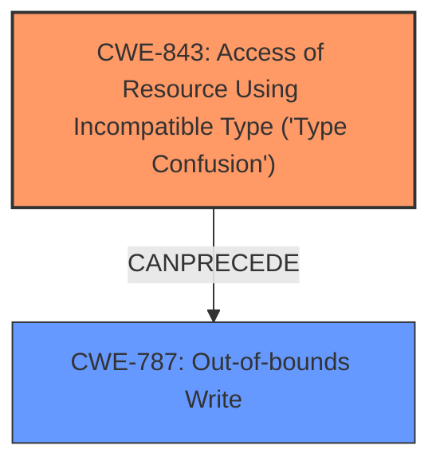

# Final Resolution for CVE-2022-4174

# Summary
| CWE ID | CWE Name | Confidence | CWE Abstraction Level | CWE Vulnerability Mapping Label | CWE-Vulnerability Mapping Notes |
|---|---|---|---|---|---|
| CWE-843 | Access of Resource Using Incompatible Type ('Type Confusion') | 0.95 | Base | Allowed | Primary CWE. Matches the **type confusion** vulnerability in V8. |
| CWE-787 | Out-of-bounds Write | 0.7 | Base | Allowed | Secondary candidate. The **type confusion** could result in writing outside of the intended memory bounds during an operation leading to heap corruption. |

## Evidence and Confidence

*   **Confidence Score:** 0.9
*   **Evidence Strength:** MEDIUM

## Relationship Analysis
The primary relationship influencing the decision is the potential for **CWE-843 (Type Confusion)** to lead to **CWE-787 (Out-of-bounds Write)**. While a Use-After-Free is possible, the vulnerability description explicitly mentions "heap corruption," which is more directly linked to out-of-bounds writes.

## Vulnerability Chain
The vulnerability chain starts with **CWE-843 (Type Confusion)**. The incorrect type interpretation leads to memory corruption, specifically on the heap. This corruption manifests as **CWE-787 (Out-of-bounds Write)** because the type confusion allows for writing to memory locations outside the intended buffer.

## Summary of Analysis
The initial analysis correctly identified **CWE-843 (Type Confusion)** as the primary weakness. The criticism suggested considering other consequences like **CWE-787 (Out-of-bounds Write)**, especially given the "heap corruption" mentioned in the vulnerability description.

The decision to include **CWE-787 (Out-of-bounds Write)** as a secondary CWE is based on the following:
*   The vulnerability description's mention of "heap corruption" suggests a memory corruption issue beyond just type mismatch. Out-of-bounds write is a direct cause of heap corruption.
*   The *CanPrecede* relationship between **CWE-843 (Type Confusion)** and **CWE-787 (Out-of-bounds Write)** suggests that type confusion can lead to out-of-bounds write, making it a plausible consequence in this scenario.

The evidence supporting **CWE-843 (Type Confusion)** is strong due to the explicit mention of "type confusion". The confidence in **CWE-787 (Out-of-bounds Write)** is slightly lower (0.7) because it is an inferred consequence based on "heap corruption". However, considering the relationship between the two CWEs, it is a reasonable addition to the classification. The provided evidence is not fully descriptive but it is sufficient.

CWE-843 and CWE-787 are at the optimal level of specificity because they are both Base level CWEs and accurately describe the **rootcause** and consequence of the vulnerability.