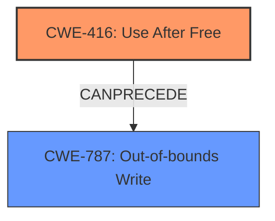

# Final Resolution for CVE-2022-4175

# Summary
| CWE ID | CWE Name | Confidence | CWE Abstraction Level | CWE Vulnerability Mapping Label | CWE-Vulnerability Mapping Notes |
|---|---|---|---|---|---|
| CWE-416 | Use After Free | 1.0 | Variant | Allowed | Primary CWE |
| CWE-787 | Out-of-bounds Write | 0.4 | Base | Allowed | Secondary Candidate |

## Evidence and Confidence

*   **Confidence Score:** 0.9
*   **Evidence Strength:** HIGH

## Relationship Analysis
The primary relationship is the potential for **CWE-416 (Use After Free)** to lead to **CWE-787 (Out-of-bounds Write)**, which can cause **heap corruption**. While **CWE-416 (Use After Free)** is the direct cause, the **heap corruption** mentioned in the description suggests that **CWE-787 (Out-of-bounds Write)** might be a consequence.

## Vulnerability Chain
The vulnerability chain starts with **CWE-416 (Use After Free)**. The use of freed memory can lead to **heap corruption**, potentially through an **CWE-787 (Out-of-bounds Write)**. The final impact is a remote attacker's ability to exploit the **heap corruption** via a crafted HTML page.

## Summary of Analysis
The initial analysis correctly identified **CWE-416 (Use After Free)** as the primary **ROOTCAUSE**. The vulnerability description explicitly mentions "use after free," providing direct evidence. The criticism is valid and strengthens the initial assessment by providing a detailed review and considering other potential CWEs. The additional suggestion to include potential consequences like **CWE-787 (Out-of-bounds Write)** is relevant. The evidence for **CWE-416 (Use After Free)** is strong, with the vulnerability description stating "Use after free in Camera Capture." Given the resulting **heap corruption** a secondary CWE of **CWE-787 (Out-of-bounds Write)** is suggested as a secondary candidate.

The selection of **CWE-416 (Use After Free)** is at the optimal level of specificity (Variant), as it directly reflects the described vulnerability. Including **CWE-787 (Out-of-bounds Write)** provides additional context to the potential consequences of the **ROOTCAUSE**.