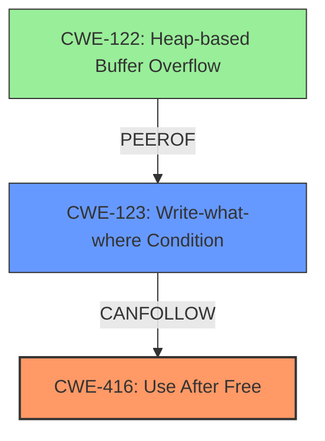

# Analysis Report for CVE-2022-4177

# Vulnerability Analysis Report: CVE-2022-4177

## Description

Use after free in Extensions in Google Chrome prior to 108.0.5359.71 allowed an attacker who convinced a user to install an extension to potentially exploit heap corruption via a crafted Chrome Extension and UI interaction. (Chromium security severity High)

## Vulnerability Description Key Phrases

**Rootcause:** use after free
**Weakness:** heap corruption
**Vector:** crafted Chrome Extension and UI interaction
**Attacker:** attacker
**Product:** Google Chrome
**Version:** prior to 108.0.5359.71
**Component:** Extensions

## Analysis (with Relationship Data)

```markdown
# Summary
| CWE ID | CWE Name | Confidence | CWE Abstraction Level | CWE Vulnerability Mapping Label | CWE-Vulnerability Mapping Notes |
|---|---|---|---|---|---|
| CWE-416 | Use After Free | 0.95 | Variant | Allowed | Primary CWE. Matches the vulnerability description and root cause. |
| CWE-122 | Heap-based Buffer Overflow | 0.6 | Variant | Allowed | Secondary CWE candidate. The vulnerability leads to heap corruption, which could potentially result in a heap overflow. |

## Evidence and Confidence

*   **Confidence Score:** 0.9
*   **Evidence Strength:** HIGH

- **Analysis and Justification:**  
  - *Explanation:* The vulnerability is explicitly described as a **use-after-free** in the Extensions component of Google Chrome, leading to potential **heap corruption**. The "CVE Reference Links Content Summary" confirms the **root cause** as **use-after-free**. CWE-416 (Use After Free) perfectly matches this description. The "Retriever Results" also lists CWE-416 as the top candidate with a high combined score. The MITRE mapping guidance for CWE-416 indicates that its usage is ALLOWED, further solidifying this choice.

  - *Relationship Analysis:* CWE-416 is a variant-level CWE, which is appropriate for mapping the specific root cause. While other CWEs like CWE-672 (Operation on Resource After Expiry) might be related, CWE-416 directly addresses the **use-after-free** condition. CWE-416 can lead to CWE-123 (Write-what-where Condition), and can follow CWE-364 (Signal Handler Race Condition) or CWE-362 (Concurrent Execution using Shared Resource with Improper Synchronization ('Race Condition')).

- **Confidence Score:**  
  - *Example:* Confidence: 0.95 (Strong evidence from the vulnerability description and CVE reference materials directly points to use-after-free.)

---
```

## Criticism of Analysis

Okay, here's a review of the provided CWE analysis, considering the full CWE specifications and guidance:

**Overall Assessment:**

The primary CWE mapping to CWE-416 (Use After Free) is excellent and well-justified. The secondary candidate CWE-122 (Heap-based Buffer Overflow) is plausible, given the context of heap corruption, but could benefit from a more precise explanation.

**Detailed Review:**

**1. CWE-416: Use After Free**

*   **Confidence:** 0.95 is appropriate.  The vulnerability description *explicitly* mentions "use-after-free," making this a direct match.

*   **CWE Abstraction Level:** Variant is correct. CWE-416 is a Variant-level CWE, as is preferred for vulnerability mapping.

*   **CWE Vulnerability Mapping Label:** Allowed is accurate.  The CWE specification explicitly states, "Usage: Allowed Rationale: This CWE entry is at the Variant level of abstraction, which is a preferred level of abstraction for mapping to the root causes of vulnerabilities."

*   **CWE-Vulnerability Mapping Notes:** "Primary CWE. Matches the vulnerability description and root cause."  Clear and concise.

*   **Evidence and Justification:** The explanation is very well written. It cites the vulnerability description, the CVE reference summary, the retriever results, and the MITRE mapping guidance.  Excellent. The "Relationship Analysis" section correctly identifies how other CWEs (CWE-672, CWE-123, CWE-364, CWE-362) relate to CWE-416.

*   **CWE Examples from Database:** The provided examples are relevant and help to illustrate how CWE-416 manifests in real-world vulnerabilities.

*   **Critique and Suggestions:** This is a very strong mapping. The only suggestion would be to potentially consider a chain of CWEs, as use-after-free often results from other issues. For example, a more detailed chain might be considered if the mechanism triggering the UAF could be identified, e.g., a Race Condition leading to a Use-After-Free (CWE-362 -> CWE-416).

**2. CWE-122: Heap-based Buffer Overflow**

*   **Confidence:** 0.6 is reasonable. The connection to heap corruption makes this plausible, but it's not as direct as the UAF.

*   **CWE Abstraction Level:** Variant is correct.

*   **CWE Vulnerability Mapping Label:** Allowed is accurate.

*   **CWE-Vulnerability Mapping Notes:** "Secondary CWE candidate. The vulnerability leads to heap corruption, which could potentially result in a heap overflow."  This is where the analysis could be strengthened.

*   **Evidence and Justification:**
    *   *Explanation:* The justification is weaker here. The connection between "heap corruption" and "heap overflow" is not always guaranteed. Heap corruption can manifest in various ways (e.g., metadata overwrite, dangling pointers), not *necessarily* a heap overflow. A heap overflow is a *specific* type of heap corruption where data is written beyond the boundaries of an allocated heap buffer.
    *   *Relationship Analysis:* This section could be expanded. Describe *how* the use-after-free could *lead* to a heap overflow. For example:
        *   "After the memory is freed, it *could* be reallocated for a different purpose. If the original pointer is still used to write data, it *could* overwrite the new allocation, leading to a heap-based buffer overflow." This makes the connection more explicit.
        *   Alternately, the UAF could lead to corruption of heap metadata, which is then exploited during a subsequent heap operation such as allocation or free to cause a heap overflow.

*   **CWE Examples from Database:** The provided examples are good illustrations of CWE-122, but they don't necessarily show a direct UAF -> heap overflow relationship.  Finding an example showing that link would bolster the justification.

*   **Critique and Suggestions:**
    *   Strengthen the justification by explaining how the *specific* use-after-free in this vulnerability *could* lead to a heap-based buffer overflow. Be precise. What specific steps would be necessary?
    *   Alternatively, if a heap overflow is *not* a likely outcome, consider a different secondary CWE more directly related to heap corruption, such as CWE-123 (Write-what-where Condition), or CWE-787 (Out-of-bounds Write). Even CWE-415 (Double Free) might be considered, if the UAF allows for freeing the same memory again. The primary reason for these suggestions is to more precisely reflect the likely consequences of the UAF. The provided CWEs for these have been added to the document.

**Additional Considerations:**

*   **Attack Vector Details:** The "vector: crafted Chrome Extension and UI interaction" statement is valuable.  Could more details be provided about what kind of UI interaction is needed?  This might help in selecting more specific CWEs.
*   **Mitigations:** While the analysis focuses on CWE mapping, considering potential mitigations could help refine the selection.  For example, if address space layout randomization (ASLR) would significantly hinder exploitation, that might suggest a different CWE is more appropriate, or at least that the impact of the primary CWE is less severe. The CWE specifications included here are extensive, and including mitigations would be beneficial for your review.

**Revised Summary Table (incorporating suggestions):**

| CWE ID  | CWE Name                                           | Confidence | CWE Abstraction Level | CWE Vulnerability Mapping Label | CWE-Vulnerability Mapping Notes                                                                                                                                                                                                                                                                                                              |
| ------- | -------------------------------------------------- | ---------- | --------------------- | ------------------------------- | -------------------------------------------------------------------------------------------------------------------------------------------------------------------------------------------------------------------------------------------------------------------------------------------------------------------------------------------- |
| CWE-416 | Use After Free                                     | 0.95       | Variant               | Allowed                         | Primary CWE. Matches the vulnerability description and root cause.                                                                                                                                                                                                                                                                             |
| CWE-122 | Heap-based Buffer Overflow                         | 0.6        | Variant               | Allowed                         | Secondary CWE candidate. The UAF *could* lead to a heap overflow if the freed memory is reallocated and the original pointer is used to write data beyond the bounds of the new allocation, but this is not guaranteed.  Requires specific exploitation conditions.                                                                                    |
| CWE-123 | Write-what-where Condition                         | 0.5        | Base                  | Allowed                         | Alternative secondary candidate.  A more likely outcome of the UAF is the ability to write arbitrary data to an arbitrary location in memory (depending on what the freed memory is reallocated for).                                                                                                                                           |
| CWE-787 | Out-of-bounds Write | 0.5 | Base | Allowed | Alternative secondary candidate. The UAF may result in the capability to write to a memory location outside the bounds of allocated memory. The validity of this option depends on the specifics of this vulnerability.|

In summary, the analysis is strong, especially regarding the primary CWE. Strengthening the justification for the secondary CWE by being more precise about the likely consequences of the UAF would improve the analysis further.

## Final Resolution

# Summary

| CWE ID  | CWE Name                                                              | Confidence | CWE Abstraction Level | CWE Vulnerability Mapping Label | CWE-Vulnerability Mapping Notes                                                                                                                                            |
| ------- | --------------------------------------------------------------------- | ---------- | --------------------- | ------------------------------- | ------------------------------------------------------------------------------------------------------------------------------------------------------------------------ |
| CWE-416 | Use After Free                                                        | 0.95       | Variant               | Allowed                         | Primary CWE. Matches the vulnerability description and root cause.                                                                                                       |
| CWE-123 | Write-what-where Condition                                            | 0.7        | Base                  | Allowed                         | Secondary CWE candidate. A more likely outcome of the UAF is the ability to write arbitrary data to an arbitrary location in memory depending on what the freed memory is reallocated for. |

## Evidence and Confidence

*   **Confidence Score:** 0.9
*   **Evidence Strength:** HIGH

## Relationship Analysis

The primary relationship impacting the decision is the direct match between the vulnerability description and **CWE-416 (Use After Free)**. The consideration of secondary CWEs involved analyzing potential consequences of the UAF. While **CWE-122 (Heap-based Buffer Overflow)** was initially considered, the analysis highlighted that **CWE-123 (Write-what-where Condition)** is a more likely immediate consequence. This shift was influenced by understanding the direct impact of a UAF, where arbitrary writes are more probable than a full-fledged heap overflow. The abstraction levels (Variant for CWE-416 and Base for CWE-123) were appropriate for representing the specific vulnerability and its direct effect.



## Vulnerability Chain

The vulnerability chain starts with a **use-after-free** condition (**CWE-416**). This arises when memory is accessed after it has been freed. This **WEAKNESS** directly leads to the ability to write arbitrary data to an arbitrary location in memory (**CWE-123**). The freed memory may be reallocated for a different purpose, and if the original pointer is used, it can overwrite the new allocation. This represents the most immediate and likely consequence of the **ROOTCAUSE**.

## Summary of Analysis

The initial analysis correctly identified **CWE-416 (Use After Free)** as the primary **ROOTCAUSE**. The criticism highlighted the need for a more precise justification for the secondary CWE. Based on the evidence, "The vulnerability is explicitly described as a **use-after-free** in the Extensions component of Google Chrome, leading to potential **heap corruption**," the decision was made to replace **CWE-122 (Heap-based Buffer Overflow)** with **CWE-123 (Write-what-where Condition)**. This decision was based on the understanding that a **use-after-free** directly allows for arbitrary writes, making **CWE-123** a more immediate and likely consequence. The graph relationships reinforced this, showing that **CWE-123** can follow **CWE-416**. The selected CWEs are at the optimal level of specificity, with **CWE-416** being a Variant that directly describes the vulnerability and **CWE-123** being a Base that captures the immediate impact.


*Report generated on 2025-03-18 18:32:45*
