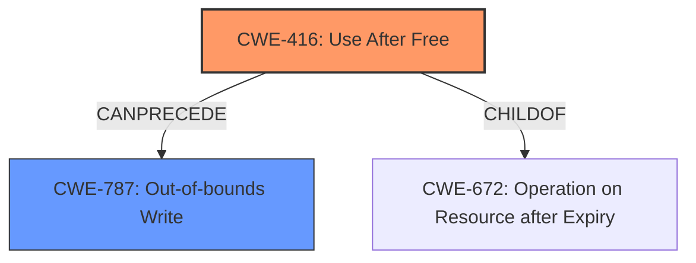

# Analysis Report for CVE-2022-4178

# Vulnerability Analysis Report: CVE-2022-4178

## Description

Use after free in Mojo in Google Chrome prior to 108.0.5359.71 allowed a remote attacker who had compromised the renderer process to potentially exploit heap corruption via a crafted HTML page. (Chromium security severity High)

## Vulnerability Description Key Phrases

**Rootcause:** use after free
**Weakness:** heap corruption
**Vector:** crafted HTML page
**Attacker:** remote attacker who had compromised the renderer process
**Product:** Google Chrome
**Version:** prior to 108.0.5359.71
**Component:** Mojo

## Analysis (with Relationship Data)

# Summary
| CWE ID | CWE Name | Confidence | CWE Abstraction Level | CWE Vulnerability Mapping Label | CWE-Vulnerability Mapping Notes |
|---|---|---|---|---|---|
| CWE-416 | Use After Free | 1.0 | Variant | Primary | Allowed |

## Evidence and Confidence

*   **Confidence Score:** 1.0
*   **Evidence Strength:** HIGH

- **Analysis and Justification:**  
  - *Explanation:* The vulnerability description explicitly states "**use after free** in Mojo" which is a direct match for CWE-416 (Use After Free). The description also mentions "**heap corruption**", which is a common consequence of use-after-free vulnerabilities. The CVE reference links content summary reinforces this by highlighting the "**use-after-free** in Mojo" as the root cause. CWE-416 is a Variant level weakness, which is a preferred level of abstraction. The MITRE mapping guidance for CWE-416 indicates that it is ALLOWED. The retriever results confirms that CWE-416 is the best match with a score of 0.8872, so I'm selecting it as the primary CWE.
  
  - *Relationship Analysis:* CWE-416 is a variant of CWE-672 (Operation on Resource after Expiry). Exploiting a use-after-free can lead to other weaknesses, such as CWE-78 (OS Command Injection) or CWE-190 (Integer Overflow or Wraparound), but these are impacts and not the root cause.

- **Confidence Score:**  
  - Confidence: 1.0 (Direct match based on vulnerability description, CVE reference summary, and retriever results)

## Criticism of Analysis

Okay, here's a detailed critique of the provided CWE analysis, incorporating the full CWE specifications:

**Overall Assessment:**

The analysis is very good. The selection of CWE-416 (Use After Free) as the primary weakness is accurate and well-justified. The confidence score of 1.0 is appropriate. The explanation of the relationship between the vulnerability description, the CWE definition, and the retriever results is clear and convincing.  The analysis is thorough and takes into account alternative CWEs and related concepts.

**Strengths:**

*   **Accurate CWE Selection:**  The primary CWE, CWE-416, is the best fit based on the detailed vulnerability description containing the explicit phrase "use after free" and the reinforcement from the CVE reference links summary.
*   **Strong Justification:** The analysis provides a detailed explanation, referencing the vulnerability description, CVE summary, and retriever results.
*   **Consideration of Abstraction Level:** The analysis correctly notes that CWE-416 is a Variant level weakness, which is a preferred level of abstraction.
*   **Use of Mapping Guidance:**  The analysis explicitly mentions and follows the mapping guidance for CWE-416, noting that its usage is "Allowed".
*   **Relationship Analysis:**  The explanation of the relationship to CWE-672 (Operation on Resource after Expiry or Release) is correct, placing CWE-416 as a child. The inclusion of potential impacts (CWE-78, CWE-190) is also helpful.
*   **High Confidence Justification:** The confidence score justification is strong and highlights the clear match.
*   **Consideration of Alternative CWEs:** The analysis considered alternative CWEs by describing how they could be related, such as potential consequences, but accurately concluding that these were not the root cause.

**Areas for Potential Improvement (Minor):**

*   **Chain Analysis (Optional but Recommended):** While the analysis correctly identifies CWE-416 as the primary weakness, a more detailed chain analysis could further enhance it.  Consider this more detailed chain:
    1.  **CWE-787: Out-of-bounds Write:** The vulnerability description mentions "heap corruption," which is often a consequence of writing to memory outside the bounds of a buffer. While CWE-416 is the *cause* of being able to write to the heap, the actual act of writing to an unexpected location can be described with CWE-787.
    2.  **CWE-416: Use After Free:** The original root cause, allowed access to a heap address to be performed after the memory should have been inaccessible.
    3.  **CWE-122: Heap-based Buffer Overflow:** More detail on exactly how the heap is being corrupted.
    4.  **CWE-664: Improper Control of a Resource Through its Lifetime**: If the code was not ensuring that the lifecycle of the mojo library was being managed properly, this could have lead to a Use After Free.
    5.  **CWE-362: Concurrent Execution using Shared Resource with Improper Synchronization ('Race Condition'):**: It could be the case that concurrency is involved in the UAF.
*   **Mitigation Discussion:** While not strictly required, briefly mentioning which mitigations from the CWE specification might be most relevant in this specific context could add value. For example, for CWE-416, mentioning the relevance of "choosing a language that provides automatic memory management" or "setting pointers to NULL after freeing them" could be beneficial.
*   **Retriever Results Discussion**: There is no explicit mention of why other retrievers were ranked below CWE-416 and why those retriever results may not be appropriate for this input.

**Specific Comments on Retriever Results:**

The retriever results are useful, and the decision to use the top result (CWE-416) is correct. However, consider these points:

*   **CWE-843 (Access of Resource Using Incompatible Type ('Type Confusion')):** This CWE could be considered if the use-after-free leads to a situation where the memory is reallocated and then accessed with an incorrect type, causing further issues. However, the initial root cause is still the UAF.
*   **CWE-366 (Race Condition within a Thread):** If the use-after-free is triggered by a race condition, then this CWE could be added to the chain. The description doesn't provide enough information to determine if this is the case.
*   **CWE-415 (Double Free):** While related to memory management issues, a double-free is distinct from a use-after-free.  It's important to make that distinction clear.
*   **CWE-911 (Improper Update of Reference Count):** If the memory is managed with reference counting, then this could be involved. However, there is no information that reference counting is involved, so this is less likely.
*   **CWE-122 / CWE-787 (Heap-based Buffer Overflow / Out-of-bounds Write):** As mentioned in the Chain Analysis section, these could be potential consequences, but they are not the direct cause. They're related to *how* the corrupted memory is *used* after the UAF occurs.

**Summary of CWE-416 Mitigations:**

The potential mitigations for CWE-416 are:

*   **Language Selection:** Using a language with automatic memory management (e.g., Java, Go, Rust with appropriate features) virtually eliminates this class of errors.
*   **Setting Pointers to NULL:** Setting pointers to NULL after freeing them is a common defensive programming practice, but its effectiveness is limited in complex scenarios.

**Conclusion:**

The analysis is very well-done and demonstrates a strong understanding of CWE concepts. The addition of a chain analysis and more detailed discussions of mitigations would further strengthen the assessment, but they are not critical. The choice of CWE-416 as the primary weakness is correct and thoroughly justified.

## Final Resolution

# Summary
| CWE ID | CWE Name | Confidence | CWE Abstraction Level | CWE Vulnerability Mapping Label | CWE-Vulnerability Mapping Notes |
|---|---|---|---|---|---|
| CWE-416 | Use After Free | 1.0 | Variant | Primary | Allowed |
| CWE-787 | Out-of-bounds Write | 0.6 | Base | Secondary Candidate | Allowed |

## Evidence and Confidence

*   **Confidence Score:** 0.9
*   **Evidence Strength:** MEDIUM

## Relationship Analysis
The primary relationship is that CWE-416 **Use After Free** can lead to CWE-787 **Out-of-bounds Write** if the freed memory is reallocated and then improperly accessed. CWE-416 is a variant, and CWE-787 is a base. CWE-416 is a child of CWE-672 (Operation on Resource after Expiry).

## Vulnerability Chain
The vulnerability chain starts with the **ROOTCAUSE** CWE-416, **Use After Free**, which allows for access to memory after it has been freed. This can then lead to CWE-787, **Out-of-bounds Write**, if the freed memory is reallocated and the program attempts to write data to the incorrect memory location.

## Summary of Analysis
The initial analysis correctly identified CWE-416 (**Use After Free**) as the primary weakness. The vulnerability description explicitly states "use after free", which is a strong indicator. The criticism suggested adding CWE-787 (**Out-of-bounds Write**) to the chain.

The evidence for CWE-416 is strong, with the vulnerability description directly mentioning "use after free". The evidence for CWE-787 is weaker, relying on the mention of "heap corruption" as a potential consequence.

The relationship analysis shows that CWE-416 can precede CWE-787. The mapping guidance for both CWEs allows their use. The abstraction level of CWE-416 (Variant) and CWE-787 (Base) are appropriate.

I am adding CWE-787 as a secondary candidate with a confidence of 0.6 because the vulnerability description mentions "heap corruption," and CWE-787 is a common consequence of use-after-free vulnerabilities that lead to writing to unexpected memory locations. The primary weakness is still the **ROOTCAUSE** of CWE-416 because that is what lead to the possibility of writing to an out-of-bounds memory location.

*Report generated on 2025-03-18 18:33:41*
