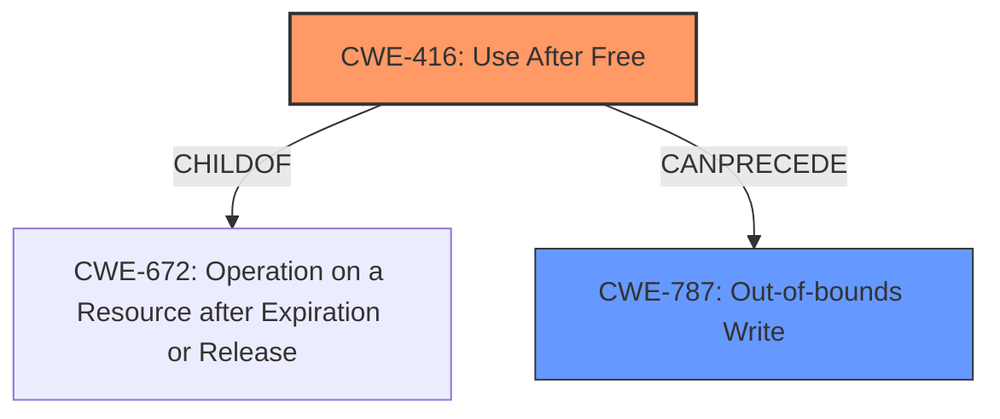

# Final Resolution for CVE-2022-4181

# Summary
| CWE ID | CWE Name | Confidence | CWE Abstraction Level | CWE Vulnerability Mapping Label | CWE-Vulnerability Mapping Notes |
|---|---|---|---|---|---|
| CWE-416 | Use After Free | 1.0 | Variant | Allowed | Primary CWE. Directly reflects the root cause identified in the vulnerability description. Can lead to heap corruption. |
| CWE-787 | Out-of-bounds Write | 0.3 | Base | Allowed | Secondary. *Consequence* of memory corruption due to UAF. |

## Evidence and Confidence

*   **Confidence Score:** 0.9
*   **Evidence Strength:** MEDIUM

## Relationship Analysis
The primary relationship considered was the parent-child relationship between CWE-672 (Operation on a Resource after Expiration or Release) and CWE-416 (**Use After Free**). CWE-416 is a variant of CWE-672, making it more specific and appropriate. The analysis also considered the potential for heap corruption as a result of the **Use After Free**, leading to the consideration of CWE-787 (**Out-of-bounds Write**) as a secondary CWE. These two are related as CWE-787 can follow CWE-416.

## Vulnerability Chain
The vulnerability chain starts with the **Use After Free (CWE-416)**. The application attempts to access memory that has already been freed, leading to memory corruption. If the attacker can control the content written to the freed memory, it can lead to **Out-of-bounds Write (CWE-787)**. The final impact is the potential for arbitrary code execution due to heap corruption.

## Summary of Analysis
The initial analysis correctly identified **CWE-416 (Use After Free)** as the primary **weakness**, based on the explicit mention of "**use after free**" in the vulnerability description. The criticism raised a valid point about acknowledging the "heap corruption" aspect of the vulnerability. While **CWE-416** remains the root cause, the heap corruption can be viewed as a consequence. This led to the consideration of **CWE-787 (Out-of-bounds Write)** as a secondary CWE, as writing to freed memory can corrupt the heap, potentially leading to an out-of-bounds write condition if the attacker has control over the write.

The graph relationships influenced the decision by highlighting the hierarchical relationship between **CWE-672** and **CWE-416**, reinforcing the selection of the more specific **CWE-416**.

The selected CWEs are at the optimal level of specificity because **CWE-416** directly addresses the **root cause** (use after free), and **CWE-787** captures a potential consequence (heap corruption leading to out-of-bounds write).

The evidence supporting this decision is the vulnerability description, which explicitly states "**use after free**" as the cause. The relationship analysis and the consideration of heap corruption further strengthen the justification.