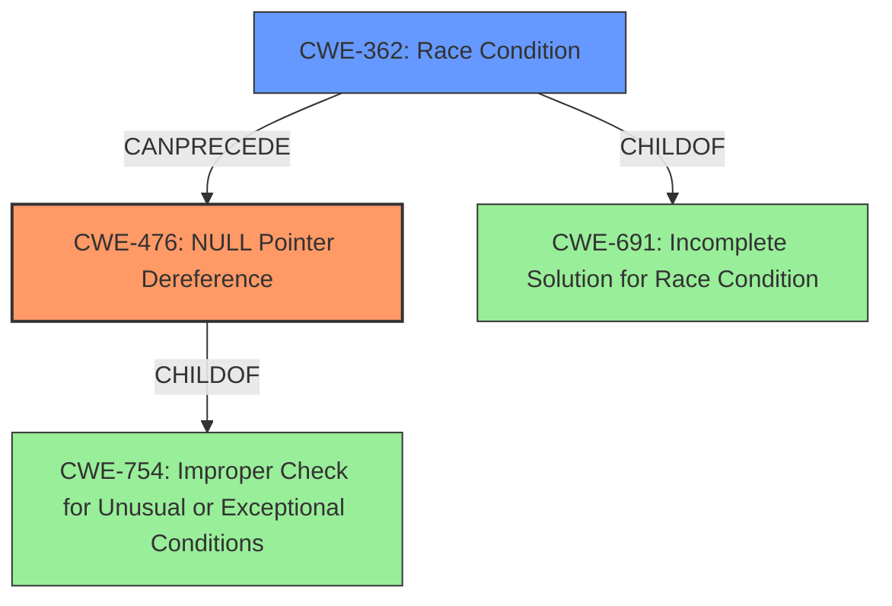

# Final Resolution for CVE-2022-41858

# Summary
| CWE ID | CWE Name | Confidence | CWE Abstraction Level | CWE Vulnerability Mapping Label | CWE-Vulnerability Mapping Notes |
|---|---|---|---|---|---|
| CWE-476 | **NULL** Pointer Dereference | 1.0 | Base | Allowed | Primary CWE |
| CWE-362 | Concurrent Execution using Shared Resource with Improper Synchronization ('Race Condition') | 0.7 | Class | Allowed-with-Review | Secondary Candidate |

## Evidence and Confidence

*   **Confidence Score:** 0.95
*   **Evidence Strength:** HIGH

## Relationship Analysis
The primary relationship influencing the decision is the potential chain where CWE-362 (Race Condition) can precede CWE-476 (**NULL** Pointer Dereference). However, the core issue remains the dereference of a **NULL** pointer. CWE-476 is a base-level CWE, making it more specific than the class-level CWE-362. The parent-child relationships of CWE-476 (ChildOf CWE-754: Improper Check for Unusual or Exceptional Conditions) and CWE-362 (ChildOf CWE-691: Incomplete Solution for Race Condition) were considered, but the direct nature of the **NULL** pointer dereference makes CWE-476 the most appropriate primary classification.

## Vulnerability Chain
The vulnerability chain starts with a race condition (CWE-362) between `slip_close()` and `sl_tx_timeout()`. This race condition leads to the `tty` pointer in the `sl` structure being set to **NULL** while `sl_tx_timeout()` is still running. Consequently, `sl_tx_timeout()` attempts to dereference the **NULL** `tty` pointer (CWE-476), leading to a system crash or information leak.

## Summary of Analysis
The initial analysis and criticism are both accurate in identifying CWE-476 as the primary **WEAKNESS**, with CWE-362 as a contributing factor. The vulnerability description explicitly states a "**NULL pointer dereference**" in `sl_tx_timeout`, which aligns directly with CWE-476. The evidence provided is strong, with the CVE reference confirming the lack of validation before dereferencing the `tty` pointer. The chain relationship (CWE-362 CanPrecede CWE-476) reinforces the role of the race condition, but the direct consequence is the **NULL** pointer dereference. The choice of CWE-476 is at the optimal level of specificity because it directly addresses the **ROOTCAUSE** of the crash. The other retriever results were correctly dismissed as they describe related but not directly applicable **WEAKNESS**es. The final decision is based on the direct match between the vulnerability description and the CWE-476 definition, supported by the CVE reference and the understanding of the vulnerability chain.