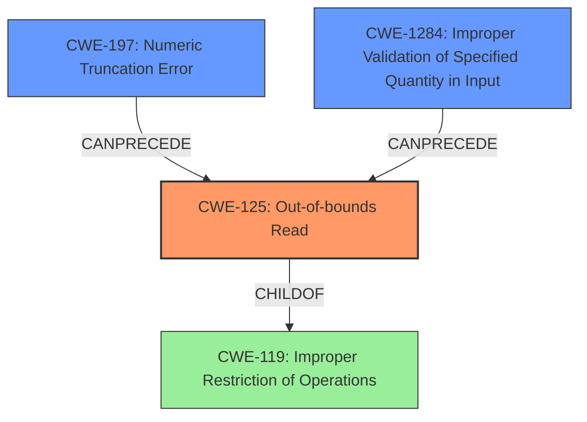

# Final Resolution for CVE-2022-41873

# Summary
| CWE ID  | CWE Name                                     | Confidence | CWE Abstraction Level | CWE Vulnerability Mapping Label | CWE-Vulnerability Mapping Notes                                                                                                                                                                                                                                                               |
| :-------- | :--------------------------------------------- | :--------- | :---------------------- | :------------------------------ | :--------------------------------------------------------------------------------------------------------------------------------------------------------------------------------------------------------------------------------------------------------------------------------------- |
| CWE-125   | Out-of-bounds Read                             | 0.95       | Base                    | Allowed                         | Primary CWE                                                                                                                                                                                                                                                                      |
| CWE-197   | Numeric Truncation Error                       | 0.85       | Base                    | Allowed                         | Secondary Candidate - Root Cause                                                                                                                                                                                                                                                           |
| CWE-1284  | Improper Validation of Specified Quantity in Input | 0.75 | Base | Allowed | Contributing Factor - Ineffective validation due to truncation. |

## Evidence and Confidence

*   **Confidence Score:** 0.90
*   **Evidence Strength:** HIGH

## Relationship Analysis
The primary relationship is that **CWE-197 (Numeric Truncation Error)** leads to **CWE-125 (Out-of-bounds Read)**. The truncation error causes an incorrect bounds check which then permits the out-of-bounds read. **CWE-1284 (Improper Validation of Specified Quantity in Input)** highlights how the **truncation** undermines the validation process. All three are at the Base level of abstraction, providing appropriate specificity. There is also a hierarchical relationship as CWE-125 is a child of **CWE-119 (Improper Restriction of Operations Within the Bounds of a Memory Buffer)**, but CWE-125 is more specific in this case.

## Vulnerability Chain
The vulnerability chain starts with the **ROOTCAUSE** being **CWE-197 (Numeric Truncation Error)**. This leads to **CWE-1284 (Improper Validation of Specified Quantity in Input)** because the truncation renders the intended validation ineffective. This ultimately allows an attacker to trigger **CWE-125 (Out-of-bounds Read)**, resulting in the ability to read sensitive data from memory.

## Summary of Analysis
The analysis accurately identifies **CWE-125 (Out-of-bounds Read)** as the primary weakness, supported by the explicit mention of "Out-of-bounds read" in the vulnerability description. The evidence is strong, stemming directly from the vulnerability report: "A crafted channel ID leads to out-of-bounds memory to be read and written with attacker-controlled data."

**CWE-197 (Numeric Truncation Error)** is correctly identified as a secondary weakness, acting as the root cause. The vulnerability description states, "However, an integer truncation issue leads to only the lowest byte of the channel ID to be checked, which leads to an incomplete out-of-bounds check." The relationship analysis confirms that CWE-197 can precede CWE-125, as the truncation error enables the out-of-bounds read.

The addition of **CWE-1284 (Improper Validation of Specified Quantity in Input)** provides further context by highlighting how the truncation undermines the intended input validation, making it ineffective. Although not a direct cause of the OOB read, it explains how the truncated value was able to bypass the original validation logic.

The selected CWEs are at the optimal level of specificity. While **CWE-119 (Improper Restriction of Operations Within the Bounds of a Memory Buffer)** is a parent of CWE-125, the latter is more specific and accurately reflects the read operation. All CWEs are at the Base level, which is preferred.

The decision to include CWE-1284 is based on the understanding that the truncation directly impacts the validation process. The description for CWE-1284 states that "The product receives input that is expected to specify a quantity (such as size or length), but it does not validate or incorrectly validates that the quantity has the required properties." Therefore it is a valid contributor.