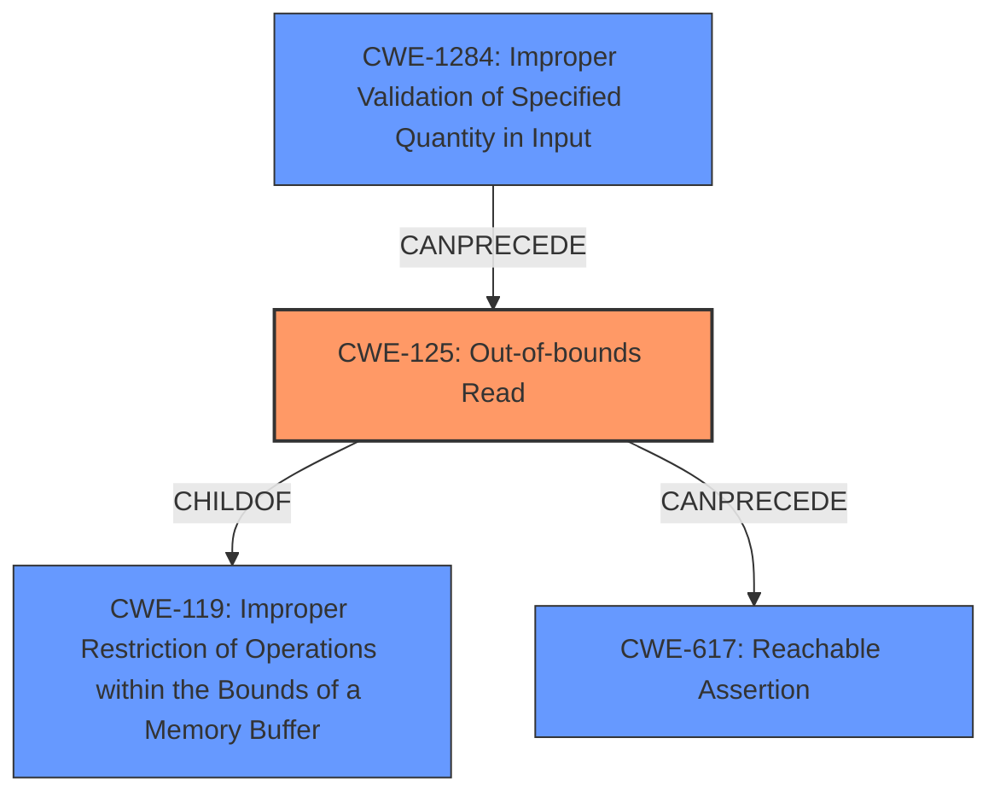

# Analysis Report for CVE-2022-41902

# Vulnerability Analysis Report: CVE-2022-41902

## Description

TensorFlow is an open source platform for machine learning. The function MakeGrapplerFunctionItem takes arguments that determine the sizes of inputs and outputs. If the inputs given are greater than or equal to the sizes of the outputs, an out-of-bounds memory read or a crash is triggered. We have patched the issue in GitHub commit a65411a1d69edfb16b25907ffb8f73556ce36bb7. The fix will be included in TensorFlow 2.11.0. We will also cherrypick this commit on TensorFlow 2.8.4, 2.9.3, and 2.10.1.

## Vulnerability Description Key Phrases

**Weakness:** out-of-bounds memory read
**Impact:** crash
**Product:** TensorFlow
**Version:** before 2.11.0
**Component:** MakeGrapplerFunctionItem function

## Analysis (with Relationship Data)

# Summary
| CWE ID | CWE Name | Confidence | CWE Abstraction Level | CWE Vulnerability Mapping Label | CWE-Vulnerability Mapping Notes |
|---|---|---|---|---|---|
| CWE-125 | Out-of-bounds Read | 0.95 | Base | Primary | Allowed |
| CWE-1284 | Improper Validation of Specified Quantity in Input | 0.75 | Base | Secondary | Allowed |
| CWE-617 | Reachable Assertion | 0.6 | Base | Secondary | Allowed |

## Evidence and Confidence

*   **Confidence Score:** 0.9
*   **Evidence Strength:** HIGH

- **Analysis and Justification:**  
  - *Explanation:* The vulnerability description explicitly mentions an "**out-of-bounds memory read**" condition in the `MakeGrapplerFunctionItem` function of TensorFlow. This occurs when input sizes are greater than or equal to output sizes, leading to reading memory outside the intended buffer. CWE-125 (Out-of-bounds Read) directly addresses this weakness, making it the most appropriate primary mapping. The "CVE Reference Links Content Summary" further confirms that the root cause involves a lack of proper bounds checking and can be generally categorized as CWE-125. The MITRE mapping guidance for CWE-125 indicates that it's ALLOWED for this type of vulnerability.

  - *Relationship Analysis:* CWE-125 is a child of CWE-119 (Improper Restriction of Operations within the Bounds of a Memory Buffer). The relationship clarifies that the out-of-bounds read is a specific type of buffer handling issue. CWE-1284 (Improper Validation of Specified Quantity in Input) is also relevant because the vulnerability arises from a failure to validate the input sizes against the output sizes. The retriever scores also indicated it as a candidate. CWE-617 is also a possible mapping since the out-of-bounds read can cause a crash.

- **Confidence Score:**  
  - Confidence: 0.95 (High confidence due to direct evidence from the vulnerability description and CVE reference summary, supported by retriever results and MITRE guidance)

## Criticism of Analysis

Okay, here's a breakdown and critique of the provided CWE analysis, incorporating the full CWE specifications:

**Overall Assessment:**

The analysis is generally good and arrives at a reasonable primary CWE. The justification is well-written and explains the reasoning behind the chosen CWEs. However, some aspects can be refined for greater accuracy and completeness.

**Detailed Critique:**

**1. Primary CWE: CWE-125 (Out-of-bounds Read)**

*   **Confidence:** 0.95
*   **Correctness:** Correct and well-justified.
*   **Justification Strength:** Strong. The vulnerability description directly states "out-of-bounds memory read." The vulnerability is a clear instance of reading data beyond the intended boundaries of a buffer.
*   **Mitigation Considerations:** The analysis could mention potential mitigations as described in the CWE specifications.
    *   **Input Validation:** As highlighted by the retriever results.  The most relevant mitigation is rigorous input validation to ensure input sizes are within expected bounds relative to output sizes. The "accept known good" input validation strategy is directly applicable.
    *   **Language Selection:**  While a rewrite in a memory-safe language is a significant undertaking, it's worth mentioning as a potential long-term solution, per the CWE specification.
*   **CWE-119 Parent Relationship** In general, CWE-119 is not a specific enough mapping. Instead, the CWE specification discourages the use of it and encourages the use of its children instead. This has been done by selecting CWE-125.

**2. Secondary CWE: CWE-1284 (Improper Validation of Specified Quantity in Input)**

*   **Confidence:** 0.75
*   **Correctness:** Correct and relevant.
*   **Justification Strength:** The failure to validate the input sizes against the output sizes is a key aspect of the vulnerability. CWE-1284 accurately captures this.
*   **Mitigation Considerations:** The CWE specification for CWE-1284 emphasizes the importance of assuming all input is malicious and using a strict "accept known good" input validation strategy. This should be mentioned explicitly. It is also worth noting that the description indicates this entry is still under development.
    * An example can be provided here: *Reject any input where the input size is greater or equal than the output size*.

**3. Secondary CWE: CWE-617 (Reachable Assertion)**

*   **Confidence:** 0.6
*   **Correctness:** Arguable. While an assertion *could* be triggered due to the OOB read (leading to a crash), it's not the fundamental *cause* of the vulnerability.  The vulnerability exists even if there's no assertion. This is more of a potential *consequence* of the OOB read.
*   **Justification Strength:** Weaker than the others. The connection is more indirect. While a crash is mentioned in the vulnerability description, it's not necessarily due to an assertion.
*   **Mitigation Considerations:** The mitigation strategies for CWE-617 (making sensitive operations unreachable and performing input validation) are already covered by CWE-125 and CWE-1284. So, it doesn't add significantly to the analysis.
*   **Alternative:** If a crash is guaranteed, it is more accurate; however, other errors could result.

**Additional Considerations & Suggestions:**

*   **CWE-787 (Out-of-bounds Write):** While the vulnerability is primarily described as an out-of-bounds *read*, there's a possibility that an attacker could leverage the out-of-bounds access to *write* to memory as well, especially if the contents being read are used to make decisions that later impact memory allocation or data handling. If the out-of-bounds read exposes sensitive data that's used to construct a write operation, then CWE-787 would be more strongly warranted. Without this further clarification, it's difficult to justify adding it, but it's something to consider when analyzing the code.
*   **CWE-824 (Access of Uninitialized Pointer):** The retriever results listed this as a candidate. While it doesn't seem to be directly applicable from the description, it is possible an uninitialized pointer could be exposed due to the out-of-bounds read.
*   **Chaining:** The analysis could benefit from explicitly mentioning potential chaining. For example:
    *   "CWE-1284 can lead to CWE-125.  Improper validation (CWE-1284) allows an attacker to provide input sizes that trigger an out-of-bounds read (CWE-125)."
*   **Negative Emphasis:** The analysis could state why certain highly-scored CWEs from the retriever results *weren't* selected. This demonstrates thoroughness. For example, explaining why CWE-476 (NULL Pointer Dereference) isn't the primary CWE. *While a crash might occur, the root cause isn't a NULL pointer dereference, but rather a memory read outside the bounds of the buffer.*
*   **Context:**  Keep in mind that the best CWE mapping depends on the level of detail known about the vulnerability and the specific goals of the analysis.

**Revised Summary Table (incorporating suggestions):**

| CWE ID  | CWE Name                                      | Confidence | CWE Abstraction Level | CWE Vulnerability Mapping Label | CWE-Vulnerability Mapping Notes                                                                                                                                                                                                                                                                              |
| :------ | :-------------------------------------------- | :--------- | :---------------------- | :------------------------------ | :----------------------------------------------------------------------------------------------------------------------------------------------------------------------------------------------------------------------------------------------------------------------------------------------------- |
| CWE-125 | Out-of-bounds Read                            | 0.95       | Base                    | Primary                       | Allowed. Directly reflects the "out-of-bounds memory read" vulnerability. Mitigation: Rigorous input validation and consideration of memory-safe languages.                                                                                                                                              |
| CWE-1284 | Improper Validation of Specified Quantity in Input | 0.80       | Base                    | Secondary                     | Allowed.  The root cause is the lack of input validation of input sizes relative to output sizes. Mitigation: Strict "accept known good" input validation of input sizes. Example: Reject any input where the input size is greater than or equal to the output size.                                          |
| CWE-617 | Reachable Assertion                            | 0.5       | Base                    | Consequence                     | Allowed. While a crash is possible, it is not guaranteed and may not be caused by an assertion failure.                                                                                                                                                                                                |

By incorporating these refinements, the analysis becomes more comprehensive, accurate, and actionable.

## Final Resolution

# Summary
| CWE ID | CWE Name | Confidence | CWE Abstraction Level | CWE Vulnerability Mapping Label | CWE-Vulnerability Mapping Notes |
|---|---|---|---|---|---|
| CWE-125 | Out-of-bounds Read | 0.95 | Base | Primary | Allowed. Directly reflects the "out-of-bounds memory read" vulnerability. Mitigation: Rigorous input validation and consideration of memory-safe languages. |
| CWE-1284 | Improper Validation of Specified Quantity in Input | 0.80 | Base | Secondary | Allowed. The root cause is the lack of input validation of input sizes relative to output sizes. Mitigation: Strict "accept known good" input validation of input sizes. Example: Reject any input where the input size is greater than or equal to the output size. |
| CWE-617 | Reachable Assertion | 0.50 | Base | Consequence | Allowed. While a crash is possible, it is not guaranteed and may not be caused by an assertion failure. |

## Evidence and Confidence

*   **Confidence Score:** 0.9
*   **Evidence Strength:** HIGH

## Relationship Analysis
The primary weakness is **CWE-125 (Out-of-bounds Read)**, which is a specific type of memory error. It is a child of **CWE-119 (Improper Restriction of Operations within the Bounds of a Memory Buffer)**, but choosing **CWE-125** provides a more specific and accurate description of the vulnerability. **CWE-1284 (Improper Validation of Specified Quantity in Input)** can precede **CWE-125**, as the lack of input validation leads to the out-of-bounds read. **CWE-617 (Reachable Assertion)** is a potential consequence of **CWE-125**, but less directly related than **CWE-1284**. The Base abstraction level of **CWE-125**, **CWE-1284**, and **CWE-617** is appropriate for identifying root causes.

## Vulnerability Chain
The vulnerability chain starts with **CWE-1284 (Improper Validation of Specified Quantity in Input)**, where the input sizes are not properly validated against the output sizes. This leads to **CWE-125 (Out-of-bounds Read)**, where the program reads memory outside the intended buffer. This out-of-bounds read can potentially cause a crash or other unexpected behavior, which can manifest as **CWE-617 (Reachable Assertion)** if an assertion is triggered. The root cause is the missing input validation, leading to a memory safety issue and potential denial of service.

## Summary of Analysis
The initial analysis and criticism both correctly identified **CWE-125 (Out-of-bounds Read)** as the primary issue, supported by the vulnerability description: "If the inputs given are greater than or equal to the sizes of the outputs, an **out-of-bounds memory read** or a crash is triggered." The relationship analysis helped confirm the specificity of **CWE-125** over its parent, **CWE-119**. The inclusion of **CWE-1284 (Improper Validation of Specified Quantity in Input)** highlights the root cause, and **CWE-617 (Reachable Assertion)** captures a potential consequence. The selected CWEs are at the optimal level of specificity, with **CWE-125** directly addressing the vulnerability and **CWE-1284** explaining the underlying cause. The evidence supports the selection of these CWEs, and the MITRE guidance allows for their use in this context. **CWE-125** is the most specific and accurately reflects the vulnerability, while **CWE-1284** explains why the out-of-bounds read occurred and can be mitigated.

*Report generated on 2025-03-18 18:48:56*
