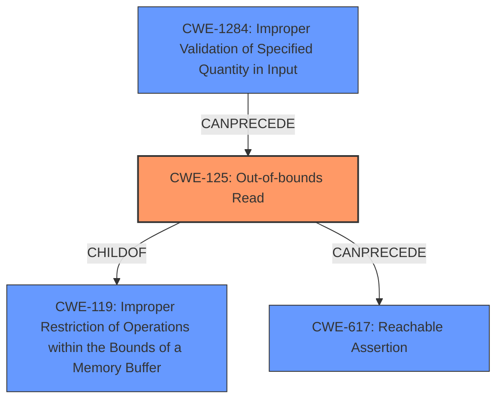

# Final Resolution for CVE-2022-41902

# Summary
| CWE ID | CWE Name | Confidence | CWE Abstraction Level | CWE Vulnerability Mapping Label | CWE-Vulnerability Mapping Notes |
|---|---|---|---|---|---|
| CWE-125 | Out-of-bounds Read | 0.95 | Base | Primary | Allowed. Directly reflects the "out-of-bounds memory read" vulnerability. Mitigation: Rigorous input validation and consideration of memory-safe languages. |
| CWE-1284 | Improper Validation of Specified Quantity in Input | 0.80 | Base | Secondary | Allowed. The root cause is the lack of input validation of input sizes relative to output sizes. Mitigation: Strict "accept known good" input validation of input sizes. Example: Reject any input where the input size is greater than or equal to the output size. |
| CWE-617 | Reachable Assertion | 0.50 | Base | Consequence | Allowed. While a crash is possible, it is not guaranteed and may not be caused by an assertion failure. |

## Evidence and Confidence

*   **Confidence Score:** 0.9
*   **Evidence Strength:** HIGH

## Relationship Analysis
The primary weakness is **CWE-125 (Out-of-bounds Read)**, which is a specific type of memory error. It is a child of **CWE-119 (Improper Restriction of Operations within the Bounds of a Memory Buffer)**, but choosing **CWE-125** provides a more specific and accurate description of the vulnerability. **CWE-1284 (Improper Validation of Specified Quantity in Input)** can precede **CWE-125**, as the lack of input validation leads to the out-of-bounds read. **CWE-617 (Reachable Assertion)** is a potential consequence of **CWE-125**, but less directly related than **CWE-1284**. The Base abstraction level of **CWE-125**, **CWE-1284**, and **CWE-617** is appropriate for identifying root causes.

## Vulnerability Chain
The vulnerability chain starts with **CWE-1284 (Improper Validation of Specified Quantity in Input)**, where the input sizes are not properly validated against the output sizes. This leads to **CWE-125 (Out-of-bounds Read)**, where the program reads memory outside the intended buffer. This out-of-bounds read can potentially cause a crash or other unexpected behavior, which can manifest as **CWE-617 (Reachable Assertion)** if an assertion is triggered. The root cause is the missing input validation, leading to a memory safety issue and potential denial of service.

## Summary of Analysis
The initial analysis and criticism both correctly identified **CWE-125 (Out-of-bounds Read)** as the primary issue, supported by the vulnerability description: "If the inputs given are greater than or equal to the sizes of the outputs, an **out-of-bounds memory read** or a crash is triggered." The relationship analysis helped confirm the specificity of **CWE-125** over its parent, **CWE-119**. The inclusion of **CWE-1284 (Improper Validation of Specified Quantity in Input)** highlights the root cause, and **CWE-617 (Reachable Assertion)** captures a potential consequence. The selected CWEs are at the optimal level of specificity, with **CWE-125** directly addressing the vulnerability and **CWE-1284** explaining the underlying cause. The evidence supports the selection of these CWEs, and the MITRE guidance allows for their use in this context. **CWE-125** is the most specific and accurately reflects the vulnerability, while **CWE-1284** explains why the out-of-bounds read occurred and can be mitigated.