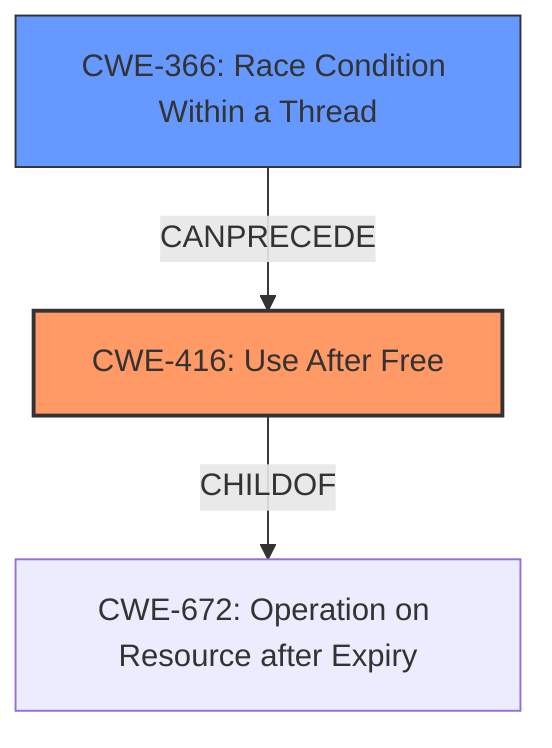

# Analysis Report for CVE-2022-4192

# Vulnerability Analysis Report: CVE-2022-4192

## Description

Use after free in Live Caption in Google Chrome prior to 108.0.5359.71 allowed a remote attacker who convinced a user to engage in specific UI interaction to potentially exploit heap corruption via UI interaction. (Chromium security severity Medium)

## Vulnerability Description Key Phrases

**Rootcause:** Use after free
**Weakness:** heap corruption
**Vector:** UI interaction
**Attacker:** remote attacker
**Product:** Google Chrome
**Version:** prior to 108.0.5359.71
**Component:** Live Caption

## Analysis (with Relationship Data)

# Summary
| CWE ID | CWE Name | Confidence | CWE Abstraction Level | CWE Vulnerability Mapping Label | CWE-Vulnerability Mapping Notes |
|---|---|---|---|---|---|
| CWE-416 | Use After Free | 1.0 | Variant | Allowed | This is the primary CWE based on the vulnerability description and supporting evidence. |

## Evidence and Confidence

*   **Confidence Score:** 1.0
*   **Evidence Strength:** HIGH

- **Analysis and Justification:**  
  - *Explanation:* The vulnerability description explicitly states "**Use after free** in Live Caption in Google Chrome...allowed a remote attacker...to potentially exploit **heap corruption** via UI interaction." The CVE Reference Links Content Summary confirms this by stating the "**root_cause**: Use after free" and "**weaknesses**: [Use after free]". CWE-416 (Use After Free) is a Variant level CWE which accurately describes the root cause. The retriever results also ranked CWE-416 as the top candidate.
  
  - *Relationship Analysis:* CWE-416 is a variant of CWE-672 (Operation on Resource after Expiry).

- **Confidence Score:**  
  - Confidence: 1.0 (The description explicitly mentions "Use after free" and the CVE references confirm it).

## Criticism of Analysis

Okay, here's a detailed review of the provided CWE analysis, considering the full CWE specifications:

**Overall Assessment:**

The analysis is well-structured and generally accurate. The primary CWE mapping to CWE-416 (Use After Free) is correct and justified. The analysis leverages the information from the vulnerability description, CVE details, and retriever results effectively. The confidence score of 1.0 is appropriate given the explicit mention of "Use after free."

**Detailed Breakdown:**

*   **Vulnerability Description Analysis:**

    *   The identification of key phrases is helpful in focusing the analysis.
    *   The descriptions of `rootcause`, `weakness`, `vector`, `attacker`, `product`, `version`, and `component` are clear and relevant.

*   **CVE Reference Links Content Summary Analysis:**

    *   The summarization of CVE details is concise and provides valuable context.
    *   The "impact" and "attack\_vectors" descriptions, while acknowledging lack of explicit detail, are reasonable inferences.
    *   The "required\_capabilities" section is a good addition.

*   **Retriever Results Analysis:**

    *   The table presentation is clear.
    *   The inclusion of individual retriever scores provides transparency.
    *   The high ranking of CWE-416 supports the analysis's conclusion.

*   **CWE Mapping Analysis:**

    *   **CWE-416 (Use After Free):**
        *   The mapping to CWE-416 is correct. The justification is strong, referencing the vulnerability description and CVE details.
        *   The Abstraction level (Variant) is appropriate, as it's a specific type of resource mismanagement.
        *   The CWE-Vulnerability Mapping Notes ("This is the primary CWE...") are clear.
        *   The relationship analysis "CWE-416 is a variant of CWE-672 (Operation on Resource after Expiry)" is accurate and important.
        *   The provided examples from the database are very good and relevant.
        *   The included specifications are also accurate and relevant.

*   **Retriever Result Critique and False Positives:**
    *   The Retriever Results present a number of potential weaknesses that are related to the Use-After-Free or that could lead to it. It is important to review these to ensure that there is not a more appropriate weakness, or that there is not a weakness chain that could be identified.
    *   **CWE-366 Race Condition within a Thread:** Could be related if concurrent threads are involved in the allocation/deallocation process. Review if multithreading is involved.
    *   **CWE-843 Access of Resource Using Incompatible Type ('Type Confusion'):** Less likely to be directly related, but possible if type confusion leads to memory corruption that results in a use-after-free.
    *   **CWE-415 Double Free:** While not the primary issue, a double-free could *lead* to a use-after-free. This is a valid consideration for a chain.
    *   **CWE-1021 Improper Restriction of Rendered UI Layers or Frames:** Seems like a false positive. This is not directly related to memory management.
    *   **CWE-122 Heap-based Buffer Overflow:** A buffer overflow might overwrite metadata that leads to a use-after-free, so this could be related in a chain.
    *   **CWE-356 Product UI does not Warn User of Unsafe Actions:** Less directly related. UI interaction is the attack vector, but the root cause is memory management. This is not a primary concern.
    *   **CWE-787 Out-of-bounds Write:** Similar to CWE-122, this could potentially overwrite memory and lead to a use-after-free.
    *   **CWE-113 Improper Neutralization of CRLF Sequences in HTTP Headers ('HTTP Request/Response Splitting'):** Almost certainly a false positive.
    *   **CWE-367 Time-of-check Time-of-use (TOCTOU) Race Condition:** Less likely, but possible if there's a TOCTOU issue related to the resource's state between a check and use.

**Recommendations for Improvement:**

1.  **Acknowledge and Dismiss False Positives:** Explicitly address why the other top retriever results are *not* the primary CWE, even if briefly. This shows a more comprehensive analysis. For example, "While CWE-366 (Race Condition within a Thread) was a high result, there is no explicit evidence that this vulnerability involves multiple threads. Therefore, it's considered a less likely root cause than CWE-416."

2.  **Consider CWE Chains:** Investigate the potential for CWE chains. Could a race condition (CWE-366) *lead* to the use-after-free (CWE-416)? Or could a heap overflow (CWE-122) cause the metadata corruption, resulting in the UAF? If so, document the chain.

3.  **Mitigation Strategies (CWE-416):** Briefly mention a relevant mitigation strategy from CWE-416 in the analysis section (e.g., "Mitigation strategies include using languages with automatic memory management or setting pointers to NULL after freeing them.").

4.  **Attack Vector Specificity:** While "UI interaction" is the vector, try to be slightly more specific, if possible, based on the Live Caption functionality. Does it involve specific events, callbacks, or data structures within the UI?

**Revised Summary Table (Example Incorporating Recommendations):**

| CWE ID | CWE Name | Confidence | CWE Abstraction Level | CWE Vulnerability Mapping Label | CWE-Vulnerability Mapping Notes |
|---|---|---|---|---|---|
| CWE-416 | Use After Free | 1.0 | Variant | Allowed | This is the primary CWE based on the vulnerability description and supporting evidence. Mitigation includes setting pointers to NULL after freeing them. While other CWEs were suggested by the retriever, such as CWE-366 (Race Condition) and CWE-122 (Heap Overflow), there is no explicit evidence in the vulnerability description to support them. |

By incorporating these suggestions, the analysis becomes even more robust and demonstrates a deeper understanding of the vulnerability and its context within the CWE framework.

## Final Resolution

# Summary
| CWE ID | CWE Name | Confidence | CWE Abstraction Level | CWE Vulnerability Mapping Label | CWE-Vulnerability Mapping Notes |
|---|---|---|---|---|---|
| CWE-416 | Use After Free | 1.0 | Variant | Allowed | This is the primary **weakness** based on the vulnerability description and supporting evidence. Mitigation includes setting pointers to NULL after freeing them. |
| CWE-366 | Race Condition Within a Thread | 0.4 | Base | Allowed | A race condition could potentially lead to the use-after-free, but there is no explicit evidence in the vulnerability description to support it. |

## Evidence and Confidence

*   **Confidence Score:** 0.9
*   **Evidence Strength:** MEDIUM

## Relationship Analysis
The primary relationship is that CWE-416 (Use After Free) is a variant of CWE-672 (Operation on Resource after Expiry). Additionally, CWE-366 (Race Condition Within a Thread) *could* potentially precede CWE-416 if multiple threads are involved in allocating/deallocating memory.

## Vulnerability Chain
The vulnerability chain starts with a potential **ROOTCAUSE** of CWE-366 (Race Condition Within a Thread) where multiple threads might be racing to access and modify memory. This could lead to CWE-416 (**Use After Free**), where memory is accessed after it has been freed, ultimately leading to **heap corruption** and potential exploitation.

## Summary of Analysis
The initial analysis correctly identified CWE-416 (Use After Free) as the primary **weakness**. The vulnerability description explicitly states "**Use after free** in Live Caption in Google Chrome...allowed a remote attacker...to potentially exploit **heap corruption** via UI interaction." The CVE Reference Links Content Summary confirms this by stating the "**root_cause**: Use after free" and "**weaknesses**: [Use after free]".

The criticism raised valid points about considering potential CWE chains and acknowledging other retriever results. While CWE-416 remains the most direct and evident **weakness**, the potential for CWE-366 (Race Condition Within a Thread) to contribute to the vulnerability is considered, especially given the concurrent nature often associated with UI interactions. However, without explicit evidence of multithreading in the vulnerability description, CWE-366 is considered a secondary candidate.

The decision to primarily classify this as CWE-416 is based on the direct evidence in the vulnerability description, making it the most specific and appropriate classification.

*Report generated on 2025-03-18 18:50:18*
