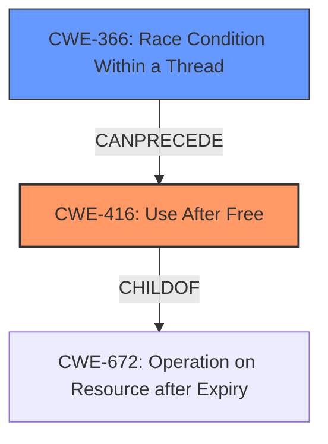

# Final Resolution for CVE-2022-4192

# Summary
| CWE ID | CWE Name | Confidence | CWE Abstraction Level | CWE Vulnerability Mapping Label | CWE-Vulnerability Mapping Notes |
|---|---|---|---|---|---|
| CWE-416 | Use After Free | 1.0 | Variant | Allowed | This is the primary **weakness** based on the vulnerability description and supporting evidence. Mitigation includes setting pointers to NULL after freeing them. |
| CWE-366 | Race Condition Within a Thread | 0.4 | Base | Allowed | A race condition could potentially lead to the use-after-free, but there is no explicit evidence in the vulnerability description to support it. |

## Evidence and Confidence

*   **Confidence Score:** 0.9
*   **Evidence Strength:** MEDIUM

## Relationship Analysis
The primary relationship is that CWE-416 (Use After Free) is a variant of CWE-672 (Operation on Resource after Expiry). Additionally, CWE-366 (Race Condition Within a Thread) *could* potentially precede CWE-416 if multiple threads are involved in allocating/deallocating memory.

## Vulnerability Chain
The vulnerability chain starts with a potential **ROOTCAUSE** of CWE-366 (Race Condition Within a Thread) where multiple threads might be racing to access and modify memory. This could lead to CWE-416 (**Use After Free**), where memory is accessed after it has been freed, ultimately leading to **heap corruption** and potential exploitation.

## Summary of Analysis
The initial analysis correctly identified CWE-416 (Use After Free) as the primary **weakness**. The vulnerability description explicitly states "**Use after free** in Live Caption in Google Chrome...allowed a remote attacker...to potentially exploit **heap corruption** via UI interaction." The CVE Reference Links Content Summary confirms this by stating the "**root_cause**: Use after free" and "**weaknesses**: [Use after free]".

The criticism raised valid points about considering potential CWE chains and acknowledging other retriever results. While CWE-416 remains the most direct and evident **weakness**, the potential for CWE-366 (Race Condition Within a Thread) to contribute to the vulnerability is considered, especially given the concurrent nature often associated with UI interactions. However, without explicit evidence of multithreading in the vulnerability description, CWE-366 is considered a secondary candidate.

The decision to primarily classify this as CWE-416 is based on the direct evidence in the vulnerability description, making it the most specific and appropriate classification.