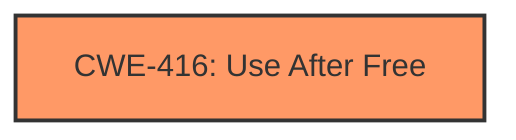

# Final Resolution for CVE-2022-4194

# Summary
| CWE ID | CWE Name | Confidence | CWE Abstraction Level | CWE Vulnerability Mapping Label | CWE-Vulnerability Mapping Notes |
|---|---|---|---|---|---|
| CWE-416 | Use After Free | 1.0 | Variant | Primary | Allowed |

## Evidence and Confidence

*   **Confidence Score:** 1.0
*   **Evidence Strength:** HIGH

## Relationship Analysis
The primary relationship considered was the direct match between the vulnerability description and the definition of CWE-416 (**CWE-416: Use After Free**). While other CWEs were considered, such as CWE-362 (**CWE-362: Concurrent Execution using Shared Resource with Improper Synchronization ('Race Condition')**) and CWE-843 (**CWE-843: Access of Resource Using Incompatible Type ('Type Confusion')**), the evidence did not strongly support their inclusion. CWE-416, being a Variant, offers a specific description for the **rootcause** of the vulnerability.

## Vulnerability Chain
The vulnerability chain consists of a **use-after-free** condition leading to potential **heap corruption**. The sequence starts with memory being freed, followed by a subsequent attempt to access or reuse that memory. This **WEAKNESS** allows a remote attacker to potentially exploit the heap, which can lead to arbitrary code execution. The **ROOTCAUSE** is the **use-after-free**.

## Summary of Analysis
The initial analysis is accurate and well-justified. The vulnerability description explicitly states a **use-after-free** condition in Google Chrome's Accessibility component. This directly aligns with the CWE-416 definition. The provided evidence is strong, and the confidence score of 1.0 is appropriate. The criticism correctly points out that while other CWEs such as CWE-362 and CWE-843 could potentially be related, there is insufficient evidence to include them in the primary classification. The decision to maintain CWE-416 as the primary CWE is based on the direct match with the vulnerability description. CWE-416 is at the optimal level of specificity (Variant) for this vulnerability.