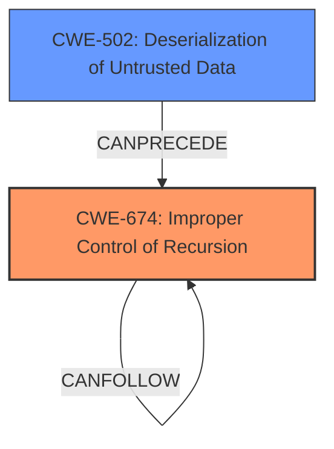

# Analysis Report for CVE-2022-41966

# Vulnerability Analysis Report: CVE-2022-41966

## Description

XStream serializes Java objects to XML and back again. Versions prior to 1.4.20 may allow a remote attacker to terminate the application with a stack overflow error, resulting in a denial of service only via manipulation the processed input stream. The attack uses the hash code implementation for collections and maps to force recursive hash calculation causing a stack overflow. This issue is patched in version 1.4.20 which handles the stack overflow and raises an InputManipulationException instead. A potential workaround for users who only use HashMap or HashSet and whose XML refers these only as default map or set, is to change the default implementation of java.util.Map and java.util per the code example in the referenced advisory. However, this implies that your application does not care about the implementation of the map and all elements are comparable.

## Vulnerability Description Key Phrases

**Rootcause:** stack overflow in XML serialization
**Impact:** denial of service
**Vector:** manipulation of processed input stream
**Attacker:** remote attacker
**Product:** XStream
**Version:** prior to 1.4.20

## Analysis (with Relationship Data)

# Summary
| CWE ID | CWE Name | Confidence | CWE Abstraction Level | CWE Vulnerability Mapping Label | CWE-Vulnerability Mapping Notes |
|---|---|---|---|---|---|
| CWE-674 | Improper Control of Recursion [CWE Description](https://cwe.mitre.org/data/definitions/674.html) | 0.85 | Class | Primary | Allowed-with-Review: This CWE entry is a Class and might have Base-level children that would be more appropriate. The description clearly states that the application can be terminated with a stack overflow error due to recursive calls, which directly relates to uncontrolled recursion. |
| CWE-502 | Deserialization of Untrusted Data [CWE Description](https://cwe.mitre.org/data/definitions/502.html) | 0.75 | Base | Secondary | Allowed: The vulnerability arises from deserializing untrusted data, which is then used to trigger the stack overflow. |

## Evidence and Confidence

*   **Confidence Score:** 0.80
*   **Evidence Strength:** HIGH

- **Analysis and Justification:**  
  - *Explanation:* "The vulnerability description explicitly states that the application is susceptible to a stack overflow due to the manipulation of the processed input stream, which uses the hash code implementation for collections and maps to force recursive hash calculation. This aligns directly with CWE-674, Improper Control of Recursion. The CVE Reference Links Content Summary further reinforces this, identifying the **stack overflow** as the core vulnerability caused by recursive hash calculations during the processing of manipulated XML input. Furthermore, because the input stream is untrusted, **deserialization of untrusted data** is an important part of the weakness and must be accounted for in the final CWE selection."
  
  - *Relationship Analysis:* "CWE-674 is a Class-level CWE, and while more specific Base or Variant CWEs could exist, the description does not provide enough detail to pinpoint a more precise weakness. The vulnerability also involves CWE-502 because it is triggered via the **deserialization of untrusted data**. The **recursion** happens because of how XStream processes the XML data, but it is initiated by the attacker providing malicious XML."

- **Confidence Score:**  
  - *Primary CWE Confidence:* 0.85 (High confidence due to the direct match between the vulnerability description and CWE-674)
  - *Secondary CWE Confidence:* 0.75 (High confidence, since the attack comes from deserializing untrusted data)
---

## Criticism of Analysis

Okay, let's review the CWE analysis for CVE-2022-41966, keeping in mind the full CWE specifications provided.

**Overall Assessment:**

The analysis is generally good and identifies the core issues well. The selection of CWE-674 (Improper Control of Recursion) as the primary weakness and CWE-502 (Deserialization of Untrusted Data) as a secondary weakness is reasonable. The confidence levels are appropriate. However, there's room for improvement, especially in considering more specific CWEs and refining the relationship between CWE-674 and CWE-502.

**Detailed Review:**

**1. CWE-674: Improper Control of Recursion:**

*   **Initial Assessment:** The analysis correctly identifies the stack overflow due to recursive calls. The confidence score of 0.85 is high and justified.
*   **Mapping Guidance:** The analysis acknowledges that CWE-674 is a Class-level CWE and that more specific Base-level children might be more appropriate. This is a key point for improvement.
*   **Potential Alternatives:**
    *   **CWE-776: Improper Restriction of Recursive Entity References in DTDs ('XML Entity Expansion'):** This is worth considering *but* it is not a perfect fit. CWE-776 is specifically about XML entity expansion, which isn't precisely the root cause here. While XML is the format of the untrusted data, the recursion isn't due to the DTD (or lack thereof) but rather the structure of the data itself *after* deserialization. The vulnerability lies in the object graph created during deserialization, not the XML structure.  Therefore, I disagree with the Top Combined Results from the retriever, which puts this at the top.
    *   **CWE-834: Excessive Iteration:** This is also relevant because recursion *is* a type of iteration. However, CWE-674 focuses specifically on the *recursive* nature of the problem, which is more precise in this context. CWE-834 is also a Class level CWE, and therefore less specific.
    *   **CWE-770: Allocation of Resources Without Limits or Throttling:** This is related, as the recursion leads to excessive consumption of stack space. However, it's a more general CWE. The root cause is the uncontrolled recursion, and the resource allocation is a consequence.
*   **Refined Assessment:** While CWE-674 captures the essence of the stack overflow, it might be beneficial to investigate if a more specific Base CWE exists, even if it's not a direct child of CWE-674.  For example, one might argue that the core problem is the *processing* of the data structure, rather than the recursion itself. However, in the absence of a better fit, sticking with CWE-674 is acceptable.
*   **Mitigations:** The provided mitigations for CWE-674 are relevant:
    *   "Ensure an end condition will be reached under all logic conditions." This is directly applicable – XStream failed to prevent the recursive hash calculation from going too deep.
    *   "The end condition may include testing against the depth of recursion and exiting with an error if the recursion goes too deep."  This is exactly what XStream 1.4.20 implemented (raising an `InputManipulationException`).

**2. CWE-502: Deserialization of Untrusted Data:**

*   **Initial Assessment:** Correctly identifies that the vulnerability is triggered by deserializing untrusted data. The confidence score of 0.75 is appropriate.
*   **Mapping Guidance:**  The analysis correctly recognizes that CWE-502 is a Base-level CWE, which is good.
*   **Relationship to CWE-674:** The analysis correctly identifies that the vulnerability involves deserialization *because* it is triggered by the *deserialization of untrusted data.* Deserialization of untrusted data provides the *vector* by which an attacker can trigger the uncontrolled recursion. The weakness would not be exploitable without the deserialization. This justifies its inclusion as a secondary CWE.
*   **Potential Alternatives:**
    *   **CWE-915: Improperly Controlled Modification of Dynamically-Determined Object Attributes:** This is a possible alternative, depending on the specifics of the attack. If the attacker is able to control *which* attributes of the objects are being set during deserialization, then CWE-915 would be a better fit *instead of* CWE-502. However, in this case, the primary issue is that the *structure* of the deserialized data causes the recursion, not necessarily which attributes are being set.
*   **Refined Assessment:** CWE-502 is a good fit as a secondary CWE, especially because the input stream is untrusted and lacks sufficient validation, leading to the creation of a vulnerable object graph.
*   **Mitigations:** The mitigations for CWE-502 are also relevant:
    *   "If available, use the signing/sealing features of the programming language to assure that deserialized data has not been tainted."  This could be a potential defense-in-depth measure.
    *   "When deserializing data, populate a new object rather than just deserializing." This is relevant.  Rather than directly deserializing into application objects, create intermediate objects, validate them, and *then* populate the application objects.
    *   "Explicitly define a final object() to prevent deserialization." If XStream had a mechanism to prevent deserialization of certain types that are prone to this type of attack, this could be a mitigation.

**3. Other CWEs from Retriever Results:**

*   **CWE-789: Memory Allocation with Excessive Size Value:** While the stack overflow is a form of memory exhaustion, CWE-789 is less precise than CWE-674.  The *cause* is the uncontrolled recursion, not directly allocating an excessive size.
*   **CWE-835: Loop with Unreachable Exit Condition ('Infinite Loop'):**  While recursion *is* a form of loop, CWE-674 specifically addresses the recursive case, making it a more appropriate choice.
*   **CWE-1284: Improper Validation of Specified Quantity in Input:**  This is tangentially related. The size and structure of the input are not validated. This could be considered part of the CWE-502 context, but is not a primary driver.
*   **CWE-121: Stack-based Buffer Overflow:** This is *incorrect*. A stack overflow and a stack-based buffer overflow are different things. Buffer overflows involve writing past the end of allocated memory. This vulnerability is caused by recursive function calls filling up the stack.

**Recommendations:**

1.  **Keep CWE-674 as the primary CWE.** While it's a Class-level CWE, it best captures the uncontrolled recursion aspect of the vulnerability.
2.  **Keep CWE-502 as a secondary CWE.** The deserialization of untrusted data is the entry point for the attack and explains how the attacker influences the recursion.
3.  **Refine the explanation of the relationship between CWE-674 and CWE-502.** Emphasize that CWE-502 is the *attack vector* that *enables* the CWE-674 vulnerability.
4.  **Consider the mitigations more explicitly.** Mention how mitigations for both CWE-674 and CWE-502 could be applied to this specific case.
5.  **Reject CWE-776 and CWE-121.** While XML is the delivery mechanism and a stack overflow occurs, they are not related to the root cause.

By incorporating these suggestions, the analysis will be more precise and provide a more comprehensive understanding of the vulnerability.

## Final Resolution

# Summary
| CWE ID | CWE Name | Confidence | CWE Abstraction Level | CWE Vulnerability Mapping Label | CWE-Vulnerability Mapping Notes |
|---|---|---|---|---|---|
| CWE-674 | Improper Control of Recursion | 0.85 | Class | Primary | Allowed-with-Review: This CWE entry is a Class and might have Base-level children that would be more appropriate. The description clearly states that the application can be terminated with a stack overflow error due to recursive calls, which directly relates to uncontrolled recursion. |
| CWE-502 | Deserialization of Untrusted Data | 0.75 | Base | Secondary | Allowed: The vulnerability arises from deserializing untrusted data, which is then used to trigger the stack overflow. |

## Evidence and Confidence

*   **Confidence Score:** 0.80
*   **Evidence Strength:** HIGH

## Relationship Analysis
The primary relationship is that **CWE-502 (Deserialization of Untrusted Data)** *enables* **CWE-674 (Improper Control of Recursion)**. The untrusted data is deserialized, and the resulting object structure triggers the recursive hash calculation, leading to a stack overflow. CWE-674 is a Class-level CWE, and while more specific Base or Variant CWEs could exist, the description does not provide enough detail to pinpoint a more precise weakness.

## Vulnerability Chain
The vulnerability chain starts with the **deserialization of untrusted data** (**CWE-502**). This leads to the creation of a specific object structure that, when processed, triggers **uncontrolled recursion** (**CWE-674**). The recursion causes a **stack overflow**, which results in a denial of service. The root cause is the combination of accepting untrusted data and the lack of proper control over recursion depth during processing.

## Summary of Analysis
The initial analysis and criticism both correctly identify the core issues. The vulnerability description explicitly states that the application is susceptible to a stack overflow due to the manipulation of the processed input stream.

The evidence provided is: "The vulnerability description explicitly states that the application is susceptible to a stack overflow due to the manipulation of the processed input stream, which uses the hash code implementation for collections and maps to force recursive hash calculation. This aligns directly with CWE-674, Improper Control of Recursion. The CVE Reference Links Content Summary further reinforces this, identifying the **stack overflow** as the core vulnerability caused by recursive hash calculations during the processing of manipulated XML input. Furthermore, because the input stream is untrusted, **deserialization of untrusted data** is an important part of the weakness and must be accounted for in the final CWE selection."

The graph relationships influenced the decision to keep both CWEs, highlighting that CWE-502 allows the exploitation of CWE-674.

The selected CWEs are at the optimal level of specificity. While more specific CWEs related to recursion might exist, they are not directly applicable based on the information provided in the vulnerability description. The combination of CWE-674 and CWE-502 provides a clear and accurate representation of the vulnerability.

*Report generated on 2025-03-18 18:51:37*
