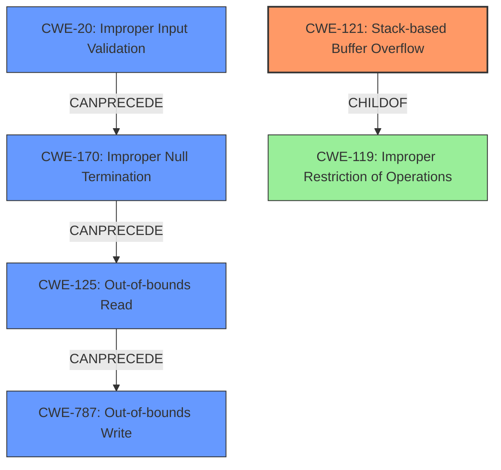

# Final Resolution for CVE-2022-41981

# Summary
| CWE ID | CWE Name | Confidence | CWE Abstraction Level | CWE Vulnerability Mapping Label | CWE-Vulnerability Mapping Notes |
|---|---|---|---|---|---|
| CWE-121 | Stack-based Buffer Overflow | 0.95 | Variant | Allowed | Primary CWE |
| CWE-125 | Out-of-bounds Read | 0.75 | Base | Allowed | Secondary Candidate |
| CWE-787 | Out-of-bounds Write | 0.70 | Base | Allowed | Secondary Candidate |
| CWE-170 | Improper Null Termination | 0.60 | Base | Allowed | Contributing Factor |
| CWE-20 | Improper Input Validation | 0.40 | Class | Allowed | Contributing Factor |

## Evidence and Confidence

*   **Confidence Score:** 0.90
*   **Evidence Strength:** HIGH

## Relationship Analysis
The primary weakness is a stack-based buffer overflow (**CWE-121**), which is a variant of **CWE-119** (Improper Restriction of Operations within the Bounds of a Memory Buffer). The vulnerability chain starts with **CWE-170** (Improper Null Termination), leading to **CWE-125** (Out-of-bounds Read) and subsequently **CWE-787** (Out-of-bounds Write). **CWE-20** (Improper Input Validation) serves as a high-level contributing factor as the lack of validation on the input data's length and null termination properties sets the stage for the buffer overflow. The abstraction levels range from Class (**CWE-20**) to Base (**CWE-125**, **CWE-787**, **CWE-170**) to Variant (**CWE-121**), providing a detailed and layered understanding of the vulnerability.

## Vulnerability Chain
The vulnerability chain begins with a lack of input validation (**CWE-20**), leading to improper null termination (**CWE-170**). This, in turn, results in an out-of-bounds read (**CWE-125**) due to the use of `strlen` on a non-null-terminated buffer. The out-of-bounds read contributes to an out-of-bounds write (**CWE-787**) through the use of `sprintf`. The final impact is a stack-based buffer overflow (**CWE-121**) which could lead to arbitrary code execution.

## Summary of Analysis
The initial analysis and criticism provide a strong foundation for classifying this vulnerability. The primary **WEAKNESS** is indeed a **stack-based buffer overflow** (**CWE-121**), as explicitly stated in the vulnerability description: "A **stack-based buffer overflow** vulnerability exists in the TGA file format parser of OpenImageIO v2.3.19.0." The secondary **WEAKNESSES** include out-of-bounds read (**CWE-125**) and write (**CWE-787**), along with improper null termination (**CWE-170**) as a contributing factor. The addition of **CWE-20** further clarifies the **ROOTCAUSE** as a failure to validate input data.

The graph relationships highlight the chain of events that leads to the vulnerability. The selection of CWEs at the Base and Variant levels provides the optimal level of specificity, offering a detailed understanding of the **ROOTCAUSE** and its consequences. The confidence scores reflect the strength of evidence for each CWE, with the primary CWE having the highest confidence.