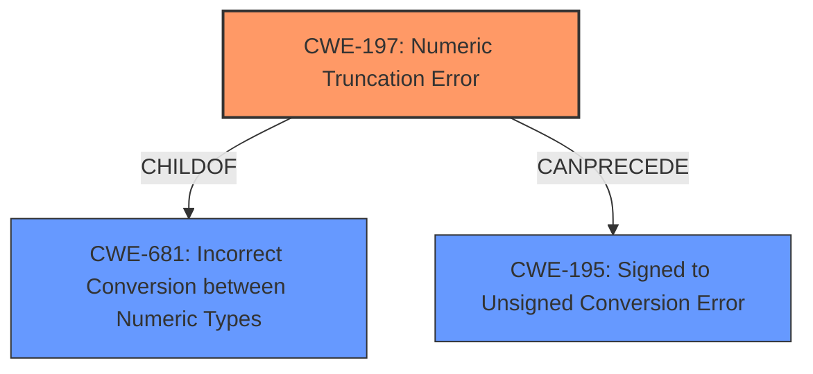

# Analysis Report for CVE-2022-42324

# Vulnerability Analysis Report: CVE-2022-42324

## Description

Oxenstored 32->31 bit integer truncation issues Integers in Ocaml are 63 or 31 bits of signed precision. The Ocaml Xenbus library takes a C uint32_t out of the ring and casts it directly to an Ocaml integer. In 64-bit Ocaml builds this is fine, but in 32-bit builds, it truncates off the most significant bit, and then creates unsigned/signed confusion in the remainder. This in turn can feed a negative value into logic not expecting a negative value, resulting in unexpected exceptions being thrown. The unexpected exception is not handled suitably, creating a busy-loop trying (and failing) to take the bad packet out of the xenstore ring.

## Vulnerability Description Key Phrases

**Rootcause:** integer truncation
**Impact:** busy-loop
**Product:** Xenbus library
**Version:** 32-bit

## Analysis (with Relationship Data)

# Summary
| CWE ID | CWE Name | Confidence | CWE Abstraction Level | CWE Vulnerability Mapping Label | CWE-Vulnerability Mapping Notes |
|---|---|---|---|---|---|
| CWE-197 | Numeric Truncation Error | 0.95 | Base | Allowed | Primary CWE |
| CWE-681 | Incorrect Conversion between Numeric Types | 0.80 | Base | Allowed | Secondary Candidate |
| CWE-195 | Signed to Unsigned Conversion Error | 0.75 | Variant | Allowed | Secondary Candidate |

## Evidence and Confidence

*   **Confidence Score:** 0.90
*   **Evidence Strength:** HIGH

- **Analysis and Justification:**  
  - *Explanation:* The vulnerability description clearly states that the root cause is an **integer truncation** issue, where a 32-bit integer is cast to a 31-bit integer, leading to data loss. This aligns directly with CWE-197 (Numeric Truncation Error). The "CVE Reference Links Content Summary" section explicitly mentions "Integer Truncation" as a core issue. The retriever results also lists CWE-197 with the highest score. The MITRE mapping guidance for CWE-197 indicates that this is ALLOWED. CWE-681 (Incorrect Conversion between Numeric Types) is a parent of CWE-197. Although less specific than CWE-197, it is still relevant as the truncation occurs during a type conversion.
  
  - *Relationship Analysis:* CWE-197 is a child of CWE-681 (Incorrect Conversion between Numeric Types) and is related to CWE-195 (Signed to Unsigned Conversion Error). The truncation can lead to signed/unsigned confusion, supporting the relevance of CWE-195.

- **Confidence Score:**  
  - Confidence: 0.95 (High confidence due to clear description of integer truncation and supporting evidence from CVE reference)

---

## Criticism of Analysis

Okay, here's a review of the provided CWE analysis, incorporating the full CWE specifications:

**Overall Assessment:**

The analysis is generally good and accurately identifies the primary CWE, CWE-197 (Numeric Truncation Error). The inclusion of CWE-681 (Incorrect Conversion between Numeric Types) as a secondary candidate is also reasonable given its parent-child relationship with CWE-197. The justification provided for each CWE is clear and well-supported by the vulnerability description and CVE summary. The confidence scores assigned are appropriate.  The analysis of CWE-195 (Signed to Unsigned Conversion Error) is also reasonable, although less directly applicable than CWE-197.

**Detailed Review and Critique:**

| CWE ID  | CWE Name                                   | Confidence | Assessment                                                                                                                                                                                                                                                                                                                                                                                                                                                                           | Recommendation                                                                                                |
| :------- | :----------------------------------------- | :--------- | :----------------------------------------------------------------------------------------------------------------------------------------------------------------------------------------------------------------------------------------------------------------------------------------------------------------------------------------------------------------------------------------------------------------------------------------------------------------------------- | :---------------------------------------------------------------------------------------------------------- |
| CWE-197 | Numeric Truncation Error                   | 0.95       | **Accurate and well-justified.** The core issue is indeed the loss of significant bits when converting from a 32-bit to a 31-bit integer. The description matches the CWE definition precisely.  The provided mitigations (preventing casts from larger to smaller primitives) directly address the root cause. Observed examples for CWE-197 also map well.                                                                                                                                    | No changes needed.                                                                                        |
| CWE-681 | Incorrect Conversion between Numeric Types | 0.80       | **Reasonable as a secondary candidate.**  As a parent of CWE-197, it represents the broader class of issues related to type conversions.  However, it's *less specific* than CWE-197. The mitigations suggested for CWE-681 (avoid conversions, check ranges) are good practices but don't pinpoint the truncation as directly as the CWE-197 mitigation. Observed examples for CWE-681 are related, but not as tightly aligned with the specific truncation issue in this case. | Consider reducing confidence slightly (e.g., to 0.75) to reflect its more general nature compared to CWE-197. |
| CWE-195 | Signed to Unsigned Conversion Error        | 0.75       | **Potentially Relevant, but Weaker than other two**. The vulnerability description mentions a potential signed/unsigned confusion *resulting* from the truncation. This is true, but less of a core issue as a consequence rather than a primary cause. Mitigation strategies for CWE-195 center around avoiding signed variables and validating after conversion, which is less specific than preventing the truncation directly. Observed examples for CWE-195 are also related, but not tightly aligned. | Consider lowering the confidence score a bit further (e.g., to 0.65).  Clearly state it as a secondary *consequence* of the truncation rather than a direct cause.                                                                               |

**Additional Considerations:**

*   **Busy Loop (Impact):** While the analysis correctly identifies the busy loop as an impact, it's important to note that this is a *symptom* of the underlying numeric error and lack of proper exception handling.  It is not a CWE that would directly map.
*   **Missing Input Validation:** The analysis correctly notes the lack of input validation. This could be related to CWE-20: Improper Input Validation. This is a consequence of the numeric trunction as well, but related to the fact that the value received after the truncation is not properly validated.
*   **CWE Chains:** The vulnerability could be viewed as a chain. For example:
    *   CWE-197: Numeric Truncation Error -> CWE-469: Incorrect Resource Selection -> CWE-400: Uncontrolled Resource Consumption
    *   CWE-197: Numeric Truncation Error -> CWE-839: Numeric Range Comparison Without Minimum Check -> Denial of Service.  This would occur if the truncated value is used as a size or offset without checking for negativity.

*   **Retriever Results:** The Retriever results do have some noise, as to be expected, the top combined results are somewhat relevant. It is important to note that the retriever results contain some false positives.

**Recommendations Summary:**

1.  **Minor Confidence Adjustment:** Reduce the confidence score for CWE-681 slightly.
2.  **Clarify CWE-195's Role:** Explicitly state that CWE-195 represents a potential *consequence* of the truncation rather than a primary cause, and reduce confidence.
3.  **Acknowledge Missing Input Validation:** Acknowledge CWE-20 as a consequence of the numeric trunction, and add it as a tertiary possible CWE.
4.  **Consider CWE Chains:** Mention the possibility of CWE chains to demonstrate a deeper understanding of the vulnerability's propagation.

By incorporating these recommendations, the analysis will be more nuanced and accurate in its CWE mapping.

## Final Resolution

# Summary
| CWE ID | CWE Name | Confidence | CWE Abstraction Level | CWE Vulnerability Mapping Label | CWE-Vulnerability Mapping Notes |
|---|---|---|---|---|---|
| CWE-197 | Numeric Truncation Error | 0.95 | Base | Allowed | Primary CWE |
| CWE-681 | Incorrect Conversion between Numeric Types | 0.75 | Base | Allowed | Secondary Candidate |
| CWE-195 | Signed to Unsigned Conversion Error | 0.65 | Variant | Allowed | Secondary Candidate |

## Evidence and Confidence

*   **Confidence Score:** 0.90
*   **Evidence Strength:** HIGH

## Relationship Analysis
The primary relationship that impacted the decision was the parent-child relationship between CWE-681 and CWE-197. CWE-197 is a specific type of CWE-681. The truncation can also lead to signed/unsigned confusion, supporting the relevance of CWE-195, but it's less direct.

## Vulnerability Chain
The chain of root cause and weaknesses that followed for the Vulnerability Description:
1.  **ROOTCAUSE**: CWE-197 (**Numeric Truncation Error**): A 32-bit integer is cast to a smaller 31-bit integer, resulting in data loss (the most significant bit is truncated).
2.  CWE-681 (**Incorrect Conversion between Numeric Types**): The truncation occurs during the conversion between the two numeric types.
3.  CWE-195 (**Signed to Unsigned Conversion Error**): The truncated value is then misinterpreted as a signed integer, leading to unexpected negative values, because the original value was unsigned.
4.  CWE-839 (**Numeric Range Comparison Without Minimum Check**): The negative value is used without proper range validation, causing a comparison error since the logic does not expect the value to be negative.
5.  Impact: The negative value leads to an unhandled exception, resulting in a busy loop and denial of service.

## Summary of Analysis
The initial analysis and criticism both correctly identified CWE-197 (**Numeric Truncation Error**) as the primary **weakness**. The vulnerability description clearly states "32->31 bit integer truncation issues" and that "it truncates off the most significant bit." The criticism suggested lowering the confidence score for CWE-681 and CWE-195 to reflect their less direct roles. The confidence scores have been updated accordingly.

The graph relationships confirm that CWE-197 is the most specific and appropriate **root cause**, being a child of CWE-681 and potentially leading to CWE-195. The analysis is based on the provided evidence and focuses on the core integer truncation issue.
The selected CWEs are at the optimal level of specificity as CWE-197 directly addresses the truncation error, while CWE-681 represents the broader type conversion issue, and CWE-195 represents a possible consequence.

*Report generated on 2025-03-18 19:04:03*
