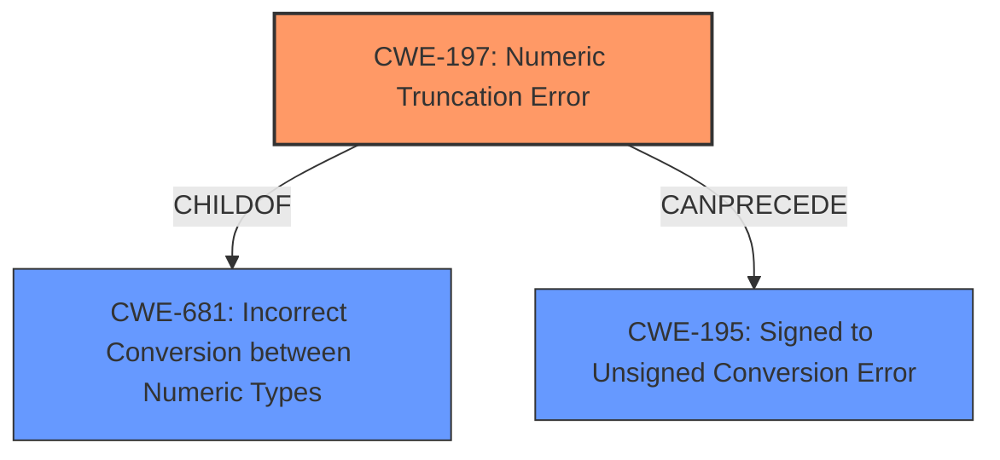

# Final Resolution for CVE-2022-42324

# Summary
| CWE ID | CWE Name | Confidence | CWE Abstraction Level | CWE Vulnerability Mapping Label | CWE-Vulnerability Mapping Notes |
|---|---|---|---|---|---|
| CWE-197 | Numeric Truncation Error | 0.95 | Base | Allowed | Primary CWE |
| CWE-681 | Incorrect Conversion between Numeric Types | 0.75 | Base | Allowed | Secondary Candidate |
| CWE-195 | Signed to Unsigned Conversion Error | 0.65 | Variant | Allowed | Secondary Candidate |

## Evidence and Confidence

*   **Confidence Score:** 0.90
*   **Evidence Strength:** HIGH

## Relationship Analysis
The primary relationship that impacted the decision was the parent-child relationship between CWE-681 and CWE-197. CWE-197 is a specific type of CWE-681. The truncation can also lead to signed/unsigned confusion, supporting the relevance of CWE-195, but it's less direct.

## Vulnerability Chain
The chain of root cause and weaknesses that followed for the Vulnerability Description:
1.  **ROOTCAUSE**: CWE-197 (**Numeric Truncation Error**): A 32-bit integer is cast to a smaller 31-bit integer, resulting in data loss (the most significant bit is truncated).
2.  CWE-681 (**Incorrect Conversion between Numeric Types**): The truncation occurs during the conversion between the two numeric types.
3.  CWE-195 (**Signed to Unsigned Conversion Error**): The truncated value is then misinterpreted as a signed integer, leading to unexpected negative values, because the original value was unsigned.
4.  CWE-839 (**Numeric Range Comparison Without Minimum Check**): The negative value is used without proper range validation, causing a comparison error since the logic does not expect the value to be negative.
5.  Impact: The negative value leads to an unhandled exception, resulting in a busy loop and denial of service.

## Summary of Analysis
The initial analysis and criticism both correctly identified CWE-197 (**Numeric Truncation Error**) as the primary **weakness**. The vulnerability description clearly states "32->31 bit integer truncation issues" and that "it truncates off the most significant bit." The criticism suggested lowering the confidence score for CWE-681 and CWE-195 to reflect their less direct roles. The confidence scores have been updated accordingly.

The graph relationships confirm that CWE-197 is the most specific and appropriate **root cause**, being a child of CWE-681 and potentially leading to CWE-195. The analysis is based on the provided evidence and focuses on the core integer truncation issue.
The selected CWEs are at the optimal level of specificity as CWE-197 directly addresses the truncation error, while CWE-681 represents the broader type conversion issue, and CWE-195 represents a possible consequence.