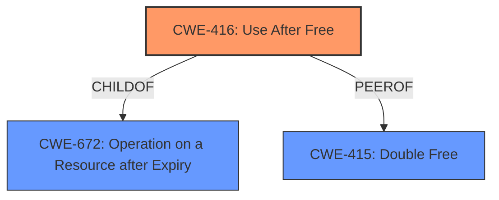

# Analysis Report for CVE-2022-42332

# Vulnerability Analysis Report: CVE-2022-42332

## Description

x86 shadow plus log-dirty mode use-after-free In environments where host assisted address translation is necessary but Hardware Assisted Paging (HAP) is unavailable, Xen will run guests in so called shadow mode. Shadow mode maintains a pool of memory used for both shadow page tables as well as auxiliary data structures. To migrate or snapshot guests, Xen additionally runs them in so called log-dirty mode. The data structures needed by the log-dirty tracking are part of aformentioned auxiliary data. In order to keep error handling efforts within reasonable bounds, for operations which may require memory allocations shadow mode logic ensures up front that enough memory is available for the worst case requirements. Unfortunately, while page table memory is properly accounted for on the code path requiring the potential establishing of new shadows, demands by the log-dirty infrastructure were not taken into consideration. As a result, just established shadow page tables could be freed again immediately, while other code is still accessing them on the assumption that they would remain allocated.

## Vulnerability Description Key Phrases

**Rootcause:** use-after-free
**Product:** Xen
**Component:** shadow plus log-dirty mode

## Analysis (with Relationship Data)

# Summary
| CWE ID | CWE Name | Confidence | CWE Abstraction Level | CWE Vulnerability Mapping Label | CWE-Vulnerability Mapping Notes |
|---|---|---|---|---|---|
| CWE-416 | Use After Free | 0.95 | Variant | Primary | Allowed |

## Evidence and Confidence

*   **Confidence Score:** 0.95
*   **Evidence Strength:** HIGH

- **Analysis and Justification:**  
  - *Explanation:* The vulnerability description explicitly states that the root cause is a **use-after-free** error. The CVE Reference Links Content Summary confirms this, stating "The core issue is a **use-after-free** vulnerability, where a memory region is accessed after it has already been released." The description aligns perfectly with CWE-416 (Use After Free), which is at the Variant level of abstraction and is the preferred level for mapping. The retriever results also rank CWE-416 as the top candidate with a high combined score. MITRE mapping guidance allows for this mapping.

  - *Relationship Analysis:* While other CWEs were considered, CWE-416 directly addresses the root cause described in the vulnerability. CWE-416 is a child of CWE-672 (Operation on a Resource after Expiry) and is related to other memory management issues like CWE-415 (Double Free). Understanding these relationships provides additional context, but CWE-416 remains the most specific and accurate representation of the weakness.

- **Confidence Score:**
  - Confidence: 0.95 (Strong evidence from the vulnerability description and CVE summary)

## Criticism of Analysis

Okay, here's a review of the provided analysis, incorporating the full CWE specifications:

**Overall Assessment:**

The analysis correctly identifies CWE-416 (Use After Free) as the primary weakness. The justification is well-supported by the vulnerability description and the CVE summary. The confidence level of 0.95 is appropriate.  The inclusion of CWE examples and the full specifications is helpful for understanding the context and rationale for the mapping.

**Detailed Review:**

*   **CWE-416 (Use After Free) - Confidence: 0.95 - Primary Mapping:**
    *   **Strengths:**
        *   The analysis clearly explains why CWE-416 is the most accurate mapping. The evidence cited directly from the vulnerability description and CVE summary leaves little room for doubt.
        *   The explanation aligns perfectly with the CWE-416 description: "The product reuses or references memory after it has been freed."
        *   The Variant level of abstraction is appropriate, as it provides sufficient specificity.
        *   The analysis acknowledges the relationship to other memory management issues like CWE-415 and CWE-672, demonstrating a broader understanding.
        *   The provided examples, particularly the chained examples like CVE-2022-2621, are relevant.
    *   **Areas for Potential Improvement (Minor):**
        *   While not strictly necessary, it might be helpful to briefly mention the "Potential Mitigations" for CWE-416 in the analysis.  Specifically, mentioning the difficulty of applying "setting pointers to NULL" in complex data structures highlights a challenge in addressing this specific vulnerability. Language selection mitigations are also relevant.
        *   The current Observed Examples are helpful, but additional examples that have a similar root cause of memory accounting may be helpful.

*   **Consideration of Other CWEs (as indicated in Retriever Results):**

    *   **CWE-415 (Double Free):** The analysis correctly excludes CWE-415. The vulnerability is explicitly a *use* after free, not a double free. While a double free could be a *cause* of a use-after-free, that is not indicated in the vulnerability description.
    *   **CWE-364 (Signal Handler Race Condition):**  This is not applicable. There is no mention of signal handlers in the description.  While race conditions are a potential concern in concurrent environments, this CWE is too specific.
    *   **CWE-1251 (Mirrored Regions with Different Values):** This is not applicable. While shadow page tables are involved, the issue is not that different mirrors are holding different values, but that memory is being freed prematurely.
    *   **CWE-1250 (Improper Preservation of Consistency Between Independent Representations of Shared State):** This is not applicable for the same reasons as above.
    *   **CWE-190 (Integer Overflow or Wraparound):** This is not directly applicable. While incorrect memory accounting *could* be related to an integer overflow, the description doesn't provide evidence of this specific error.
    *   **CWE-362 (Concurrent Execution using Shared Resource with Improper Synchronization ('Race Condition')):** This is a *potential* contributing factor.  The Xen hypervisor is certainly a concurrent environment.  However, the analysis does not provide evidence that a race condition exists.
    *   **CWE-667 (Improper Locking):** Similarly, this could be a contributing factor if locking were used to manage the memory in question. However, the analysis does not have evidence that locking is used in this context, and that the locking is improper.
    *   **CWE-367 (Time-of-check Time-of-use (TOCTOU) Race Condition):** This is not applicable. There's no indication that the system checks the state of memory and then acts on it later.
    *   **CWE-306 (Missing Authentication for Critical Function):** This is clearly not applicable.

**Recommendations:**

1.  **Minor Enhancement:** Briefly mention some key mitigations (and their limitations) for CWE-416, drawing from the "Potential Mitigations" section of the CWE specification.
2.  **Maintain High Confidence:**  The current mapping to CWE-416 is accurate and well-justified.
3. **If More Information is Available:** If further analysis reveals evidence of a race condition (CWE-362) or improper locking (CWE-667) as *contributing* factors to the insufficient memory accounting, consider adding these as secondary CWEs, but only if there's sufficient evidence.  If those CWEs are introduced, be sure to examine their mitigations and add them to the analysis.

By incorporating these suggestions, the analysis can be made even stronger and more informative. Overall, it's a well-reasoned and accurate assessment of the vulnerability.

## Final Resolution

# Summary
| CWE ID | CWE Name | Confidence | CWE Abstraction Level | CWE Vulnerability Mapping Label | CWE-Vulnerability Mapping Notes |
|---|---|---|---|---|---|
| CWE-416 | Use After Free | 0.95 | Variant | Primary | Allowed |

## Evidence and Confidence

*   **Confidence Score:** 0.95
*   **Evidence Strength:** HIGH

## Relationship Analysis
The primary CWE is CWE-416 (**CWE-416: Use After Free**), which is a variant. The criticism correctly identifies its relationship to parent CWEs like CWE-672 (**CWE-672: Operation on a Resource after Expiry**), but it is the most specific and appropriate. Other CWEs such as CWE-415 (**CWE-415: Double Free**) and concurrency-related CWEs were considered but deemed less relevant based on the available information. The abstraction level of Variant is appropriate as it represents a specific type of memory management issue.

## Vulnerability Chain
The vulnerability chain starts with insufficient memory accounting in shadow mode logic, leading to premature freeing of shadow page tables. This results in a **use-after-free** condition (CWE-416) when other code attempts to access the freed memory. The impact is undefined behavior and potential system instability.

## Summary of Analysis
The initial analysis correctly identified CWE-416 (**CWE-416: Use After Free**) as the primary weakness. The criticism reinforced this decision and provided additional context by considering other CWEs and their potential relationships. The decision is strongly based on the vulnerability description, which explicitly states that the root cause is a **use-after-free** error: "As a result, just established shadow page tables could be freed again immediately, while other code is still accessing them on the assumption that they would remain allocated." The graph relationships helped confirm that CWE-416 is the most specific and relevant classification. The chosen CWE is at the optimal level of specificity, providing a clear and accurate representation of the vulnerability.

*Report generated on 2025-03-18 19:04:42*
