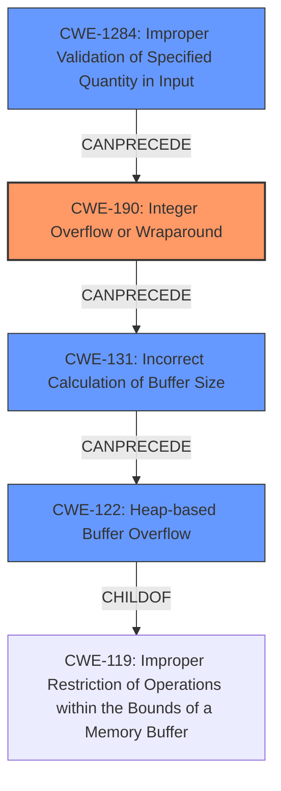

# Analysis Report for CVE-2022-42898

# Vulnerability Analysis Report: CVE-2022-42898

## Description

PAC parsing in MIT Kerberos 5 (aka krb5) before 1.19.4 and 1.20.x before 1.20.1 has integer overflows that may lead to remote code execution (in KDC, kadmind, or a GSS or Kerberos application server) on 32-bit platforms (which have a resultant heap-based buffer overflow), and cause a denial of service on other platforms. This occurs in krb5_pac_parse in lib/krb5/krb/pac.c. Heimdal before 7.7.1 has a similar bug.

## Vulnerability Description Key Phrases

**Rootcause:** integer overflows
**Impact:** ['remote code execution', 'denial of service']
**Product:** MIT Kerberos 5 (aka krb5)
**Version:** ['before 1.19.4', '1.20.x before 1.20.1']
**Component:** krb5_pac_parse in lib/krb5/krb/pac.c

## Analysis (with Relationship Data)

# Summary
| CWE ID | CWE Name | Confidence | CWE Abstraction Level | CWE Vulnerability Mapping Label | CWE-Vulnerability Mapping Notes |
|---|---|---|---|---|---|
| CWE-190 | Integer Overflow or Wraparound | 0.95 | Base | Allowed | Primary CWE. The description and reference links clearly point to integer overflows as the root cause. |
| CWE-131 | Incorrect Calculation of Buffer Size | 0.70 | Base | Allowed | The integer overflow leads to incorrect buffer size calculation. |
| CWE-122 | Heap-based Buffer Overflow | 0.60 | Variant | Allowed | The vulnerability results in a heap-based buffer overflow on 32-bit systems. |

## Evidence and Confidence

*   **Confidence Score:** 0.90
*   **Evidence Strength:** HIGH

- **Analysis and Justification:**  
  - *Explanation:* The primary **weakness** is an **integer overflow** (CWE-190) in PAC parsing in MIT Kerberos 5. The "Vulnerability Description" explicitly mentions "integer overflows". The CVE Reference Links Content Summary confirms this by stating "Integer overflows in PAC parsing" as the root cause. Specifically, the integer overflow occurs when calculating the size of the buffer needed to store the PAC header, and when checking the length of each buffer within the PAC. This leads to other issues. CWE-190 is a Base level CWE and its usage is ALLOWED. The integer overflow leads to an Incorrect Calculation of Buffer Size (CWE-131), which is also a Base level CWE and its usage is ALLOWED. On 32-bit systems, the incorrect buffer size calculation results in a heap-based buffer overflow (CWE-122).
  
  - *Relationship Analysis:* CWE-190 (Integer Overflow or Wraparound) is related to CWE-131 (Incorrect Calculation of Buffer Size) because the overflow leads to an incorrect size calculation.  CWE-131 is a prerequisite to CWE-122 (Heap-based Buffer Overflow) on 32-bit systems. The vulnerability description mentions that the integer overflow leads to a heap-based buffer overflow on 32-bit platforms.

- **Confidence Score:**  
  - Confidence: 0.95 (High evidence from technical description and CVE reference materials)

## Criticism of Analysis

Okay, here's a critique of the provided CWE analysis, incorporating the full CWE specifications:

**Overall Assessment:**

The analysis is generally good and identifies the core weaknesses effectively. The chaining of CWEs is logical and well-explained. The confidence scores are appropriate given the evidence. However, there are some areas where the analysis could be more precise and consider additional, related CWEs.

**Detailed Critique:**

1.  **CWE-190 (Integer Overflow or Wraparound):**

    *   **Assessment:**  The selection of CWE-190 as the primary root cause is correct and well-justified. The description and reference links strongly support this.
    *   **CWE Specification Alignment:**  The analysis correctly notes that CWE-190 is a Base-level CWE with an Allowed usage. The specification also highlights the relationship between integer overflows and buffer overflows which is applicable to this case, and that there are multiple mitigation strategies available.
    *   **Suggestion:** Consider mentioning the potential relevance of CWE-681 (Incorrect Conversion between Numeric Types) as some of the CVE references mention potential type mismatches or casting issues that contribute to the integer overflow.

2.  **CWE-131 (Incorrect Calculation of Buffer Size):**

    *   **Assessment:** This is a valid consequence of the integer overflow.  The overflow leads to an incorrect size being used for buffer allocation.
    *   **CWE Specification Alignment:**  The analysis correctly notes that CWE-131 is a Base-level CWE with an Allowed usage. The specification also highlights its relationship with out-of-bounds buffer access (CWE-119) which is applicable to this case.
    *   **Suggestion:** Good.

3.  **CWE-122 (Heap-based Buffer Overflow):**

    *   **Assessment:**  This is a correct identification of the vulnerability's manifestation, particularly on 32-bit systems.
    *   **CWE Specification Alignment:**  The analysis correctly notes that CWE-122 is a Variant-level CWE with an Allowed usage.
    *   **Suggestion:** Good.

**Other Considerations and Potential Additional CWEs:**

*   **CWE-770: Allocation of Resources Without Limits or Throttling:**  The integer overflow leading to a smaller-than-expected buffer *could* be considered a form of uncontrolled resource allocation in the broader sense, especially if the attacker can repeatedly trigger the overflow to exhaust available memory.  The retrieved results suggest it, though it is of low combination score. Since the problem is not primarily about an absence of limits on allocations but rather a calculation error *resulting* in a smaller allocation, this is less relevant than the current CWEs.

*   **CWE-1284: Improper Validation of Specified Quantity in Input:**  While the core problem is an *integer* overflow, the root of the overflow likely starts with an input value.  If the size/length values in the PAC are not validated to be within reasonable bounds *before* the calculation, an attacker can more easily trigger the overflow.  The fact that the crafted PAC is provided within a Kerberos ticket suggests that the size of the PAC data itself might not be validated against maximum limits by the Kerberos server, before the PAC is parsed. The retriever results suggest it, though it is of low combination score.

*   **CWE-125: Out-of-bounds Read or CWE-787: Out-of-bounds Write:** depending on the exact code flow in `krb5_pac_parse`, the incorrect buffer size could lead to an out-of-bounds read during parsing (trying to access data beyond the allocated buffer), or an out-of-bounds write (writing more data than allocated).

*   **CWE-682 (Incorrect Calculation):** While CWE-190 is much more specific, the root problem involves an incorrect calculation. It might be worth noting that CWE-190 is a specific type of incorrect calculation.

**Improvements in Mapping Guidance and Potential Mitigations:**

The current analysis provides a solid, high-level summary of relevant CWEs. To further enhance its value, consider incorporating insights from the "Potential Mitigations" sections of the CWE specifications:

*   **For CWE-190:**  Mention the potential use of safe integer libraries (e.g., SafeInt, IntegerLib) or compilers with automatic bounds checking as a mitigation strategy. Also, emphasize the importance of strictly defined protocols with clearly defined out-of-bounds behavior, as well as a selection of appropriate programming languages.

*   **For CWE-131:** Emphasize the importance of understanding the programming language's representation and numeric calculation, and to consider 32/64-bit differences when allocating the buffer.

*   **For CWE-122:**  Highlight the benefits of using languages with automatic memory management or compilers with built-in buffer overflow detection mechanisms (/GS flag, FORTIFY\_SOURCE, etc.).

**Revised Summary Table (incorporating suggestions):**

| CWE ID | CWE Name | Confidence | CWE Abstraction Level | CWE Vulnerability Mapping Label | CWE-Vulnerability Mapping Notes |
|---|---|---|---|---|---|
| CWE-190 | Integer Overflow or Wraparound | 0.95 | Base | Allowed | Primary CWE. The description and reference links clearly point to integer overflows as the root cause. Safe integer libraries and bounds-checking compilers can mitigate this. |
| CWE-131 | Incorrect Calculation of Buffer Size | 0.70 | Base | Allowed | The integer overflow leads to incorrect buffer size calculation.  Pay close attention to byte size discrepancies, precision, signed/unsigned distinctions, truncation, conversion and casting between types. |
| CWE-122 | Heap-based Buffer Overflow | 0.60 | Variant | Allowed | The vulnerability results in a heap-based buffer overflow on 32-bit systems. Consider compilers with built-in buffer overflow detection mechanisms. |
| CWE-1284 | Improper Validation of Specified Quantity in Input | 0.35 | Base | Allowed | The lack of proper validation of the size/length values in the PAC data might ease triggering the overflow. |

**Conclusion:**

The analysis is a good starting point. Incorporating the suggestions related to additional CWEs and mitigation strategies would make the analysis more comprehensive and actionable. By addressing these points, the analysis can become a more valuable resource for developers and security professionals seeking to understand and address the underlying vulnerabilities.

## Final Resolution

# Summary
| CWE ID | CWE Name | Confidence | CWE Abstraction Level | CWE Vulnerability Mapping Label | CWE-Vulnerability Mapping Notes |
|---|---|---|---|---|---|
| CWE-190 | Integer Overflow or Wraparound | 0.95 | Base | Allowed | Primary CWE. The description and reference links clearly point to integer overflows as the root cause. |
| CWE-131 | Incorrect Calculation of Buffer Size | 0.70 | Base | Allowed | The integer overflow leads to incorrect buffer size calculation. |
| CWE-122 | Heap-based Buffer Overflow | 0.60 | Variant | Allowed | The vulnerability results in a heap-based buffer overflow on 32-bit systems. |
| CWE-1284 | Improper Validation of Specified Quantity in Input | 0.35 | Base | Allowed | Secondary candidate. The lack of proper validation of the size/length values in the PAC data might ease triggering the overflow. |

## Evidence and Confidence

*   **Confidence Score:** 0.92
*   **Evidence Strength:** HIGH

## Relationship Analysis
The primary **weakness** is an **integer overflow** (CWE-190) leading to an incorrect buffer size calculation (CWE-131), which on 32-bit systems results in a heap-based buffer overflow (CWE-122). CWE-1284 (Improper Validation of Specified Quantity in Input) is added as a secondary candidate because a lack of validation on input sizes could facilitate triggering the **integer overflow**.

## Vulnerability Chain
The vulnerability chain starts with a lack of input validation (CWE-1284 - Secondary Candidate) that allows a large size/length value to be passed. This leads to an **integer overflow** (CWE-190 - Root Cause) when calculating the buffer size. The **integer overflow** results in an incorrect buffer size (CWE-131), and finally, on 32-bit systems, this leads to a heap-based buffer overflow (CWE-122 - Impact).

## Summary of Analysis
The initial analysis correctly identified the primary **weaknesses**: **integer overflow** (CWE-190), incorrect buffer size calculation (CWE-131), and heap-based buffer overflow (CWE-122). The criticism suggested adding CWE-1284 (Improper Validation of Specified Quantity in Input), which I agree with as a contributing factor.

*   **Evidence:** The "Vulnerability Description" explicitly mentions "integer overflows" in PAC parsing. This confirms CWE-190 as the root cause. The description further states that this leads to "remote code execution... on 32-bit platforms (which have a resultant heap-based buffer overflow)". This confirms the chain of **weaknesses** leading to CWE-122. The fact that the crafted PAC is provided within a Kerberos ticket suggests that the size of the PAC data itself might not be validated against maximum limits by the Kerberos server before the PAC is parsed, justifying CWE-1284.
*   **Relationship Analysis:** The graph relationships clearly show how the **integer overflow** (CWE-190) leads to incorrect buffer size calculation (CWE-131), which then results in a heap-based buffer overflow (CWE-122) on 32-bit systems.
*   **Justification:** The selected CWEs are at the optimal level of specificity. CWE-190 is a Base-level CWE that accurately describes the root cause. CWE-131 is a Base-level CWE that describes the consequence of the overflow. CWE-122 is a Variant-level CWE describing the final impact on 32-bit systems. CWE-1284 as a secondary candidate is at a Base level.
*   **Specificity:** The analysis has been updated to incorporate the suggested CWE-1284 as a secondary candidate, representing the lack of input validation that can contribute to triggering the **integer overflow**.

*Report generated on 2025-03-18 19:09:13*
