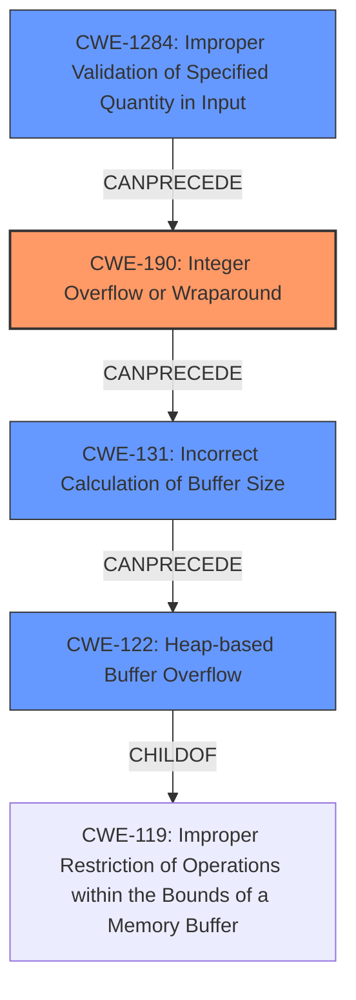

# Final Resolution for CVE-2022-42898

# Summary
| CWE ID | CWE Name | Confidence | CWE Abstraction Level | CWE Vulnerability Mapping Label | CWE-Vulnerability Mapping Notes |
|---|---|---|---|---|---|
| CWE-190 | Integer Overflow or Wraparound | 0.95 | Base | Allowed | Primary CWE. The description and reference links clearly point to integer overflows as the root cause. |
| CWE-131 | Incorrect Calculation of Buffer Size | 0.70 | Base | Allowed | The integer overflow leads to incorrect buffer size calculation. |
| CWE-122 | Heap-based Buffer Overflow | 0.60 | Variant | Allowed | The vulnerability results in a heap-based buffer overflow on 32-bit systems. |
| CWE-1284 | Improper Validation of Specified Quantity in Input | 0.35 | Base | Allowed | Secondary candidate. The lack of proper validation of the size/length values in the PAC data might ease triggering the overflow. |

## Evidence and Confidence

*   **Confidence Score:** 0.92
*   **Evidence Strength:** HIGH

## Relationship Analysis
The primary **weakness** is an **integer overflow** (CWE-190) leading to an incorrect buffer size calculation (CWE-131), which on 32-bit systems results in a heap-based buffer overflow (CWE-122). CWE-1284 (Improper Validation of Specified Quantity in Input) is added as a secondary candidate because a lack of validation on input sizes could facilitate triggering the **integer overflow**.

## Vulnerability Chain
The vulnerability chain starts with a lack of input validation (CWE-1284 - Secondary Candidate) that allows a large size/length value to be passed. This leads to an **integer overflow** (CWE-190 - Root Cause) when calculating the buffer size. The **integer overflow** results in an incorrect buffer size (CWE-131), and finally, on 32-bit systems, this leads to a heap-based buffer overflow (CWE-122 - Impact).

## Summary of Analysis
The initial analysis correctly identified the primary **weaknesses**: **integer overflow** (CWE-190), incorrect buffer size calculation (CWE-131), and heap-based buffer overflow (CWE-122). The criticism suggested adding CWE-1284 (Improper Validation of Specified Quantity in Input), which I agree with as a contributing factor.

*   **Evidence:** The "Vulnerability Description" explicitly mentions "integer overflows" in PAC parsing. This confirms CWE-190 as the root cause. The description further states that this leads to "remote code execution... on 32-bit platforms (which have a resultant heap-based buffer overflow)". This confirms the chain of **weaknesses** leading to CWE-122. The fact that the crafted PAC is provided within a Kerberos ticket suggests that the size of the PAC data itself might not be validated against maximum limits by the Kerberos server before the PAC is parsed, justifying CWE-1284.
*   **Relationship Analysis:** The graph relationships clearly show how the **integer overflow** (CWE-190) leads to incorrect buffer size calculation (CWE-131), which then results in a heap-based buffer overflow (CWE-122) on 32-bit systems.
*   **Justification:** The selected CWEs are at the optimal level of specificity. CWE-190 is a Base-level CWE that accurately describes the root cause. CWE-131 is a Base-level CWE that describes the consequence of the overflow. CWE-122 is a Variant-level CWE describing the final impact on 32-bit systems. CWE-1284 as a secondary candidate is at a Base level.
*   **Specificity:** The analysis has been updated to incorporate the suggested CWE-1284 as a secondary candidate, representing the lack of input validation that can contribute to triggering the **integer overflow**.