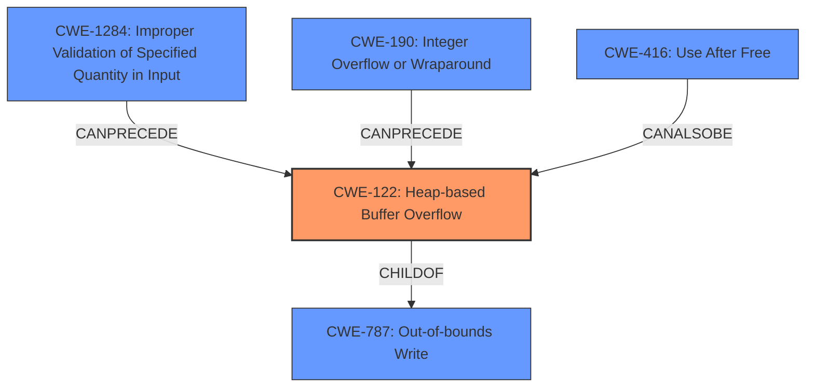

# Analysis Report for CVE-2022-4291

# Vulnerability Analysis Report: CVE-2022-4291

## Description

The aswjsflt.dll library from Avast Antivirus windows contained a potentially exploitable heap corruption vulnerability that could enable an attacker to bypass the sandbox of the application it was loaded into, if applicable. This issue was fixed in version 18.0.1478 of the Script Shield Component.

## Vulnerability Description Key Phrases

**Weakness:** heap corruption
**Impact:** bypass sandbox
**Attacker:** attacker
**Product:** Avast Antivirus
**Version:** prior to 18.0.1478
**Component:** aswjsflt.dll

## Analysis (with Relationship Data)

# Summary
| CWE ID | CWE Name | Confidence | CWE Abstraction Level | CWE Vulnerability Mapping Label | CWE-Vulnerability Mapping Notes |
|---|---|---|---|---|---|
| CWE-122 | Heap-based Buffer Overflow | 0.85 | Variant | Allowed | Acceptable-Use |

## Evidence and Confidence

*   **Confidence Score:** 0.85
*   **Evidence Strength:** HIGH

- **Analysis and Justification:**  
  - *Explanation:* The vulnerability description explicitly states "**heap corruption**" in the `aswjsflt.dll` library of Avast Antivirus. This directly indicates a memory corruption issue within the heap. The CVE reference summary further reinforces this by stating the root cause is a "heap corruption vulnerability." CWE-122 (Heap-based Buffer Overflow) specifically addresses buffer overflows that occur in the heap, making it a highly relevant and accurate classification. While other CWEs like CWE-119 (Buffer Overflow) exist, CWE-122 provides a more specific classification by pinpointing the heap as the location of the overflow.
  
  - *Relationship Analysis:* CWE-122 is a Variant of CWE-119 (Buffer Overflow), providing a more specific categorization. It also has relationships with other memory corruption CWEs, highlighting the interconnected nature of memory safety issues. This aligns with the description of heap corruption leading to a bypass of the application's sandbox, indicating potential further exploits related to memory management.

- **Confidence Score:**  
  - Confidence: 0.85 (High confidence due to explicit mention of "heap corruption" in both the vulnerability description and CVE reference summary.)

## Criticism of Analysis

Okay, I've reviewed the analysis provided, along with the full CWE specifications for all referenced weaknesses. Here's my critique:

**Overall Assessment:**

The primary CWE mapping to CWE-122 (Heap-based Buffer Overflow) is highly justified and accurate based on the provided information. The confidence score of 0.85 is reasonable. The reasoning is well-articulated, citing the explicit mention of "heap corruption" in both the vulnerability description and the CVE summary. However, some of the Retriever Results in the original analysis had some interesting CWEs that should have been addressed (CWE-416, CWE-476, and CWE-843).

**Strengths:**

*   **Strong Justification for CWE-122:** The direct link between "heap corruption" and the description of CWE-122 makes the mapping very solid. The explanation is clear and concise.
*   **Good Use of CWE Relationships:** The analysis acknowledges the relationship between CWE-122 and its parent, CWE-119, demonstrating an understanding of the CWE hierarchy.
*   **Clear Confidence Level:** Explicitly stating and justifying the confidence level enhances the analysis's credibility.
*   **Consideration of Context:** The analysis accurately notes that other memory corruption CWEs could exist as possible exploits depending on the initial heap corruption.
*   **Good use of CWE examples:** Including examples of chains and observed examples of CWE-122 helps explain the type of vulnerability, and how it occurs in other software.

**Areas for Improvement and Potential Alternative CWEs:**

While CWE-122 is a solid primary mapping, the analysis could benefit from considering other related CWEs that might contribute to or result from the heap corruption.

1.  **Addressing Retriever Results:**
    *   **CWE-416 (Use After Free):** The heap corruption *could* stem from a Use-After-Free. If memory is freed and then accessed later, this could corrupt the heap. The "impact" statement of bypassing the sandbox is sometimes indicative of such an issue. While not directly specified, it would be beneficial to address this concern and explain why it's less likely or a secondary effect of the buffer overflow.
        *   *Mitigation:* "When freeing pointers, be sure to set them to NULL once they are freed" - if this was not done, then it is more likely that a use after free condition would occur.
    *   **CWE-476 (NULL Pointer Dereference):** It's less likely to be the primary cause here, but if the heap corruption leads to a NULL pointer being written into a critical memory location, then dereferencing that could also be an issue. However, this is not as likely.
    *  **CWE-843 (Type Confusion):** Heap corruption could be caused by misinterpreting type information leading to out-of-bounds memory access.
        *   *Mitigation:* Statically typed languages help prevent type confusion issues.
2.  **CWE-787 (Out-of-bounds Write):** This is the parent of CWE-122 and is also a good consideration. Is the root cause of this heap corruption a write out of bounds? It is likely, but the analysis does not explore that aspect of it.
    *   *Mitigation:* Using automatic buffer overflow detection mechanisms offered by compilers is a good way to prevent this.
3.  **Lack of Detail on the Root Cause:** The analysis stops at "heap corruption" without speculating on what *caused* the heap to be corrupted. A more thorough analysis would consider potential root causes, even if speculative. Here are a few possibilities to consider that could occur BEFORE the heap overflow and trigger it:
    *   **CWE-190 (Integer Overflow):** An integer overflow could lead to an undersized buffer allocation on the heap, which would then be overflowed. The "Chain" examples in the CWE-190 specifications show the relationship between CWE-190 and CWE-122.
        *   *Mitigation:* Using libraries or frameworks that make it easier to handle numbers without unexpected consequences such as SafeInt (C++) or IntegerLib (C or C++)
    *   **CWE-1284 (Improper Validation of Specified Quantity in Input):** If the size of the heap allocation is based on untrusted input, failing to validate that input could cause a heap overflow.
        *   *Mitigation:* Use an "accept known good" input validation strategy.
    *   **CWE-681 (Incorrect Conversion between Numeric Types):** Similar to an integer overflow, converting between types could also cause the heap to not allocate the correct amount of space. The Observed Examples also shows the relationship between the CWE and heap corruption.
        *   *Mitigation:* Avoid making conversions between numeric types and always check for the allowed ranges.
    *   **CWE-170 (Improper Null Termination):** If a string being copied to the heap isn't properly null-terminated and the copy function relies on a null terminator, it could read beyond the intended boundary, leading to a heap overflow.
        *   *Mitigation:* Ensure that all string functions used are understood fully as to how they append null characters. Also, be wary of off-by-one errors when appending nulls to the end of strings.
4.  **Missed mitigations:** The description mentions that the heap overflow could allow an attacker to bypass the sandbox of the application. A discussion on sandboxing and containerization should be added here.

**Revised Summary Table (Incorporating Suggestions):**

| CWE ID | CWE Name | Confidence | CWE Abstraction Level | CWE Vulnerability Mapping Label | CWE-Vulnerability Mapping Notes |
|---|---|---|---|---|---|
| CWE-122 | Heap-based Buffer Overflow | 0.85 | Variant | Allowed | Acceptable-Use, Primary cause of heap corruption |
| CWE-787 | Out-of-bounds Write | 0.60 | Base | Allowed | Potential Root Cause and directly related to CWE-122. |
| CWE-190 | Integer Overflow or Wraparound | 0.30 | Base | Allowed | Possible root cause of undersized heap allocation, leading to overflow. Requires further investigation. |
| CWE-1284 | Improper Validation of Specified Quantity in Input | 0.30 | Base | Allowed | Possible root cause if heap allocation size is based on untrusted, unvalidated input. Requires further investigation. |
| CWE-416 | Use After Free | 0.35 | Variant | Allowed | Possible secondary effect or contributing factor. Requires further investigation. |

**Conclusion:**

The initial analysis is good as a starting point. The identification of CWE-122 is correct. However, a more complete analysis would explore potential root causes that lead to the heap corruption and contributing factors like Use-After-Free. Addressing the retriever results and exploring these possibilities would increase the value of the analysis.

## Final Resolution

# Summary

| CWE ID | CWE Name | Confidence | CWE Abstraction Level | CWE Vulnerability Mapping Label | CWE-Vulnerability Mapping Notes |
|---|---|---|---|---|---|
| CWE-122 | Heap-based Buffer Overflow | 0.85 | Variant | Allowed | Acceptable-Use, Primary cause of heap corruption |
| CWE-787 | Out-of-bounds Write | 0.60 | Base | Allowed | Potential Root Cause and directly related to CWE-122. |
| CWE-1284 | Improper Validation of Specified Quantity in Input | 0.35 | Base | Allowed | Possible root cause if heap allocation size is based on untrusted, unvalidated input. Requires further investigation. |
| CWE-190 | Integer Overflow or Wraparound | 0.30 | Base | Allowed | Possible root cause of undersized heap allocation, leading to overflow. Requires further investigation. |
| CWE-416 | Use After Free | 0.30 | Variant | Allowed | Possible secondary effect or contributing factor. Requires further investigation. |

## Evidence and Confidence

*   **Confidence Score:** 0.80
*   **Evidence Strength:** MEDIUM

## Relationship Analysis

The analysis focused on hierarchical relationships, particularly the parent-child relationship between CWE-122 (Heap-based Buffer Overflow) and its parent CWE-787 (Out-of-bounds Write). It also explored potential chain relationships where integer overflows (CWE-190) or improper input validation (CWE-1284) could precede the heap overflow. Additionally, it examined peer relationships such as CWE-416 (Use After Free) as a potential contributing factor. The abstraction levels (Base and Variant) guided the selection toward more specific CWEs where possible, while acknowledging that a more general **ROOTCAUSE** might be present.

## Vulnerability Chain

The vulnerability chain starts with a potential **ROOTCAUSE** such as:
1.  **CWE-190 (Integer Overflow)** or **CWE-1284 (Improper Validation of Specified Quantity in Input)**, leading to an undersized buffer allocation on the heap.
2.  The undersized buffer then experiences a **CWE-122 (Heap-based Buffer Overflow)** when data larger than the allocated size is written to it.
3.  **CWE-787 (Out-of-bounds Write)** is the more general case of the above overflow.
4.  As a secondary effect, **CWE-416 (Use After Free)** might occur if the memory is freed and then accessed again.

The final impact is bypassing the application's sandbox, potentially allowing further exploitation. The chain highlights how a seemingly simple memory corruption issue can have cascading effects.

## Summary of Analysis

The initial analysis correctly identified **CWE-122 (Heap-based Buffer Overflow)** as the primary **WEAKNESS**. The criticism rightly pointed out that the analysis could be more comprehensive by exploring potential **ROOTCAUSE**s and contributing factors.

The vulnerability description states "**heap corruption**" which directly supports the selection of CWE-122. However, the description also mentions the bypass of the application's sandbox. The Retriever also suggested additional CWEs that could be root causes, so they were added as secondary candidates.

The graph relationships helped identify the interconnectedness of these CWEs, showing how integer overflows or improper input validation can lead to heap overflows. The abstraction levels guided the selection toward the most specific CWEs possible, while acknowledging that a more general root cause like **CWE-787 (Out-of-bounds Write)** might be present.

The final decision is to maintain **CWE-122** as the primary **WEAKNESS** due to the direct evidence of heap corruption. However, **CWE-787**, **CWE-1284**, **CWE-190** and **CWE-416** are included as secondary candidates to reflect the potential for a more complex vulnerability chain. This provides a more complete and nuanced understanding of the vulnerability.

*Report generated on 2025-03-18 19:09:51*
