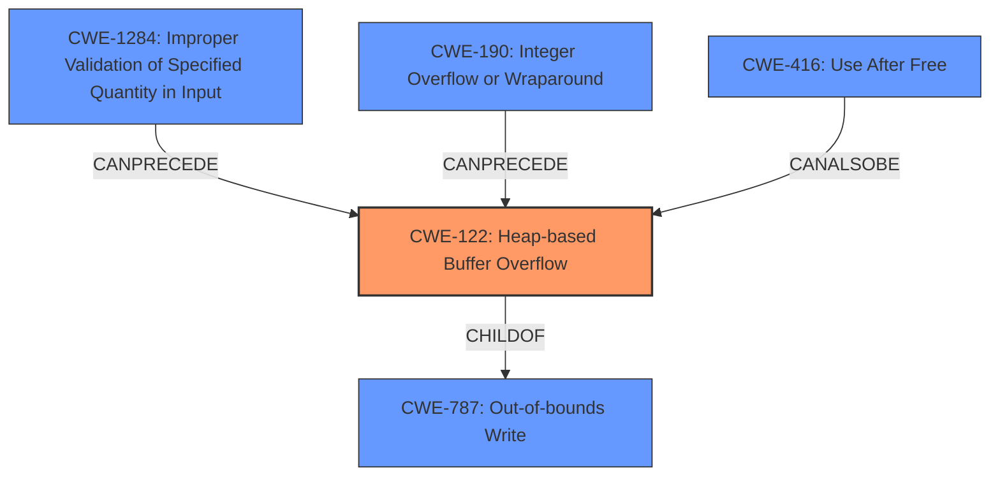

# Final Resolution for CVE-2022-4291

# Summary

| CWE ID | CWE Name | Confidence | CWE Abstraction Level | CWE Vulnerability Mapping Label | CWE-Vulnerability Mapping Notes |
|---|---|---|---|---|---|
| CWE-122 | Heap-based Buffer Overflow | 0.85 | Variant | Allowed | Acceptable-Use, Primary cause of heap corruption |
| CWE-787 | Out-of-bounds Write | 0.60 | Base | Allowed | Potential Root Cause and directly related to CWE-122. |
| CWE-1284 | Improper Validation of Specified Quantity in Input | 0.35 | Base | Allowed | Possible root cause if heap allocation size is based on untrusted, unvalidated input. Requires further investigation. |
| CWE-190 | Integer Overflow or Wraparound | 0.30 | Base | Allowed | Possible root cause of undersized heap allocation, leading to overflow. Requires further investigation. |
| CWE-416 | Use After Free | 0.30 | Variant | Allowed | Possible secondary effect or contributing factor. Requires further investigation. |

## Evidence and Confidence

*   **Confidence Score:** 0.80
*   **Evidence Strength:** MEDIUM

## Relationship Analysis

The analysis focused on hierarchical relationships, particularly the parent-child relationship between CWE-122 (Heap-based Buffer Overflow) and its parent CWE-787 (Out-of-bounds Write). It also explored potential chain relationships where integer overflows (CWE-190) or improper input validation (CWE-1284) could precede the heap overflow. Additionally, it examined peer relationships such as CWE-416 (Use After Free) as a potential contributing factor. The abstraction levels (Base and Variant) guided the selection toward more specific CWEs where possible, while acknowledging that a more general **ROOTCAUSE** might be present.

## Vulnerability Chain

The vulnerability chain starts with a potential **ROOTCAUSE** such as:
1.  **CWE-190 (Integer Overflow)** or **CWE-1284 (Improper Validation of Specified Quantity in Input)**, leading to an undersized buffer allocation on the heap.
2.  The undersized buffer then experiences a **CWE-122 (Heap-based Buffer Overflow)** when data larger than the allocated size is written to it.
3.  **CWE-787 (Out-of-bounds Write)** is the more general case of the above overflow.
4.  As a secondary effect, **CWE-416 (Use After Free)** might occur if the memory is freed and then accessed again.

The final impact is bypassing the application's sandbox, potentially allowing further exploitation. The chain highlights how a seemingly simple memory corruption issue can have cascading effects.

## Summary of Analysis

The initial analysis correctly identified **CWE-122 (Heap-based Buffer Overflow)** as the primary **WEAKNESS**. The criticism rightly pointed out that the analysis could be more comprehensive by exploring potential **ROOTCAUSE**s and contributing factors.

The vulnerability description states "**heap corruption**" which directly supports the selection of CWE-122. However, the description also mentions the bypass of the application's sandbox. The Retriever also suggested additional CWEs that could be root causes, so they were added as secondary candidates.

The graph relationships helped identify the interconnectedness of these CWEs, showing how integer overflows or improper input validation can lead to heap overflows. The abstraction levels guided the selection toward the most specific CWEs possible, while acknowledging that a more general root cause like **CWE-787 (Out-of-bounds Write)** might be present.

The final decision is to maintain **CWE-122** as the primary **WEAKNESS** due to the direct evidence of heap corruption. However, **CWE-787**, **CWE-1284**, **CWE-190** and **CWE-416** are included as secondary candidates to reflect the potential for a more complex vulnerability chain. This provides a more complete and nuanced understanding of the vulnerability.