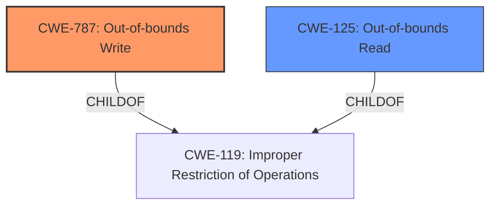

# Final Resolution for CVE-2022-42932

# Summary
| CWE ID | CWE Name | Confidence | CWE Abstraction Level | CWE Vulnerability Mapping Label | CWE-Vulnerability Mapping Notes |
|---|---|---|---|---|---|
| CWE-787 | Out-of-bounds Write | 0.90 | Base | Allowed | Primary CWE. The vulnerability involves writing data past the end of the intended buffer. |
| CWE-125 | Out-of-bounds Read | 0.75 | Base | Allowed | Secondary CWE. Memory corruption allows the possibility of reading from unintended memory locations. |

## Evidence and Confidence

*   **Confidence Score:** 0.85
*   **Evidence Strength:** HIGH

## Relationship Analysis
The primary relationship considered was the parent-child relationship between CWE-787/CWE-125 and CWE-119. While CWE-119 is a parent, the base CWEs 787 and 125 offer more specific details. There are no direct relationships found to other CWEs discussed.

## Vulnerability Chain
The vulnerability chain involves memory safety bugs leading to memory corruption.
  - The root cause is a failure to properly manage memory boundaries.
  - This results in out-of-bounds write (CWE-787) and potentially out-of-bounds read (CWE-125).
  - The impact is arbitrary code execution due to memory corruption.

## Summary of Analysis
The initial analysis and criticism were well-reasoned and provided a strong foundation for understanding the vulnerability. The decision to map the vulnerability to CWE-787 and CWE-125 is well-supported by the evidence in the vulnerability description and the Bugzilla links, which point to buffer overruns and out-of-bounds writes in WebGL and Base64 decoding.

The primary evidence supporting this classification is the vulnerability description: "Mozilla developers Ashley Hale and the Mozilla Fuzzing Team reported **memory safety bugs** present in Firefox 105 and Firefox ESR 102.3. Some of these bugs showed evidence of **memory corruption** and we presume that with enough effort some of these could have been exploited to **run arbitrary code**."

The criticism suggested considering more specific variants of CWE-787, such as CWE-122 (Heap-based Buffer Overflow). While this is a valid point, the available information does not definitively confirm whether the affected buffers are allocated on the heap. Without that confirmation, sticking with the more general CWE-787 is the most appropriate course of action.

The suggestion to explore chaining relationships, such as CWE-20 (Improper Input Validation) -> CWE-787/CWE-125, is also reasonable. However, the vulnerability description does not explicitly mention improper input validation as the root cause. Therefore, while it is possible that improper input validation is a contributing factor, there is not enough evidence to include it in the primary classification.

The suggestion of **CWE-843: Access of Resource Using Incompatible Type ('Type Confusion')** is an interesting one but not supported by the current evidence. Similarly, the suggestion of **CWE-124: Buffer Underwrite ('Buffer Underflow')** is not supported by the evidence.

The selected CWEs are at the optimal level of specificity because they accurately reflect the nature of the vulnerability based on the available evidence. CWE-787 and CWE-125 are both Base-level CWEs, which provide more specific details than the Class-level CWE-119.