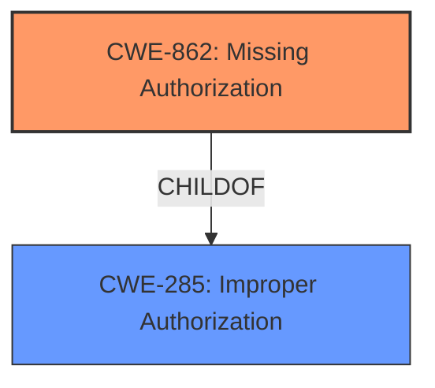

# Final Resolution for CVE-2022-43581

# Summary
| CWE ID  | CWE Name   | Confidence | CWE Abstraction Level | CWE Vulnerability Mapping Label | CWE-Vulnerability Mapping Notes |
|--------------|-----------------------------------------------------------------------------------------------------------------|------------|-----------------------|---------------------------------------|----------------------------------------------------------------------------------------------------------------------------------|
| **CWE-862** | **Missing Authorization** | 0.85 | Class | Primary | Allowed-with-Review: This CWE entry is a Class and might have Base-level children that would be more appropriate |
| CWE-285 | Improper Authorization | 0.65 | Class | Secondary | Discouraged: CWE-285 is high-level and lower-level CWEs can frequently be used instead. It is a level-1 Class (i.e., a child of a Pillar). |

## Evidence and Confidence

*   **Confidence Score:** 0.8
*   **Evidence Strength:** HIGH

## Relationship Analysis
The primary relationship that impacted my decision was the parent-child relationship between CWE-285 and CWE-862. CWE-862 is a more specific child of the class-level CWE-285. Since the vulnerability description explicitly mentions **missing authorization**, CWE-862 is the more precise choice. The analysis also considered CWE-425 but I have removed that as a candidate. Abstraction levels played a key role; the initial analysis correctly identified that using the class-level CWE-285 is discouraged when a more specific base-level CWE is available.

## Vulnerability Chain
The vulnerability chain starts with the **ROOTCAUSE** of **missing authorization**. This leads to the ability of an authenticated user to load external plugins and execute code. The sequence is as follows:

1.  **Missing Authorization (CWE-862)**: The system does not perform an authorization check.
2.  **Impact**: Authenticated users can load external plugins and execute code, potentially leading to arbitrary code execution.

There are no missing links in this chain, based on the provided information.

## Summary of Analysis
The initial analysis correctly identified the potential for **missing authorization** as the **WEAKNESS**, but started with a high-level CWE. The criticism accurately pointed out that the vulnerability description "is vulnerable to **missing authorization** and could allow an authenticated user to load external plugins and execute code" directly aligns with **CWE-862 (Missing Authorization)** [CWE Description: The product does not perform an authorization check when an actor attempts to access a resource or perform an action.]. Because the description explicitly indicates a *missing* check, not an *improper* check, CWE-862 is more accurate than CWE-285. The retriever results, while providing additional context, did not directly influence the final decision. The relationship analysis, particularly the parent-child relationship between CWE-285 and CWE-862, reinforced the selection of the more specific CWE-862. The decision to select CWE-862 is justified by its direct alignment with the vulnerability description and its appropriate level of specificity.