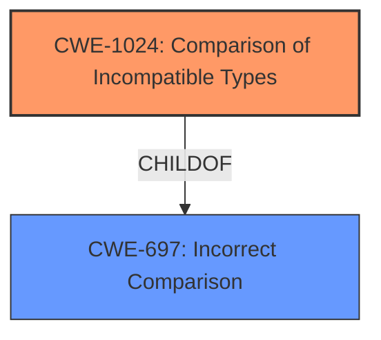

# Final Resolution for CVE-2022-43690

# Summary
| CWE ID | CWE Name | Confidence | CWE Abstraction Level | CWE Vulnerability Mapping Label | CWE-Vulnerability Mapping Notes |
|---|---|---|---|---|---|
| CWE-1024 | Comparison of Incompatible Types | 0.90 | Base | Allowed | Primary CWE |

## Evidence and Confidence

*   **Confidence Score:** 0.90
*   **Evidence Strength:** HIGH

## Relationship Analysis
The primary relationship influencing the decision is that **CWE-1024** is a Base level weakness, offering a specific description of the issue. It is a child of the more abstract **CWE-697**. Choosing **CWE-1024** provides greater specificity than its parent.

## Vulnerability Chain
The vulnerability chain starts with the **ROOTCAUSE** of using a non-strict comparison (== instead of ===) in PHP, which is an instance of **CWE-1024** (Comparison of Incompatible Types). This improper comparison leads to a potential authentication bypass, allowing unauthorized access.

## Summary of Analysis
The initial analysis correctly identified **CWE-1024** as a strong candidate due to the "strict comparison for the legacy_salt" issue described in the vulnerability report. The criticism correctly pointed out that **CWE-639** was a weaker secondary candidate, as the **ROOTCAUSE** is not directly related to user-controlled keys.

The final decision is to classify this vulnerability as **CWE-1024** (Comparison of Incompatible Types) with high confidence (0.90). This is because the vulnerability description directly states that there was an issue with "strict comparison for the legacy_salt". This aligns directly with **CWE-1024**, which describes scenarios where incompatible types are compared, leading to incorrect results. The evidence includes the vulnerability description itself, which explicitly mentions the comparison problem. **CWE-1024** is at the optimal level of specificity, as it captures the **ROOTCAUSE** of the vulnerability, which is the incorrect comparison of data types.