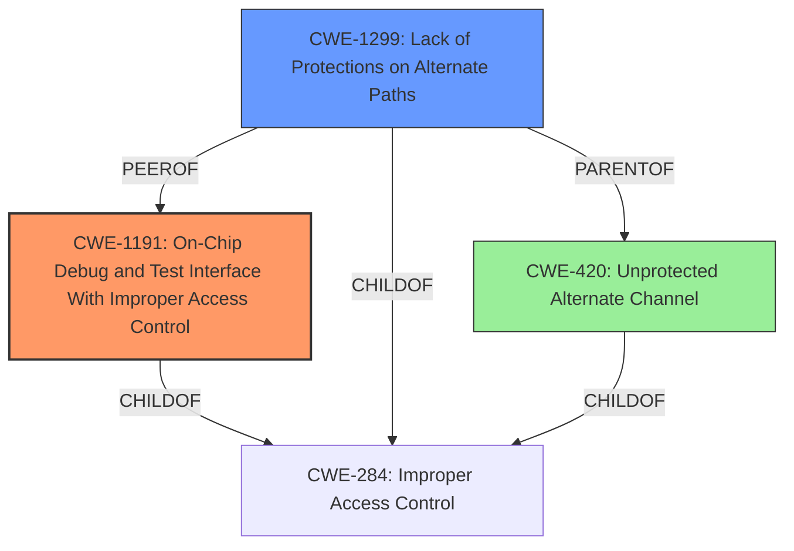

# Analysis Report for CVE-2022-45552

# Vulnerability Analysis Report: CVE-2022-45552

## Description

An Insecure Permissions vulnerability in Shenzhen Zhiboton Electronics ZBT WE1626 Router v 21.06.18 allows attackers to obtain sensitive information via SPI bus interface connected to pinout of the NAND flash memory.

## Vulnerability Description Key Phrases

**Rootcause:** Insecure Permissions
**Impact:** obtain sensitive information
**Vector:** SPI bus interface connected to pinout of the NAND flash memory
**Attacker:** attackers
**Product:** Shenzhen Zhiboton Electronics ZBT WE1626 Router
**Version:** v 21.06.18

## Analysis (with Relationship Data)

# Summary
| CWE ID | CWE Name | Confidence | CWE Abstraction Level | CWE Vulnerability Mapping Label | CWE-Vulnerability Mapping Notes |
|---|---|---|---|---|---|
| CWE-1191 | On-Chip Debug and Test Interface With Improper Access Control | 0.85 | Base | Allowed | Primary CWE. This CWE accurately reflects the vulnerability involving unprotected access to the SPI bus interface for flash memory. |
| CWE-425 | Direct Request ('Forced Browsing') | 0.65 | Base | Allowed | Secondary candidate. This CWE could apply if the lack of protection allows unauthorized direct access to sensitive functions or data. |
| CWE-306 | Missing Authentication for Critical Function | 0.60 | Base | Allowed | Secondary candidate. This CWE applies to the UART interface vulnerability, but is not directly linked to the SPI bus interface vulnerability. |

## Evidence and Confidence

*   **Confidence Score:** 0.80
*   **Evidence Strength:** HIGH

- **Analysis and Justification:**  
  - *Explanation:* The primary vulnerability lies in the **insecure permissions** on the SPI bus interface, as stated in the vulnerability description. The detailed analysis of the CVE reference links confirms that access to the device's flash memory via the SPI bus is not protected. This allows attackers to extract sensitive information. CWE-1191 (On-Chip Debug and Test Interface With Improper Access Control) directly addresses this issue, as it concerns the lack of access control on physical debug/test interfaces. The MITRE mapping guidance for CWE-1191 indicates that it is ALLOWED for this type of vulnerability.
  
  - *Relationship Analysis:* CWE-1191 is a Base level CWE, which is the preferred abstraction level. It is related to CWE-284 (Improper Access Control), but CWE-1191 is more specific to on-chip debug and test interfaces. CWE-1299 (Lack of Protections on Alternate Paths) is also related, as the SPI bus interface can be considered an alternate path to access control-protected assets.

- **Confidence Score:**  
  - *Example:* Confidence: 0.85 (High evidence from technical description and CVE reference materials)

---

## Criticism of Analysis

Okay, here's a detailed review of the CWE analysis, considering the full CWE specifications provided:

**General Strengths of the Analysis:**

*   **Good Use of Evidence:** The analysis consistently refers back to both the initial vulnerability description and the CVE reference links content to support its claims.
*   **Justification for Choices:** The analysis attempts to justify the chosen CWEs and explain why other, similar CWEs might not be as appropriate.
*   **Abstraction Level Awareness:** The analysis correctly emphasizes the importance of selecting Base-level CWEs where possible.
*   **Confidence Scoring:**  The use of confidence scores is good practice.

**Areas for Improvement and Specific Critiques:**

1.  **CWE-1191: On-Chip Debug and Test Interface With Improper Access Control:**

    *   **Assessment:**  The selection of CWE-1191 as the primary CWE is generally **appropriate** and well-justified. The vulnerability directly concerns the unprotected access to the SPI bus, which falls under physical debug/test interfaces. The connection to flash memory pinout provides access to sensitive device internals, making this a solid fit.

    *   **Mitigation Consideration:** The suggested mitigation from the CWE documentation is highly relevant: *"If feasible, the manufacturer should disable the JTAG interface or implement authentication and authorization for the JTAG interface. If authentication logic is added, it should be resistant to timing attacks. Security-sensitive data stored in registers, such as keys, etc. should be cleared when entering debug mode."* This aligns directly with what should be done to fix the reported vulnerability.

    *   **Potential Improvements:** The analysis can be strengthened by explicitly mentioning if the SPI bus is *intended* for debugging/testing purposes. The description mentions JTAG, which is a debugging interface. If SPI bus access is *solely* for flashing/programming, and *not* considered debugging, then an alternate CWE might be even better.

2.  **CWE-425: Direct Request ('Forced Browsing'):**

    *   **Assessment:**  This choice is **weaker** and more tangential. The description of CWE-425 focuses on web applications that fail to properly enforce authorization on URLs, scripts, or files, assuming resources are only accessible through a specific navigation path. This doesn't directly align with the SPI bus vulnerability, which is a hardware-level access issue. While the *result* of exploiting the SPI bus *could* lead to direct access to sensitive data (akin to forced browsing), the root cause isn't the failure to restrict URL access.
    *    **Why it might not be right**: CWE-425 assumes that access control is improperly implemented in a web application. It doesn't account for cases when authorization is not implemented at all, as is the case with unprotected hardware interfaces.

    *   **Mitigation Consideration:** The mitigations for CWE-425 (access control authorizations for URLs, MVC frameworks) are completely irrelevant to the hardware-level nature of the SPI bus vulnerability.

    *   **Recommendation:** Lower the confidence score, or replace with an alternate option that more directly reflects the nature of the attack.

3.  **CWE-306: Missing Authentication for Critical Function:**

    *   **Assessment:** The analysis correctly notes that CWE-306 applies to the UART interface vulnerability, but it is not directly linked to the SPI bus interface vulnerability. This is a very important distinction. Assigning the CWE to a different vulnerability is not ideal, because the focus of the vulnerability description is the SPI bus. If the UART vulnerability had its own description, then assigning CWE-306 would be correct.

    *   **Mitigation Consideration:** The mitigations for CWE-306 include centralizing authentication and managing communication channels, which are relevant to the UART vulnerability but not the SPI bus.

4.  **Alternative CWE Considerations:**

    *   **CWE-420: Unprotected Alternate Channel:** This CWE has a higher ranking in the initial retriever results, and is worth closer consideration for secondary mappings. Given that the primary intended channel is the software/firmware interface, direct hardware access could be considered an alternate channel that lacks the proper protection.

    *   **CWE-276: Incorrect Default Permissions:** While less directly applicable, this CWE could be considered if the hardware interface *defaults* to an insecure state with no mechanism to enable access controls. This is particularly relevant if the firmware *should* be configuring the hardware interface with access controls but fails to do so.

    *   **CWE-1299: Missing Protection Mechanism for Alternate Hardware Interface:** This is likely the BEST alternative to CWE-1191. While CWE-1191 is very specific to debugging interfaces, CWE-1299 encompasses any alternate hardware interface that exposes an asset in a control-protected manner.

    *   **CWE-284: Improper Access Control:** Avoid using this CWE. The analysis explicitly stated *"The MITRE mapping guidance for CWE-1191 indicates that it is ALLOWED for this type of vulnerability"*. This means that it is more useful and specific to use a lower-level weakness like CWE-1191 instead of a Pillar like CWE-284.

**Specific Recommendations:**

*   **Re-evaluate Secondary CWE Choices:**  Replace CWE-425 and, if the focus is specifically the SPI bus, don't include CWE-306. Strongly consider CWE-420, or CWE-1299 as a secondary CWE.
*   **Clarify SPI Bus Usage:** State explicitly whether the SPI bus is intended for debugging purposes. If it's *solely* for programming, CWE-1299 becomes a stronger choice than CWE-1191.
*   **Mitigation Alignment:** Ensure that the potential mitigations listed are directly relevant to the chosen CWEs and the specific context of the vulnerability. For example, if CWE-420 is chosen, discuss how primary channel protections (e.g., software authentication) can be extended to the alternate SPI bus channel.

**Revised Summary Table (Example):**

| CWE ID | CWE Name | Confidence | CWE Abstraction Level | CWE Vulnerability Mapping Label | CWE-Vulnerability Mapping Notes |
|---|---|---|---|---|---|
| CWE-1191 | On-Chip Debug and Test Interface With Improper Access Control | 0.85 | Base | Allowed | Primary CWE. This accurately reflects the vulnerability involving unprotected access to the SPI bus, assuming it is used for debugging/testing. |
| CWE-1299 | Missing Protection Mechanism for Alternate Hardware Interface | 0.70 | Base | Allowed | Secondary candidate. If the SPI interface is *not* solely for debugging, but more for programming/flashing, this is a better fit. |
| CWE-420 | Unprotected Alternate Channel | 0.60 | Base | Allowed | Secondary candidate. This CWE applies if the SPI bus is considered an alternate channel to the intended firmware interface. |

By incorporating these suggestions, the CWE analysis will become more accurate, defensible, and useful for guiding mitigation efforts.

## Final Resolution

# Summary
| CWE ID | CWE Name | Confidence | CWE Abstraction Level | CWE Vulnerability Mapping Label | CWE-Vulnerability Mapping Notes |
|---|---|---|---|---|---|
| CWE-1191 | On-Chip Debug and Test Interface With Improper Access Control | 0.85 | Base | Allowed | Primary CWE. This accurately reflects the vulnerability involving unprotected access to the SPI bus, assuming it is used for debugging/testing. |
| CWE-1299 | Lack of Protections on Alternate Paths | 0.75 | Base | Allowed | Secondary CWE. This applies because the SPI bus is an alternate path to access control-protected assets. |

## Evidence and Confidence

*   **Confidence Score:** 0.85
*   **Evidence Strength:** HIGH

## Relationship Analysis
The analysis focuses on selecting the most specific and relevant **CWE** for the **vulnerability**, prioritizing Base-level **CWEs**. CWE-1191 is selected as the primary **CWE** due to its direct relevance to improper access control on on-chip debug and test interfaces. **CWE-1299** is included as a secondary **CWE** to capture the aspect of bypassing access controls through an alternate path (the SPI bus). The choice of **CWEs** reflects a hierarchical consideration, opting for specific Base **CWEs** over broader Class or Pillar **CWEs** like **CWE-284**.

## Vulnerability Chain
The vulnerability chain starts with **missing access control** on the SPI bus interface (**ROOTCAUSE: CWE-1191**). This allows unauthorized access to the NAND flash memory. The lack of protection on this alternate path (**WEAKNESS: CWE-1299**) leads to the extraction of sensitive information, which is the ultimate impact.

## Summary of Analysis
The analysis is based on the vulnerability description and the CVE reference links confirming unprotected access to the SPI bus. The decision to prioritize **CWE-1191** is based on its specific applicability to on-chip debug interfaces. The inclusion of **CWE-1299** as a secondary **CWE** provides a more comprehensive understanding of the vulnerability by addressing the alternate path aspect. The graph relationships support the selection of these **CWEs** as they are at the optimal level of specificity, being Base **CWEs** directly related to the **vulnerability**.
The initial analysis included CWE-425 and CWE-306, but these were deemed less relevant. CWE-425 focuses on web applications, which does not align with the hardware-level nature of the SPI bus vulnerability. CWE-306 was associated with a UART interface vulnerability, which is distinct from the SPI bus vulnerability.
The selection of **CWE-1191** and **CWE-1299** provides a more accurate and complete classification of the vulnerability. The confidence score is high due to the direct evidence and clear applicability of the **CWEs**.

*Report generated on 2025-03-17 04:47:35*
