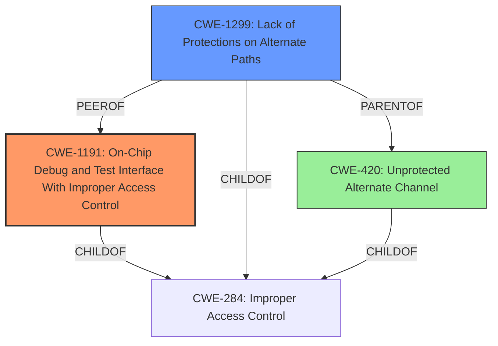

# Final Resolution for CVE-2022-45552

# Summary
| CWE ID | CWE Name | Confidence | CWE Abstraction Level | CWE Vulnerability Mapping Label | CWE-Vulnerability Mapping Notes |
|---|---|---|---|---|---|
| CWE-1191 | On-Chip Debug and Test Interface With Improper Access Control | 0.85 | Base | Allowed | Primary CWE. This accurately reflects the vulnerability involving unprotected access to the SPI bus, assuming it is used for debugging/testing. |
| CWE-1299 | Lack of Protections on Alternate Paths | 0.75 | Base | Allowed | Secondary CWE. This applies because the SPI bus is an alternate path to access control-protected assets. |

## Evidence and Confidence

*   **Confidence Score:** 0.85
*   **Evidence Strength:** HIGH

## Relationship Analysis
The analysis focuses on selecting the most specific and relevant **CWE** for the **vulnerability**, prioritizing Base-level **CWEs**. CWE-1191 is selected as the primary **CWE** due to its direct relevance to improper access control on on-chip debug and test interfaces. **CWE-1299** is included as a secondary **CWE** to capture the aspect of bypassing access controls through an alternate path (the SPI bus). The choice of **CWEs** reflects a hierarchical consideration, opting for specific Base **CWEs** over broader Class or Pillar **CWEs** like **CWE-284**.

## Vulnerability Chain
The vulnerability chain starts with **missing access control** on the SPI bus interface (**ROOTCAUSE: CWE-1191**). This allows unauthorized access to the NAND flash memory. The lack of protection on this alternate path (**WEAKNESS: CWE-1299**) leads to the extraction of sensitive information, which is the ultimate impact.

## Summary of Analysis
The analysis is based on the vulnerability description and the CVE reference links confirming unprotected access to the SPI bus. The decision to prioritize **CWE-1191** is based on its specific applicability to on-chip debug interfaces. The inclusion of **CWE-1299** as a secondary **CWE** provides a more comprehensive understanding of the vulnerability by addressing the alternate path aspect. The graph relationships support the selection of these **CWEs** as they are at the optimal level of specificity, being Base **CWEs** directly related to the **vulnerability**.
The initial analysis included CWE-425 and CWE-306, but these were deemed less relevant. CWE-425 focuses on web applications, which does not align with the hardware-level nature of the SPI bus vulnerability. CWE-306 was associated with a UART interface vulnerability, which is distinct from the SPI bus vulnerability.
The selection of **CWE-1191** and **CWE-1299** provides a more accurate and complete classification of the vulnerability. The confidence score is high due to the direct evidence and clear applicability of the **CWEs**.