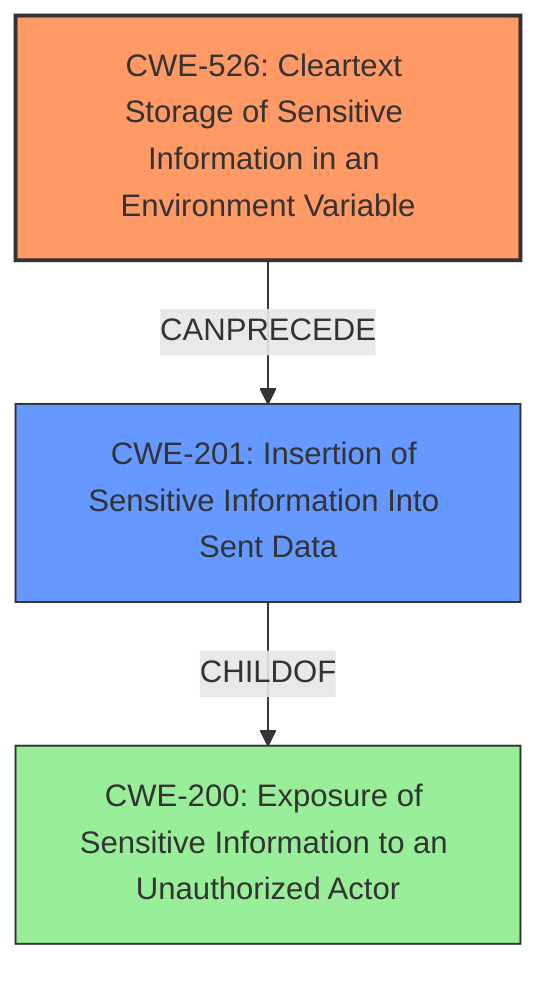

# Final Resolution for CVE-2022-46155

# Summary
| CWE ID | CWE Name | Confidence | CWE Abstraction Level | CWE Vulnerability Mapping Label | CWE-Vulnerability Mapping Notes |
|---|---|---|---|---|---|
| **CWE-526** | Cleartext Storage of Sensitive Information in an Environment Variable | 0.95 | Variant | Allowed | Primary **CWE** |
| **CWE-201** | Insertion of Sensitive Information Into Sent Data | 0.75 | Base | Allowed | Secondary Candidate |

## Evidence and Confidence

*   **Confidence Score:** 0.93
*   **Evidence Strength:** HIGH

## Relationship Analysis
The primary **CWE**, **CWE-526** (Cleartext Storage of Sensitive Information in an Environment Variable), is a variant-level **CWE** and doesn't have direct relationships with other **CWE**s in terms of parent-child. However, it represents a specific instance of storing sensitive information insecurely. The secondary **CWE**, **CWE-201** (Insertion of Sensitive Information Into Sent Data), is a base-level **CWE** and has child relationships to **CWE-200** (Exposure of Sensitive Information to an Unauthorized Actor). The vulnerability chain progresses from storing the API key in an environment variable (**CWE-526**) to including it in the built artifact and distributing it (**CWE-201**). The abstraction levels influenced the decision to prioritize the more specific **CWE-526** as the primary cause while acknowledging the contribution of **CWE-201** as a consequence.

## Vulnerability Chain
The vulnerability chain starts with the **ROOTCAUSE** of storing the API key in an environment variable (**CWE-526**). This is followed by the **WEAKNESS** of including this sensitive information in the build process and subsequently in the distributed `airtable.js` file (**CWE-201**). This leads to the impact of exposing the API key to unauthorized actors. There are no missing links in the chain, as the description clearly outlines how the API key is bundled into the built code due to the misconfigured build script.

## Summary of Analysis
The initial analysis correctly identified **CWE-526** as the primary **CWE** due to the direct inclusion of the API key from the environment variable into the build artifact. The criticism highlighted the need to refine the justification for **CWE-201**, emphasizing that it's the distribution of the already-compromised bundle that constitutes the "insertion into sent data."

The analysis is primarily based on the provided evidence from the vulnerability description, which states: "When the build script is run, it would bundle environment variables into the build target of a transpiled bundle. Specifically, the AIRTABLE_API_KEY and AIRTABLE_ENDPOINT_URL environment variables are inserted during Browserify builds due to being referenced in Airtable.js code."

The graph relationships influenced the final selection by illustrating how **CWE-526** leads to **CWE-201**. The decision to select **CWE-526** as the primary **CWE** is justified because it represents the root cause of the vulnerability. It is also at the optimal level of specificity, being a Variant **CWE**. **CWE-201** is included as a secondary **CWE** to highlight the consequence of distributing the built artifact containing the sensitive information.

The suggestion in the criticism to consider **CWE-522** (Insufficiently Protected Credentials) was considered. However, **CWE-522** is a Class level **CWE** and is therefore less specific than **CWE-526**. Since the vulnerability description clearly states that the API key is stored in an environment variable, **CWE-526** is the more appropriate choice.

The automatic retriever results were reviewed, and the irrelevant **CWE**s (e.g., **CWE-79**, **CWE-78**, **CWE-1336**) were excluded because they do not align with the technical details of the vulnerability.