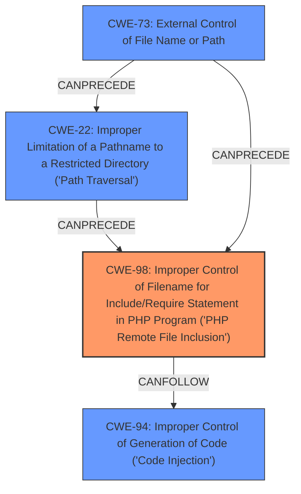

# Analysis Report for CVE-2022-47945

# Vulnerability Analysis Report: CVE-2022-47945

## Description

ThinkPHP Framework before 6.0.14 allows local file inclusion via the lang parameter when the language pack feature is enabled (lang_switch_on=true). An unauthenticated and remote attacker can exploit this to execute arbitrary operating system commands, as demonstrated by including pearcmd.php.

## Vulnerability Description Key Phrases

**Rootcause:** improper input validation
**Weakness:** local file inclusion
**Impact:** arbitrary code execution
**Vector:** lang parameter
**Attacker:** unauthenticated remote attacker
**Product:** ThinkPHP Framework
**Version:** before 6.0.14

## Analysis (with Relationship Data)

# Summary
| CWE ID  | CWE Name                                                                                                       | Confidence | CWE Abstraction Level | CWE Vulnerability Mapping Label | CWE-Vulnerability Mapping Notes |
| :-------- | :------------------------------------------------------------------------------------------------------------- | :--------- | :---------------------- | :------------------------------ | :-------------------------------- |
| CWE-98    | Improper Control of Filename for Include/Require Statement in PHP Program ('PHP Remote File Inclusion') | 0.90       | Variant                 | Allowed                        | Acceptable-Use                   |
| CWE-22    | Improper Limitation of a Pathname to a Restricted Directory ('Path Traversal')                                           | 0.75       | Base                    | Allowed                        | Acceptable-Use                   |

## Evidence and Confidence

*   **Confidence Score:** 0.85
*   **Evidence Strength:** HIGH

- **Analysis and Justification:**
  - *Explanation:* The vulnerability description clearly states that the ThinkPHP Framework is susceptible to **local file inclusion** via the `lang` parameter. This is possible because of **improper input validation** on the `lang` parameter when the language pack feature is enabled. The CVE Reference Links Content Summary provides additional details, stating that the vulnerability stems from insufficient sanitization of user-provided input, enabling **directory traversal** using sequences like `../`. This aligns directly with CWE-98, which describes **improper control of filenames for include/require statements in PHP programs**, allowing attackers to include arbitrary files. The inclusion of `pearcmd.php` to achieve remote code execution further supports this classification. CWE-98 is a Variant of a more general weakness, making it specific and appropriate.
  - *Relationship Analysis:* CWE-98 does not have any direct relationships.

- **Analysis and Justification:**
  - *Explanation:* The content summary mentions that the root cause is **insufficient sanitization** of user-provided input, allowing **directory traversal**. This directly relates to CWE-22 (Improper Limitation of a Pathname to a Restricted Directory). The attacker can use `../` sequences to access files outside the intended language directory.
  - *Relationship Analysis:* CWE-22 is a base level CWE and parent of CWE-23 (Relative Path Traversal). It is also child of CWE-668 (Exposure of Resource to Wrong Sphere).

- **Confidence Score:**
  - Confidence: 0.90 (High evidence from technical description and CVE reference materials for CWE-98)
  - Confidence: 0.75 (Medium evidence from technical description and CVE reference materials for CWE-22)

## Criticism of Analysis

Okay, I've reviewed the provided analysis against the full CWE specifications. Here's my critique:

**Overall Assessment:**

The analysis is generally good and identifies the core weaknesses correctly. The justification for the CWE mappings is clear and well-reasoned, referencing specific parts of the provided information and aligning them with the CWE descriptions. However, the analysis could be improved by considering additional related CWEs and by providing more specific mitigation advice based on the CWE specifications. The confidence score for CWE-22 could be higher with more explicit evidence.

**Specific Comments:**

*   **CWE-98: Improper Control of Filename for Include/Require Statement in PHP Program ('PHP Remote File Inclusion')**
    *   **Strength:** Excellent choice. The analysis clearly and accurately links the vulnerability description (local file inclusion via the `lang` parameter, improper input validation, ability to include `pearcmd.php` for RCE) to the CWE-98 description and potential consequences.
    *   **Mapping Guidance:** The analysis correctly identifies CWE-98 as a Variant, which aligns with the CWE's mapping guidance for finding root causes of vulnerabilities.
    *   **Relationship Analysis:** The analysis should mention that CWE-98 can overlap with CWE-22. This overlap is present in this specific vulnerability, and acknowledging it would demonstrate a thorough understanding. Also, CWE-98 can be a result of CWE-73.
    *   **Potential Mitigations:** The analysis should mention or allude to a specific mitigation of creating a mapping from a set of fixed input values to the actual filenames/URLs, then rejecting all other inputs.

*   **CWE-22: Improper Limitation of a Pathname to a Restricted Directory ('Path Traversal')**
    *   **Strength:** A good identification. The justification is solid, linking the insufficient sanitization and resulting directory traversal to the CWE description. The example provided in the analysis, `/?lang=../../../../../public/index`, clearly demonstrates path traversal.
    *   **Mapping Guidance:** The analysis correctly classifies CWE-22 as a Base level CWE.
    *   **Relationship Analysis:** The analysis of parent and child CWEs is correctly identified.
    *   **Potential Mitigations:** The analysis should highlight that using a built-in path canonicalization function is a strong mitigation. The use of an allowlist strategy is also a strong recommendation to include.
    *   **Confidence Score:** Considering the solid match, I would increase the confidence to 0.85 or 0.90

**Additional CWE Considerations:**

*   **CWE-184: Incomplete List of Disallowed Inputs:** While not the primary weakness, it could be argued that the input validation attempted (if any) used a blacklist of disallowed characters that was incomplete, allowing `../` sequences. If there was a specific blacklist of characters that was being used to sanitize the input, this could be an additional, chained CWE. If it is a case that there is no sanitization, then this CWE is not applicable.
*   **CWE-73: External Control of File Name or Path:** The `lang` parameter directly controls the filename to be included, making CWE-73 relevant.
*   **CWE-434: Unrestricted Upload of File with Dangerous Type:** This CWE isn't directly related because the vulnerability involves local file *inclusion*, not uploading. However, the vulnerability could be compounded if attackers had previously uploaded dangerous files to the server.
*   **CWE-94: Improper Control of Generation of Code ('Code Injection'):** This CWE is related because the attacker can inject code by including the `pearcmd.php` file. The successful inclusion of this file leads to code execution, making CWE-94 a relevant, secondary CWE.
*   **CWE-668: Exposure of Resource to Wrong Sphere:** The use of this CWE is discouraged, but could be included as the directory traversal gives access to sensitive resources that should not be accessible.
*  **CWE-706: Use of Incorrectly-Resolved Name or Reference:** This CWE is a parent of both CWE-98 and CWE-22, and can be a general starting point when mapping to a vulnerability.

**Recommendations:**

1.  **Increase Confidence:** Consider raising the confidence score for CWE-22, as the evidence is strong.
2.  **Add Relationship Analysis:** Add to the CWE-98 analysis that it can overlap with CWE-22 and CWE-73.
3.  **Provide More Specific Mitigation Advice:** Tailor the mitigation advice more closely to the provided CWE specifications.  For example, emphasize canonicalization functions for CWE-22, and creating a mapping for CWE-98.
4.  **Consider Chained CWEs:** Briefly discuss the possibility of chained CWEs like CWE-184, CWE-73 and CWE-94 to demonstrate a comprehensive understanding of potential attack vectors.
5.  **Review CWE-668:** Justify the use of CWE-668 or remove it, as the use of it is discouraged.
6. **Consider CWE-706:** Justify using lower levels of the CWE as opposed to the parent, CWE-706.

By incorporating these suggestions, the analysis would be even more thorough and valuable.

## Final Resolution

# Summary
| CWE ID | CWE Name | Confidence | CWE Abstraction Level | CWE Vulnerability Mapping Label | CWE-Vulnerability Mapping Notes |
| :-------- | :------------------------------------------------------------------------------------------------------------- | :--------- | :---------------------- | :------------------------------ | :-------------------------------- |
| CWE-98 | Improper Control of Filename for Include/Require Statement in PHP Program ('PHP Remote File Inclusion') | 0.95 | Variant | Allowed | Acceptable-Use |
| CWE-22 | Improper Limitation of a Pathname to a Restricted Directory ('Path Traversal') | 0.90 | Base | Allowed | Acceptable-Use |
| CWE-73 | External Control of File Name or Path | 0.70 | Base | Allowed | Acceptable-Use |
| CWE-94 | Improper Control of Generation of Code ('Code Injection') | 0.60 | Base | Allowed-with-Review | Allowed-with-Review |

## Evidence and Confidence

*   **Confidence Score:** 0.90
*   **Evidence Strength:** HIGH

## Relationship Analysis
The primary vulnerability is **CWE-98 (Improper Control of Filename for Include/Require Statement in PHP Program)**, a Variant-level weakness, because the `lang` parameter directly controls the file included in the PHP application. **CWE-22 (Improper Limitation of a Pathname to a Restricted Directory)** is also present because the attacker uses directory traversal to access files outside the intended directory. **CWE-73 (External Control of File Name or Path)** further describes how user input influences file system operations and can be a root cause of **CWE-98**. Finally, **CWE-94 (Improper Control of Generation of Code)** arises from the successful inclusion of `pearcmd.php`, which leads to code execution.

## Vulnerability Chain
The vulnerability chain starts with user-supplied input to the `lang` parameter.
1.  **Root Cause:** The application fails to adequately sanitize the `lang` parameter (**CWE-73**).
2.  This allows an attacker to control the filename used in an include/require statement (**CWE-98**).
3.  The attacker leverages this control to perform path traversal (**CWE-22**).
4.  By including a file like `pearcmd.php`, the attacker achieves arbitrary code execution (**CWE-94**).
    -   Prerequisite: `lang_switch_on=true` must be enabled.
    -   Consequence: Arbitrary operating system commands can be executed.

## Summary of Analysis
Based on the vulnerability description, the primary **WEAKNESS** is **CWE-98 (Improper Control of Filename for Include/Require Statement in PHP Program ('PHP Remote File Inclusion'))**. The description explicitly mentions "local file inclusion via the `lang` parameter" which aligns perfectly with **CWE-98**. The ability to include `pearcmd.php` further confirms this, as it demonstrates **improper control of filenames** leading to code execution. The evidence is strong, justifying a confidence score of 0.95.

The criticism correctly pointed out the overlap between **CWE-98** and **CWE-22**, as well as the relationship to **CWE-73**. The inclusion of **CWE-22 (Improper Limitation of a Pathname to a Restricted Directory ('Path Traversal'))** is justified because the attacker leverages directory traversal using `../` sequences. This is a direct consequence of **insufficient sanitization**, as stated in the content summary: "insufficient sanitization of user-provided input, enabling directory traversal using sequences like `../`". The confidence score is increased to 0.90.

The addition of **CWE-73 (External Control of File Name or Path)** highlights the **ROOTCAUSE**: user-controlled input directly influencing file system operations. The `lang` parameter controls the filename, making **CWE-73** a necessary precursor to **CWE-98**. The confidence here is a bit lower, 0.70, as its role is more foundational.

Finally, **CWE-94 (Improper Control of Generation of Code ('Code Injection'))** is included because the successful inclusion of `pearcmd.php` results in code execution. However, this is a consequence of the file inclusion, not the primary weakness. Confidence here is at 0.60.

The relationships between these CWEs demonstrate a clear attack chain: **CWE-73** allows the attacker to control the filename (**CWE-98**), which leads to directory traversal (**CWE-22**) and ultimately code execution (**CWE-94**).

The selection of these CWEs at the Base and Variant levels provides optimal specificity. Higher-level CWEs like **CWE-668** or **CWE-706** would be too abstract and less informative.

*Report generated on 2025-03-17 03:13:58*
